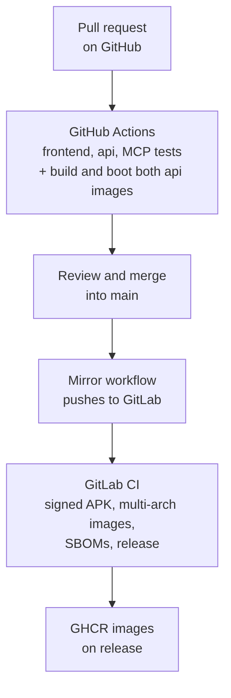

# Contributing to openGym

Thanks for taking a look. openGym is deliberately small and light on dependencies, and the aim is
to keep it that way: easy to read, easy to self-host.

## Project layout

```
frontend/  React + Vite app (src/views, src/components, src/store, src/lib). Builds to static files.
           android/ and ios/ are the Capacitor shells for the standalone app (docs/MOBILE.md).
api/       Backend: server.js on plain node:http, two dependencies (@simplewebauthn/server, web-push).
           coach/ is the optional AI coach; openapi.yaml documents every route.
web/       Multi-stage Dockerfile (builds the frontend, serves it with nginx) and the nginx template.
mcp/       Optional read-only MCP server for LLM clients (Claude Desktop, Cursor, ...). Not in the
           Docker build; it only runs when a client spawns it. See mcp/README.md.
website/   The static project site at opengym.duarte-santos.ch.
kubernetes/ Example manifests (docs/SELF_HOSTING_KUBERNETES.md).
docs/      User and operator guides (index: docs/README.md); docs/dev/ has feature design notes.
media/     Exercise images and GIFs, gitignored and fetched at runtime.
```

## Running for development

```bash
cp .env.example .env
docker compose up -d --build      # api + web + media on :8080

cd frontend && npm install && npm run dev   # hot reload, proxies /api to :3000
cd frontend && npm test                     # training logic, locales, components
cd api && npm test
cd mcp && npm test
```

## Guidelines

- **Keep it dependency-light.** The frontend uses React, React Router and Zustand; `api/` has two
  dependencies. A new dependency on either side is a hard sell.
- **Match the style.** Small components, clear names, comments only where the *why* isn't obvious.
  State lives in the Zustand store (`src/store`), pure helpers in `src/lib`. There is no linter or
  formatter config, so follow the surrounding code.
- **Don't commit** `media/` or `data/`; both are gitignored.
- **Click through what you touched**, including the workout flow, in a browser before opening a
  pull request.
- **Training logic gets a unit test.** Anything that decides what you lift next, or reads a logged
  session back, belongs in a pure helper in `src/lib` with a test beside it. These rules are easy
  to get subtly wrong and nearly impossible to check by clicking; the progression engine has had
  real bugs that only a test caught.
- **New UI strings go into every locale** in `frontend/src/locales/`. English is the source
  language and has no file. `node scripts/check-locales.mjs` (run in CI) flags a key that is
  missing, blank or has lost a `{n}` placeholder. Portuguese (Brazil) inherits from Portuguese
  (Portugal) and has its own guard test.

## Using AI tools

openGym itself is developed with Claude Code (see
[How openGym is built](README.md#how-opengym-is-built)), and [`CLAUDE.md`](CLAUDE.md) holds the
project context for it. You're welcome to use whatever tools you like for a pull request. The bar
is the same either way: you understand the change, it's tested, and you can answer questions about
it in review.

## What CI does with your pull request

<p align="center">
<picture>
  <source media="(prefers-color-scheme: dark)" srcset="docs/diagrams/ci-dark.png">
  
</picture>
</p>

A pull request runs the three test suites and builds and boots both api image targets. The APK and
the published images come from GitLab CI on the mirror, built from `main` after the merge. If your
change needs an APK to be judged, say so in the pull request and a maintainer will run that build.
A first-time contributor's workflows wait for a maintainer to approve them, so "no checks yet"
just means nobody has pressed the button.

Merge requests still open on the GitLab mirror are reviewed too and land on `main` here. New work
should come as a GitHub pull request.

## Good first issues

- More starter plans
- More languages for the exercise instructions (the dataset ships several)
- Percentage or training-max programming (5/3/1 style) on top of the progression engine in
  `src/lib/progression.js`; the policy interface is already there
- Accessibility passes on the workout and chart screens

## Where to ask what

| You have | Goes to |
| --- | --- |
| A quick question, or you'd rather chat | [Discord](https://discord.gg/e62jY6fwVb) |
| A question, or self-hosting that won't behave | [Discussions → Q&A](https://github.com/DuarteSantos8/openGym/discussions/categories/q-a) |
| An idea you're not sure about yet | [Discussions → Ideas](https://github.com/DuarteSantos8/openGym/discussions/categories/ideas) |
| A reproducible bug | [Issues](https://github.com/DuarteSantos8/openGym/issues) |
| A change you've already built | [A pull request](https://github.com/DuarteSantos8/openGym/pulls) |
| A security problem | [Private report](https://github.com/DuarteSantos8/openGym/security/advisories/new), see [SECURITY.md](SECURITY.md) |

An answered question in Discussions is worth more than the same answer in a chat log, because the
next person searching "passkey login fails behind my reverse proxy" finds it. If a Discord answer
turns out to be worth keeping, it belongs in Discussions afterwards.

## Reporting bugs

Open an issue with what you did, what you expected, what happened, and your browser and OS. For
login or passkey problems, include your `RP_ID` and `ORIGIN` (not the contents of `data/`); most
login issues are an origin mismatch.

By contributing you agree that your work is licensed under the project's
[GNU AGPL v3.0](LICENSE).
