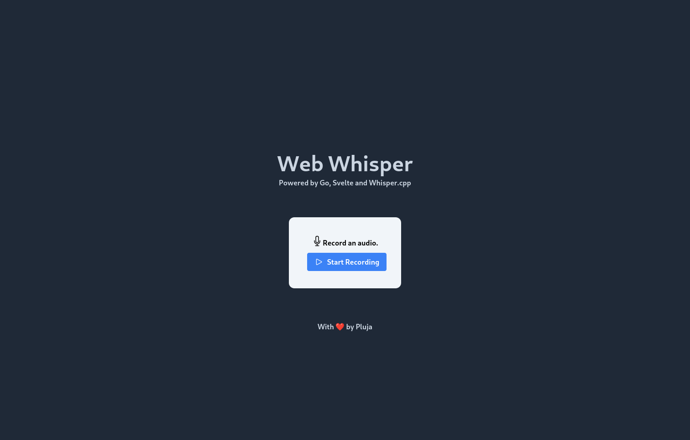
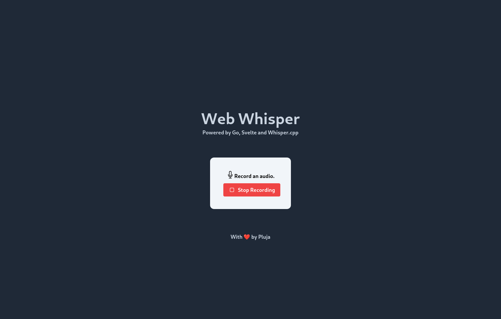
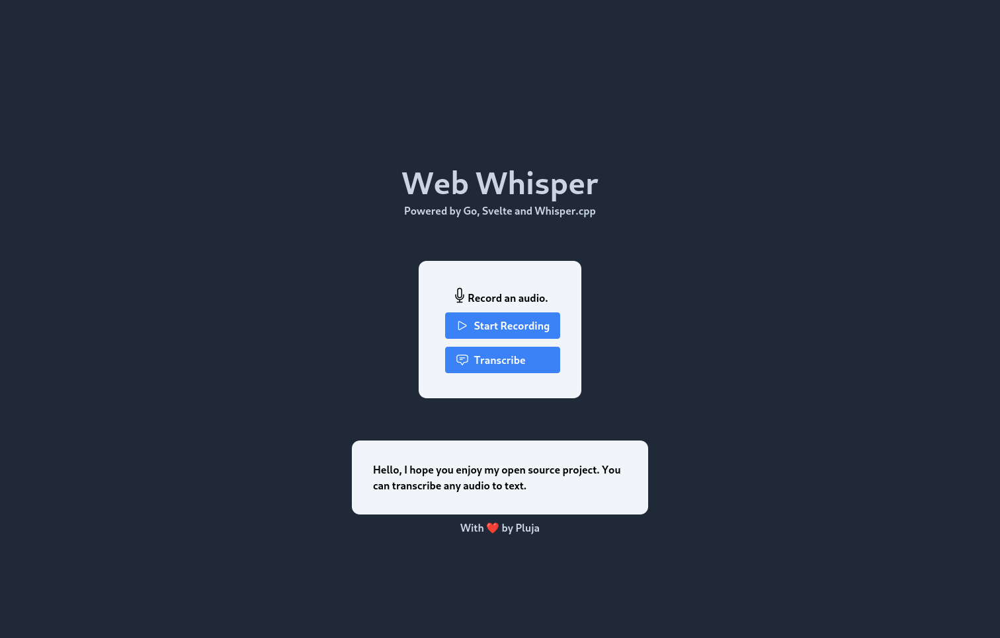

# Web Whisper 

 </img>

This logo has been generated with Stable Diffusion

Get OpenAI's [Whisper](https://github.com/openai/whisper) right into your browser!

This is a small personal project I am using to learn Golang and Svelte. It is a light web frontend for OpenAI's whisper.

## Contents:

- [Features](#features)
- [Roadmap](#roadmap)
- [Self-hosting](#self-hosting)
    - [With docker](#docker-compose)
    - [From source](#manual)
- [Screenshots](#screenshots)

## ✨ Features:

- [x] Backend written in **Go**
- [x] Frontend written with **Svelte** and **Tailwind CSS**.
- [x] Whisper from [whisper.cpp](https://github.com/ggerganov/whisper.cpp).
    - You don't need a GPU, uses CPU.
    - No need for complex installations.
- [x] Record and transcribe audio right from your browser.
- [x] Lightweight and beautiful UI.
- [x] Self-hosted. No 3rd parties.
- [x] Docker compose for easy self-hosting
- [x] Select input audio language

## 🧭 Roadmap:

- [ ] Upload any files (video, audio...)
- [ ] Download `.srt` subtitle files
- [ ] History of your transcriptions
- [ ] Translate input to English

## 🪺 Self-hosting

### Docker-compose

> Install [Docker](https://docs.docker.com/engine/install/#server) and [docker-compose](https://docs.docker.com/compose/install/)

1. Clone this repo: `git clone https://codeberg.org/pluja/web-whisper`
2. Open and edit the `docker-compose.yml` to fit your needs:

#### Local usage:

The WebRTC microphone recording **needs** to have an SSL certificate (HTTPS) in order to work. To achieve this, I set up a caddy server within the `docker-compose.yml` that will create a self-signed certificate for you.

3. `docker compose up -d`
4. Visit https://localhost:3000

#### Server setup

The WebRTC microphone recording **needs** to have an SSL certificate (HTTPS) in order to work. This means that for this app to work, you need to serve it via HTTPS. You can use the already setup caddy server that will get it working on `localhost:3000` through HTTPS. Otherwise, you will need to setup a reverse proxy to serve the site via HTTPS.

If you want to set up a reverse proxy, you can just:

3. Comment all caddy-related lines from the `docker-compose.yml` file.
4. Uncomment the `ports` part of the `frontend` service OR setup the network of your reverse proxy.
5. Point your reverse proxy to the frontend.
6. Build and run the containers: `docker compose up -d`

### Manual

This is a small guide on how to self-host this project.

It is built of two parts; the `backend` and the `frontend`. Both need to be running at the same time so you can make use of it.

First step is to clone this repository:

`git clone https://codeberg.org/pluja/web-whisper`

And enter the directory:

`cd web-whisper`

#### Running the backend

You will need `go` (Golang) installed on your computer.

- Now head to the `backend` directory: `cd backend`
- Simply run `go mod download` to get all de dependencies.
- Setup the `whipser.cpp` dependency: `bash setup.sh`
    - You can edit the `setup.sh` to download a better model other than the `small` if you want ([See this link](https://github.com/ggerganov/whisper.cpp#more-audio-samples))
- Run the backend `go run .`
    - The backend starts at `localhost:9090`; you can edit the `main.go` file to change the default port.

#### Running the frontend

You will need `npm` and `yarn` to run the frontend.

- Head to the `frontend` folder: `cd frontend`
- Run `npm i`
- Run `yarn`
- Run the frontend with `yarn dev`
    - The frontend will be available at the address in the console output.

## Screenshots

##### Main page

##### Recording

##### Result
