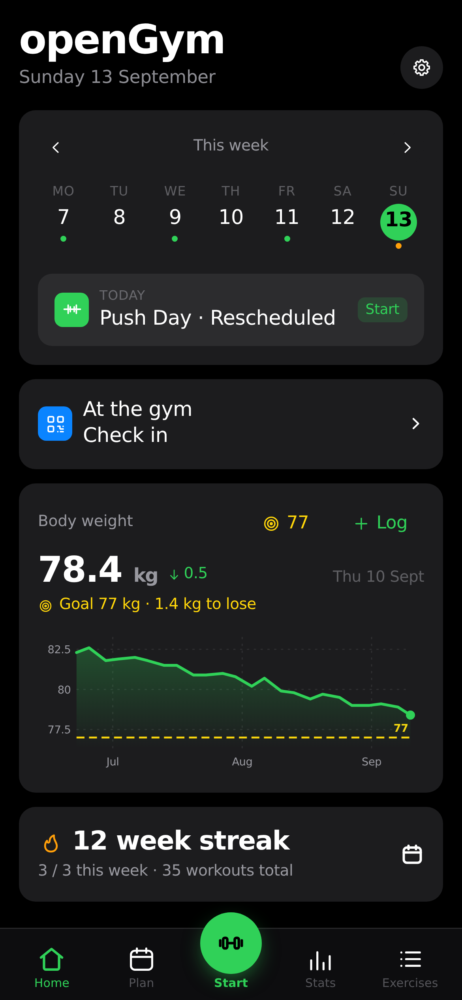
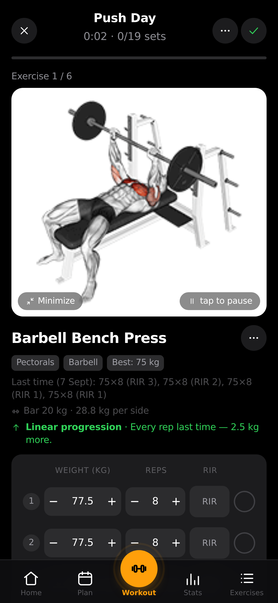
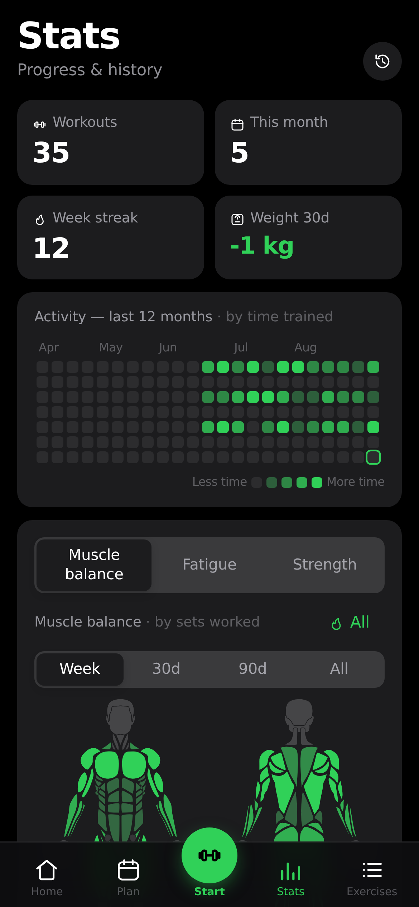
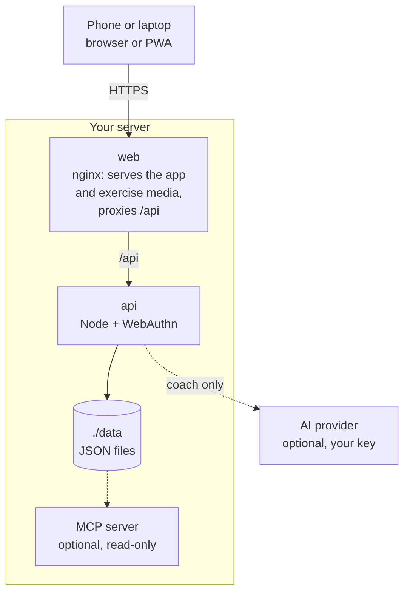
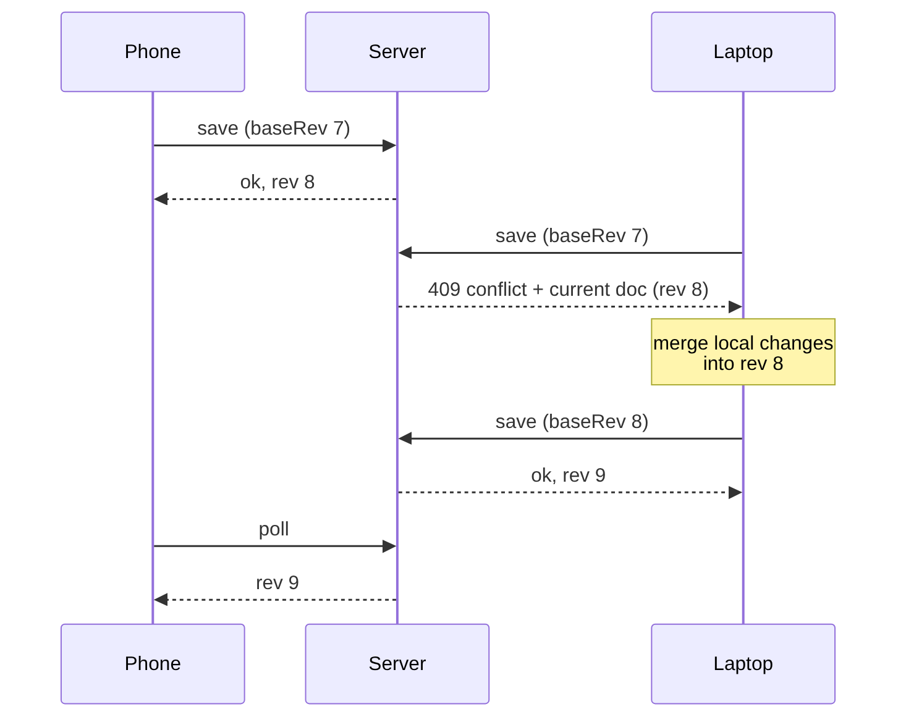

<div align="center">


**A self-hosted gym and body-weight tracker you actually own.**

Plan your week, run guided workouts, log every set and your body weight,<br>
on your phone, synced across your devices, behind your own passkey login.

[](https://discord.gg/e62jY6fwVb)
[](https://discord.gg/e62jY6fwVb)
[](https://github.com/DuarteSantos8/openGym/stargazers)

[](https://github.com/DuarteSantos8/openGym/releases)
[](https://github.com/DuarteSantos8/openGym/actions/workflows/test.yml)
[](https://gitlab.com/DuarteSantos8/opengym/-/pipelines)
[](https://gitlab.com/DuarteSantos8/opengym/-/pipelines?ref=main)
[](LICENSE)

[Website](https://opengym.duarte-santos.ch) ·
[Live demo](https://opengym.duarte-santos.ch/demo/) ·
[Android APK](https://github.com/DuarteSantos8/openGym/releases/latest) ·
[Self-hosting guide](docs/SELF_HOSTING.md) ·
[Roadmap](ROADMAP.md) ·
[Changelog](CHANGELOG.md)

<a href="https://buymeacoffee.com/duartesantos" target="_blank"></a>

</div>

<table align="center">
<tr>
<td align="center"><br><sub><b>Home</b> · today's workout and weight</sub></td>
<td align="center"><br><sub><b>Guided workout</b> · demos and sets</sub></td>
<td align="center"><br><sub><b>Stats</b> · heatmap, charts and PRs</sub></td>
</tr>
</table>

## Why openGym

Most workout apps keep your data on their servers, push you towards a subscription, or vanish
when the company does. openGym runs on your own box, keeps your data in a folder you control, and
is yours to fork. It still behaves like a modern app: installable on the home screen, passkey
sign-in, works offline, syncs between your phone and your laptop.

No account on someone else's server, no subscription, no ads, no telemetry. One
`docker compose up` and it's running.

The [in-browser demo](https://opengym.duarte-santos.ch/demo/) is the real app with example data,
if you want to try it before installing anything.

## Features

**Planning**

- A routine per weekday over a library of **1,324 exercises** with animated demos, searchable and
  browsable by muscle on a body map. Filter by the equipment you own.
- Four starter plans (Push/Pull/Legs, Upper/Lower, Full Body, 5×5) that load as ordinary,
  editable routines.
- Move a session to another day without touching the weekly plan. The week starts on Monday or
  Sunday, your choice.
- Or skip the weekdays altogether: a **rotation** (A, B, C, A, ...) where the next session is
  simply the next one you haven't done, however the week went.
- Supersets, warm-up sets, drop sets and rest-pause, timed exercises (planks, hangs, carries),
  cardio by time and speed, rest time per exercise, planned deloads.
- Your own exercises, with your own photo, GIF or short video. Location data is stripped on the
  device before upload.

**Training**

- Guided sessions: today's workout starts itself, weights are pre-filled from last time, a rest
  timer runs between sets, PRs are detected as you go. On a rest day it tells you when the next
  session is.
- A quiet workout screen: one menu per exercise, the set number as the set's own menu, card or
  list view. Switches in Settings bring the old button rows back if you liked them.
- Optional effort column as RIR or RPE, colour-coded, with a plain-language line per level.
- Plate math for barbell, EZ bar, trap bar and Smith machine, worked out from the plates you own.
- Bodyweight exercises know they carry no load: log reps, add a dip belt if you use one.
- Per-side reps for lunges and single-arm work, the screen stays awake while you train, and a
  rest-timer alert can flash the screen for loud gyms.
- Swipe a set left to delete it (with Undo) or right to copy it. Pyramid sets with their own reps
  and rest per set, and a scroll wheel for any rest time up to 15 minutes.

**Progress**

- Progression rules per routine or per exercise: linear, Greyskull LP, double progression through a
  visible rep range, or adding time. Each target explains why it is that number; missed reps never
  add load, stalls trigger a deload.
- Estimated 1RM per exercise with its own curve, Structural Balance ratios (Poliquin, Thibaudeau,
  ATG), a year-long activity heatmap.
- A muscle map in three modes: where your volume went, what is still recovering, and what has gone
  untrained.
- Body-weight chart against a goal line, and progress photos on a timeline with a before/after
  slider.
- Edit any saved workout after the fact, log one you did on paper, or move it to the right date.
  Records are re-read from the corrected history.

**Accounts and data**

- Passkeys (Face ID, Touch ID, fingerprint) with per-profile data synced across devices. Password
  sign-in can be switched on per instance; new devices pair with a one-time code or QR.
- Two devices editing at once merge field by field instead of overwriting each other (see
  [sync](#how-sync-works)).
- Import from FitNotes, Strong, Hevy (CSV or API key) and Apple Health weight exports. Export
  everything as one JSON file whenever you like.
- Share a plan as a small file or print it as a PDF.
- Optional admin dashboard with invite-only signup and an activity log.
- 18 languages, including right-to-left Arabic and Traditional Chinese. Exercise names and
  instructions are translated for most of them.

**Optional extras, off by default**

- An [AI coach](docs/AI_COACH.md) that drafts a week of routines and later suggests changes based on
  what you logged. You approve every change. It runs on your server with your own provider key
  (Anthropic, OpenAI, Gemini or any OpenAI-compatible endpoint, Ollama included).
- An [MCP server](mcp/README.md) so an assistant like Claude Desktop can answer questions about your
  training history. Read-only and local; not part of the Docker build.

The full list of what changed release by release is in the [changelog](CHANGELOG.md).

## Quick start

You need [Docker](https://docs.docker.com/get-docker/) with Compose.

```bash
git clone https://github.com/DuarteSantos8/openGym
cd openGym
cp .env.example .env
docker compose pull      # prebuilt images, amd64 + arm64 (skip this to build from source)
docker compose up -d
```

Open <http://localhost:8080>, tap **Create profile**, and you're in. The first start downloads
the exercise media (about 140 MB) once.

To reach it from your phone with passkeys you need HTTPS on a domain; that's a two-line change in
`.env`. The [self-hosting guide](docs/SELF_HOSTING.md) walks through Cloudflare Tunnel, Caddy,
Traefik and nginx, and there are separate guides for
[HTTPS on a LAN](docs/SELF_HOSTING_HTTPS.md) and [Kubernetes](docs/SELF_HOSTING_KUBERNETES.md).

> [!NOTE]
> Images are published from the same tag to `registry.gitlab.com/duartesantos8/opengym/{api,web}`
> (what `docker-compose.yml` pulls) and `ghcr.io/duartesantos8/opengym-{api,web}`. Swap the
> `image:` lines if you prefer GHCR, or run `docker compose up -d --build` to build locally. Either
> way you don't need Node on the host.

<details>
<summary><b>Configuration reference</b> (all through <code>.env</code>)</summary>

| Variable | What it does | Default |
|---|---|---|
| `RP_ID` | Hostname passkeys are bound to | `localhost` |
| `ORIGIN` | Full URL the app is served from | `http://localhost:8080` |
| `WEB_PORT` | Host port for the web UI | `8080` |
| `NGINX_PORT` | Port the web container listens on inside the container | `80` |
| `BACKEND` | Name of the API service that `/api` is proxied to | `api` |
| `PORT` | Port the API listens on; the web container proxies to the same value | `3000` |
| `RP_NAME` | Name shown in the passkey prompt | `openGym` |
| `SESSION_DAYS` | How long a sign-in lasts, in days | `90` |
| `ADMIN_UIDS` | User ids that get the admin dashboard, comma-separated | *(none)* |
| `FIRST_USER_ADMIN` | `1`: the first profile created on an empty instance becomes its admin | *(off)* |
| `INVITE_ONLY` | Require an invite code to create a profile | *(off)* |
| `ALLOW_GUEST` | Offer "Continue without account"; `0` requires a profile | *(on)* |
| `PASSWORD_LOGIN` | Offer name-and-password sign-in next to passkeys | *(off)* |
| `TRUST_PROXY` | Let the sign-in throttle read the client address from proxy headers | `1` in `docker-compose.yml` |
| `AUDIT_LOG` | Record sign-ins and admin actions; `0` records nothing | *(on)* |
| `AUDIT_MAX` | Events kept in the activity log; `0` for no limit | `5000` |
| `AUDIT_DAYS` | Days kept in the activity log; `0` keeps until `AUDIT_MAX` | `90` |
| `AUDIT_IP` | Record the caller's address: `off`, `net` (network only) or `full` | `off` |
| `VAPID_SUBJECT` | Contact URL sent with push notifications | your `ORIGIN` |
| `API_TARGET` | API image to build: `default`, or `coach` with the Claude Agent SDK and Codex CLI | `default` |
| `COACH_DISABLED` | `1` forces the AI coach off instance-wide | *(unset)* |

Push-notification keys are generated on first run into `./data/vapid.json`. `DATA_DIR` is pinned to
`/data` inside the container and mapped to `./data` on the host; change the volume, not the
variable. The [self-hosting guide](docs/SELF_HOSTING.md) covers every option in detail.

</details>

## Phone app

The same codebase builds a standalone app with Capacitor: no account, no server, everything stays
on the phone, with native reminders and a rest countdown in the notification shade.

- **Android:** download the signed APK from the [latest release](https://github.com/DuarteSantos8/openGym/releases/latest)
  or the [website](https://opengym.duarte-santos.ch). Each build sits next to its `.sha256`, and
  the app checks for updates itself. openGym is deliberately not on the Play Store.
- **iPhone:** Apple doesn't allow installs outside the App Store. Self-host and add the PWA to your
  home screen from Safari, or build the native app onto your own device with Xcode.

Details and build instructions: [docs/MOBILE.md](docs/MOBILE.md).

## How it works

<p align="center">
<picture>
  <source media="(prefers-color-scheme: dark)" srcset="docs/diagrams/architecture-dark.png">
  
</picture>
</p>

- **`frontend/`** is React 19 and Vite (React Router, Zustand), built to static files inside Docker.
- **`api/`** is plain `node:http` with two dependencies: `@simplewebauthn/server` for passkeys and
  `web-push` for notifications. Everything is stored as JSON under `./data`.
- **`web/`** builds the frontend and serves it with nginx, proxying `/api` so the whole app sits on
  one origin, which passkeys require.

The training logic (progression rules, 1RM, how a logged session is read back) lives in pure
functions under `frontend/src/lib/` with tests beside them. The HTTP API is documented as an
OpenAPI spec in [`api/openapi.yaml`](api/openapi.yaml), browsable at
[opengym.duarte-santos.ch/api.html](https://opengym.duarte-santos.ch/api.html).

### How sync works

Each profile's data is one document with a server revision. A device sends the revision it last
saw along with its changes; if another device wrote in between, the server refuses and returns the
current document so the device can merge and retry. Every change carries its own stamp, down to a
single setting or routine field, so the merge keeps the newest edit of each one and a deletion stays
deleted.

<p align="center">
<picture>
  <source media="(prefers-color-scheme: dark)" srcset="docs/diagrams/sync-dark.png">
  
</picture>
</p>

Nothing that hasn't reached the server is discarded on disconnect or sign-out, and the app shows a
banner whenever it's working offline.

### Your data

Everything lives in `./data` on your host:

| File | Contents |
|---|---|
| `db.json` | Profiles and public passkey data |
| `db.json.bak` | A copy of the last good `db.json`, used if the main file can't be read |
| `state-<user>.json` | Each user's plan, workouts, body weight and settings |
| `audit.log` | Admin activity log (no IP addresses unless you turn that on) |
| `secret` | Session-cookie signing key |

Back up `./data` and you've backed up everything. Passkey private keys never reach the server; they
stay in your phone's secure hardware or your password manager.

## Documentation

The [documentation index](docs/README.md) sorts every guide by who it's for. The most used ones:

| I want to | Read |
|---|---|
| Get a quick answer | [FAQ](docs/FAQ.md) |
| Set up my own instance | [Self-hosting](docs/SELF_HOSTING.md) |
| Use the Android or iPhone app | [Phone app](docs/MOBILE.md) |
| Bring my history from another app | [Importing data](docs/DATA_IMPORTS.md) |
| Turn on the AI coach | [AI coach](docs/AI_COACH.md) |
| Contribute code | [Contributing](CONTRIBUTING.md) |
| Report a security problem | [Security](SECURITY.md) |

## Roadmap

A release roughly every two weeks, each small and themed. The full plan is in
[ROADMAP.md](ROADMAP.md), and the issues sit in the
[GitHub milestones](https://github.com/DuarteSantos8/openGym/milestones). The next two releases
finish the community wishes, then comes a new exercise database and a themed release every
two weeks after it.

| Release | When | Theme |
|---|---|---|
| v1.3.10 | released Oct 2026 | New design, rotation, swipe actions, safer sync |
| v1.3.11 | next | Fixes, about thirty community pull requests, Health Connect, measurements |
| v1.3.12 | Nov 2026 | Community features: focus view, widget, timer rework |
| v1.4.0 | Nov 2026 | A new exercise database |
| v1.4.1 to v1.4.4 | Dec 2026 and Jan 2027 | Programmes, the progression engine, cardio |
| v1.4.5 to v1.4.10 | Jan to Apr 2027 | Search, accounts, the iOS app, Android and health, looks |
| later | | Database storage |

## Community

- **[Discord](https://discord.gg/e62jY6fwVb)** for release announcements, self-hosting help and
  quick back-and-forth. Usually the fastest way to get an answer.
- **[Discussions](https://github.com/DuarteSantos8/openGym/discussions)** for questions and ideas
  you want the next person to find by searching.
- **[Issues](https://github.com/DuarteSantos8/openGym/issues)** for reproducible bugs and agreed-on
  work. Login trouble is almost always an `RP_ID`/`ORIGIN` mismatch; the
  [self-hosting guide](docs/SELF_HOSTING.md) covers it.
- **[Pull requests](https://github.com/DuarteSantos8/openGym/pulls)** are welcome; start with
  [CONTRIBUTING.md](CONTRIBUTING.md).

<a href="https://github.com/DuarteSantos8/openGym/graphs/contributors">
  
</a>

### Where the code lives

GitHub is the home of the project. [gitlab.com/DuarteSantos8/opengym](https://gitlab.com/DuarteSantos8/opengym)
is a mirror, updated by a GitHub Actions workflow on every push to `main` and every release tag. It
exists because its CI builds the release artifacts: the signed APK, the multi-arch images and the
SBOMs. Nothing is merged there by hand. In the changelog, `!NN` refers to a GitLab merge request
from the weeks in August and September 2026 when the project lived there.

## How openGym is built

People have asked about this, so plainly: **openGym is developed with
[Claude Code](https://claude.com/claude-code)**, Anthropic's coding agent. A large share of the
code, tests and documentation is drafted in Claude Code sessions, and the repository carries a
[`CLAUDE.md`](CLAUDE.md) with the project context those sessions start from.

What that does and doesn't mean:

- **A person decides and ships.** What goes in, what gets reviewed and merged, and every release
  are the maintainer's call. Changes are tested on a staging instance and on real phones before
  they are tagged.
- **Tests hold the logic in place.** The training logic is covered by unit tests, and pull requests
  run the frontend, API and MCP suites in CI. That is the guard against plausible-looking code
  that is wrong, whoever or whatever wrote it.
- **The app itself doesn't need an LLM.** Nothing in a default install calls an AI service. The AI
  coach and the MCP server are opt-in, and the coach only talks to the provider you configure, with
  your own key.

Community pull requests are written by their authors, with whatever tools they like, and reviewed
the same way.

## Support

openGym is free and stays free: AGPL, no paid tier, nothing held back for sponsors. If it replaced a
paid tracker for you and you'd like to chip in, there's a coffee button below. A star, a bug report
or a pull request helps just as much.

<a href="https://buymeacoffee.com/duartesantos" target="_blank">
  
</a>

[](https://star-history.com/#DuarteSantos8/openGym&Date)

## License

**openGym's own code** is licensed under the [GNU AGPL v3.0](LICENSE). You can self-host, use,
modify and share it; if you run a modified version as a network service, you have to offer that
version's source under the same license.

> [!IMPORTANT]
> **The exercise media is not covered by that license.** Exercise metadata and instruction text come
> from [ExerciseDB v1](https://exercisedb.dev/) through
> [hasaneyldrm/exercises-dataset](https://github.com/hasaneyldrm/exercises-dataset) under MIT. The
> images and animations are third-party content under neither MIT nor the AGPL, and their ownership
> is disputed: the dataset attributes them to [Gym visual](https://gymvisual.com/), while
> [ExerciseDB/AscendAPI](https://exercisedb.io/faq) claims to own them. openGym doesn't redistribute
> them (your instance downloads them on first start) and doesn't relicense them. To reuse that
> media, clear it with the rights holder first.

Full third-party notices, including the body-diagram geometry, are in [NOTICE.md](NOTICE.md).
