# back

Generated by `scripts/catalogue/build.mjs`, do not edit. Click an id to edit that exercise. Pictures © Gym visual, licensed for openGym only (see [NOTICE](../media/NOTICE.md)).

| | id | name | equipment | target |
|---|---|---|---|---|
| 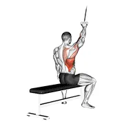 | [0007](../exercises/0007.json) | alternate lateral pulldown | cable | lats |
| 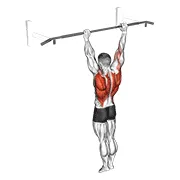 | [3293](../exercises/3293.json) | archer pull up | body weight | lats |
| 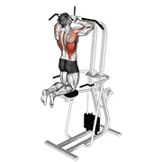 | [0015](../exercises/0015.json) | assisted parallel close grip pull-up | leverage machine | lats |
| 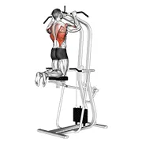 | [0017](../exercises/0017.json) | assisted pull-up | leverage machine | lats |
| 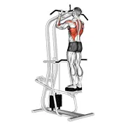 | [1431](../exercises/1431.json) | assisted standing chin-up | leverage machine | lats |
| 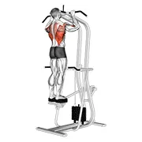 | [1432](../exercises/1432.json) | assisted standing pull-up | leverage machine | lats |
| 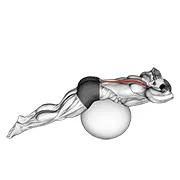 | [1314](../exercises/1314.json) | back extension on exercise ball | stability ball | spine |
| 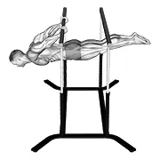 | [3297](../exercises/3297.json) | back lever | body weight | upper back |
| 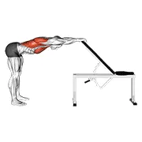 | [1405](../exercises/1405.json) | back pec stretch | body weight | lats |
| 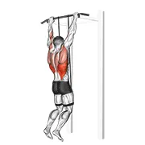 | [0970](../exercises/0970.json) | band assisted pull-up | band | lats |
| 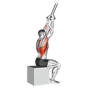 | [0974](../exercises/0974.json) | band close-grip pulldown | band | lats |
| 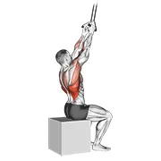 | [3117](../exercises/3117.json) | band fixed back close grip pulldown | band | lats |
| 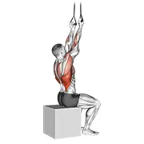 | [3116](../exercises/3116.json) | band fixed back underhand pulldown | band | lats |
| 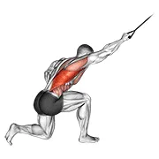 | [0983](../exercises/0983.json) | band kneeling one arm pulldown | band | lats |
| 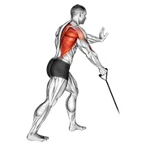 | [0988](../exercises/0988.json) | band one arm standing low row | band | upper back |
| 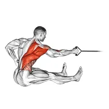 | [0990](../exercises/0990.json) | band one arm twisting seated row | band | upper back |
| 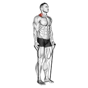 | [1018](../exercises/1018.json) | band shrug | band | traps |
| 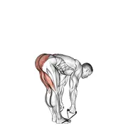 | [1010](../exercises/1010.json) | band straight leg deadlift | band | spine |
| 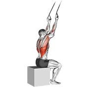 | [1013](../exercises/1013.json) | band underhand pulldown | band | lats |
| 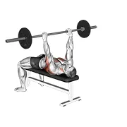 | [1316](../exercises/1316.json) | barbell bent arm pullover | barbell | lats |
| 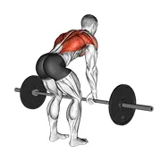 | [0027](../exercises/0027.json) | barbell bent over row | barbell | upper back |
| 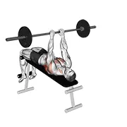 | [0034](../exercises/0034.json) | barbell decline bent arm pullover | barbell | lats |
| 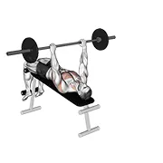 | [0037](../exercises/0037.json) | barbell decline wide-grip pullover | barbell | lats |
| 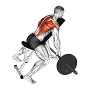 | [0049](../exercises/0049.json) | barbell incline row | barbell | upper back |
| 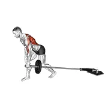 | [0064](../exercises/0064.json) | barbell one arm bent over row | barbell | upper back |
| 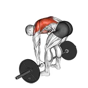 | [3017](../exercises/3017.json) | barbell pendlay row | barbell | upper back |
| 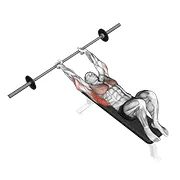 | [0073](../exercises/0073.json) | barbell pullover | barbell | lats |
| 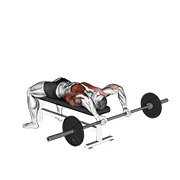 | [0022](../exercises/0022.json) | barbell pullover to press | barbell | lats |
|  | [0118](../exercises/0118.json) | barbell reverse grip bent over row | barbell | upper back |
| 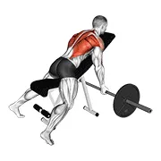 | [1317](../exercises/1317.json) | barbell reverse grip incline bench row | barbell | upper back |
| 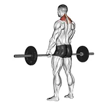 | [0095](../exercises/0095.json) | barbell shrug | barbell | traps |
| 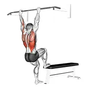 | [3019](../exercises/3019.json) | bench pull-ups | body weight | lats |
| 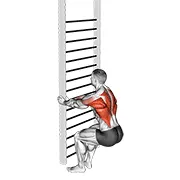 | [3168](../exercises/3168.json) | bodyweight squatting row | body weight | upper back |
| 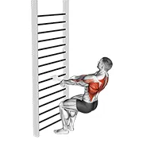 | [3167](../exercises/3167.json) | bodyweight squatting row (with towel) | body weight | upper back |
| 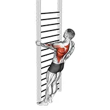 | [3156](../exercises/3156.json) | bodyweight standing close-grip one arm row | body weight | upper back |
| 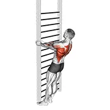 | [3158](../exercises/3158.json) | bodyweight standing close-grip row | body weight | upper back |
| 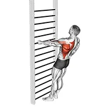 | [3162](../exercises/3162.json) | bodyweight standing one arm row | body weight | upper back |
| 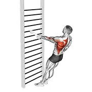 | [3161](../exercises/3161.json) | bodyweight standing one arm row (with towel) | body weight | upper back |
| 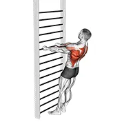 | [3166](../exercises/3166.json) | bodyweight standing row | body weight | upper back |
| 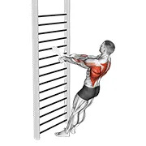 | [3165](../exercises/3165.json) | bodyweight standing row (with towel) | body weight | upper back |
| 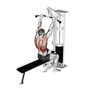 | [0150](../exercises/0150.json) | cable bar lateral pulldown | cable | lats |
| 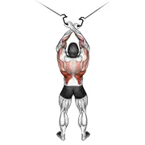 | [0153](../exercises/0153.json) | cable cross-over lateral pulldown | cable | lats |
| 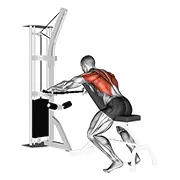 | [0159](../exercises/0159.json) | cable decline seated wide-grip row | cable | upper back |
| 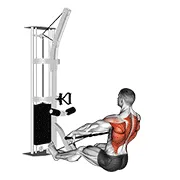 | [0160](../exercises/0160.json) | cable floor seated wide-grip row | cable | upper back |
| 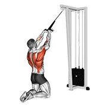 | [0167](../exercises/0167.json) | cable high row (kneeling) | cable | upper back |
| 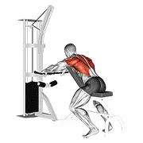 | [1318](../exercises/1318.json) | cable incline bench row | cable | upper back |
| 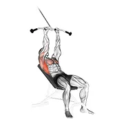 | [0172](../exercises/0172.json) | cable incline pushdown | cable | lats |
| 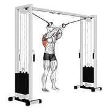 | [2330](../exercises/2330.json) | cable lat pulldown full range of motion | cable | lats |
| 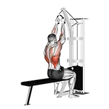 | [0177](../exercises/0177.json) | cable lateral pulldown (with rope attachment) | cable | lats |
| 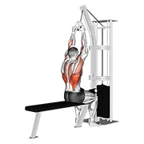 | [2616](../exercises/2616.json) | cable lateral pulldown with v-bar | cable | lats |
| 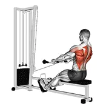 | [0180](../exercises/0180.json) | cable low seated row | cable | upper back |
|  | [0184](../exercises/0184.json) | cable lying extension pullover (with rope attachment) | cable | lats |
|  | [0189](../exercises/0189.json) | cable one arm bent over row | cable | upper back |
|  | [3563](../exercises/3563.json) | cable one arm pulldown | cable | lats |
|  | [0193](../exercises/0193.json) | cable one arm straight back high row (kneeling) | cable | upper back |
|  | [1319](../exercises/1319.json) | cable palm rotational row | cable | upper back |
|  | [0198](../exercises/0198.json) | cable pulldown | cable | lats |
|  | [0197](../exercises/0197.json) | cable pulldown (pro lat bar) | cable | lats |
|  | [0199](../exercises/0199.json) | cable pushdown (straight arm) v. 2 | cable | lats |
|  | [0205](../exercises/0205.json) | cable rear pulldown | cable | lats |
|  | [0208](../exercises/0208.json) | cable reverse-grip straight back seated high row | cable | upper back |
|  | [1320](../exercises/1320.json) | cable rope crossover seated row | cable | upper back |
|  | [1321](../exercises/1321.json) | cable rope elevated seated row | cable | upper back |
|  | [1322](../exercises/1322.json) | cable rope extension incline bench row | cable | upper back |
|  | [1323](../exercises/1323.json) | cable rope seated row | cable | upper back |
|  | [0213](../exercises/0213.json) | cable seated high row (v-bar) | cable | lats |
|  | [0214](../exercises/0214.json) | cable seated one arm alternate row | cable | upper back |
|  | [0861](../exercises/0861.json) | cable seated row | cable | upper back |
|  | [0218](../exercises/0218.json) | cable seated wide-grip row | cable | upper back |
|  | [0220](../exercises/0220.json) | cable shrug | cable | traps |
|  | [1717](../exercises/1717.json) | cable squat row (with rope attachment) | cable | lats |
|  | [0234](../exercises/0234.json) | cable standing row (v-bar) | cable | upper back |
|  | [0236](../exercises/0236.json) | cable standing twist row (v-bar) | cable | upper back |
|  | [0238](../exercises/0238.json) | cable straight arm pulldown | cable | lats |
|  | [0237](../exercises/0237.json) | cable straight arm pulldown (with rope) | cable | lats |
|  | [0239](../exercises/0239.json) | cable straight back seated row | cable | upper back |
|  | [2464](../exercises/2464.json) | cable thibaudeau kayak row | cable | lats |
|  | [0244](../exercises/0244.json) | cable twisting pull | cable | lats |
|  | [0245](../exercises/0245.json) | cable underhand pulldown | cable | lats |
|  | [1324](../exercises/1324.json) | cable upper row | cable | upper back |
|  | [1325](../exercises/1325.json) | cable wide grip rear pulldown behind neck | cable | lats |
|  | [0248](../exercises/0248.json) | cambered bar lying row | barbell | upper back |
|  | [1326](../exercises/1326.json) | chin-up | body weight | lats |
|  | [0253](../exercises/0253.json) | chin-ups (narrow parallel grip) | body weight | upper back |
|  | [1327](../exercises/1327.json) | close grip chin-up | body weight | lats |
|  | [0293](../exercises/0293.json) | dumbbell bent over row | dumbbell | upper back |
|  | [0305](../exercises/0305.json) | dumbbell decline shrug | dumbbell | traps |
|  | [0304](../exercises/0304.json) | dumbbell decline shrug v. 2 | dumbbell | traps |
|  | [0327](../exercises/0327.json) | dumbbell incline row | dumbbell | upper back |
|  | [0329](../exercises/0329.json) | dumbbell incline shrug | dumbbell | traps |
|  | [3541](../exercises/3541.json) | dumbbell incline y-raise | dumbbell | upper back |
|  | [1328](../exercises/1328.json) | dumbbell lying rear delt row | dumbbell | upper back |
|  | [0292](../exercises/0292.json) | dumbbell one arm bent-over row | dumbbell | upper back |
|  | [1329](../exercises/1329.json) | dumbbell palm rotational bent over row | dumbbell | upper back |
|  | [1330](../exercises/1330.json) | dumbbell reverse grip incline bench one arm row | dumbbell | upper back |
|  | [1331](../exercises/1331.json) | dumbbell reverse grip incline bench two arm row | dumbbell | upper back |
|  | [2327](../exercises/2327.json) | dumbbell reverse grip row (female) | dumbbell | upper back |
|  | [0406](../exercises/0406.json) | dumbbell shrug | dumbbell | traps |
|  | [3664](../exercises/3664.json) | dumbbell side plank with rear fly | dumbbell | upper back |
|  | [1772](../exercises/1772.json) | elbow lift - reverse push-up | body weight | upper back |
|  | [3292](../exercises/3292.json) | elevator | body weight | upper back |
|  | [1332](../exercises/1332.json) | exercise ball alternating arm ups | stability ball | lats |
|  | [1333](../exercises/1333.json) | exercise ball back extension with arms extended | stability ball | spine |
|  | [1334](../exercises/1334.json) | exercise ball back extension with hands behind head | stability ball | spine |
|  | [1335](../exercises/1335.json) | exercise ball back extension with knees off ground | stability ball | spine |
|  | [1336](../exercises/1336.json) | exercise ball back extension with rotation | stability ball | spine |
|  | [1338](../exercises/1338.json) | exercise ball hug | stability ball | spine |
|  | [1339](../exercises/1339.json) | exercise ball lat stretch | stability ball | lats |
|  | [1341](../exercises/1341.json) | exercise ball lower back stretch (pyramid) | stability ball | lats |
|  | [1342](../exercises/1342.json) | exercise ball lying side lat stretch | stability ball | lats |
|  | [1343](../exercises/1343.json) | exercise ball prone leg raise | stability ball | spine |
|  | [3010](../exercises/3010.json) | ez bar lying bent arms pullover | ez barbell | lats |
|  | [1344](../exercises/1344.json) | ez bar reverse grip bent over row | ez barbell | upper back |
|  | [3295](../exercises/3295.json) | front lever reps | body weight | upper back |
|  | [0466](../exercises/0466.json) | gironda sternum chin | body weight | lats |
|  | [0489](../exercises/0489.json) | hyperextension | body weight | spine |
|  | [0488](../exercises/0488.json) | hyperextension (on bench) | body weight | spine |
|  | [0499](../exercises/0499.json) | inverted row | body weight | upper back |
|  | [2300](../exercises/2300.json) | inverted row bent knees | body weight | upper back |
|  | [2298](../exercises/2298.json) | inverted row on bench | body weight | upper back |
|  | [0497](../exercises/0497.json) | inverted row v. 2 | body weight | upper back |
|  | [0498](../exercises/0498.json) | inverted row with straps | body weight | upper back |
|  | [0521](../exercises/0521.json) | kettlebell alternating renegade row | kettlebell | upper back |
|  | [0522](../exercises/0522.json) | kettlebell alternating row | kettlebell | upper back |
|  | [0541](../exercises/0541.json) | kettlebell one arm row | kettlebell | upper back |
|  | [0548](../exercises/0548.json) | kettlebell sumo high pull | kettlebell | traps |
|  | [1345](../exercises/1345.json) | kettlebell two arm row | kettlebell | upper back |
|  | [0558](../exercises/0558.json) | kipping muscle up | body weight | lats |
|  | [1346](../exercises/1346.json) | kneeling lat stretch | body weight | lats |
|  | [3418](../exercises/3418.json) | l-pull-up | body weight | lats |
|  | [0571](../exercises/0571.json) | lever alternating narrow grip seated row | leverage machine | upper back |
|  | [0572](../exercises/0572.json) | lever assisted chin-up | leverage machine | lats |
|  | [0573](../exercises/0573.json) | lever back extension | leverage machine | spine |
|  | [0574](../exercises/0574.json) | lever bent over row | barbell | upper back |
|  | [3200](../exercises/3200.json) | lever bent-over row with v-bar | leverage machine | upper back |
|  | [0579](../exercises/0579.json) | lever front pulldown | leverage machine | lats |
|  | [0580](../exercises/0580.json) | lever gripless shrug | leverage machine | traps |
|  | [1439](../exercises/1439.json) | lever gripless shrug v. 2 | leverage machine | traps |
|  | [0581](../exercises/0581.json) | lever high row | leverage machine | upper back |
|  | [0588](../exercises/0588.json) | lever narrow grip seated row | leverage machine | upper back |
|  | [0589](../exercises/0589.json) | lever one arm bent over row | barbell | upper back |
|  | [1356](../exercises/1356.json) | lever one arm lateral high row | leverage machine | upper back |
|  | [1347](../exercises/1347.json) | lever one arm lateral wide pulldown | leverage machine | lats |
|  | [2285](../exercises/2285.json) | lever pullover | leverage machine | lats |
|  | [2736](../exercises/2736.json) | lever reverse grip lateral pulldown | leverage machine | lats |
|  | [1348](../exercises/1348.json) | lever reverse grip vertical row | leverage machine | upper back |
|  | [1349](../exercises/1349.json) | lever reverse t-bar row | leverage machine | upper back |
|  | [1350](../exercises/1350.json) | lever seated row | leverage machine | upper back |
|  | [0604](../exercises/0604.json) | lever shrug | leverage machine | traps |
|  | [0606](../exercises/0606.json) | lever t bar row | leverage machine | upper back |
|  | [1351](../exercises/1351.json) | lever t-bar reverse grip row | leverage machine | upper back |
|  | [1313](../exercises/1313.json) | lever unilateral row | leverage machine | upper back |
|  | [0609](../exercises/0609.json) | london bridge | rope | upper back |
|  | [1352](../exercises/1352.json) | lower back curl | body weight | spine |
|  | [1353](../exercises/1353.json) | medicine ball catch and overhead throw | medicine ball | lats |
|  | [1354](../exercises/1354.json) | medicine ball overhead slam | medicine ball | upper back |
|  | [0627](../exercises/0627.json) | mixed grip chin-up | body weight | lats |
|  | [0631](../exercises/0631.json) | muscle up | body weight | lats |
|  | [1401](../exercises/1401.json) | muscle-up (on vertical bar) | body weight | lats |
|  | [1355](../exercises/1355.json) | one arm against wall | body weight | lats |
|  | [0638](../exercises/0638.json) | one arm chin-up | body weight | lats |
|  | [1773](../exercises/1773.json) | one arm towel row | body weight | upper back |
|  | [0651](../exercises/0651.json) | pull up (neutral grip) | body weight | lats |
|  | [0652](../exercises/0652.json) | pull-up | body weight | lats |
|  | [0670](../exercises/0670.json) | rear pull-up | body weight | lats |
|  | [3144](../exercises/3144.json) | resistance band seated straight back row | resistance band | upper back |
|  | [0673](../exercises/0673.json) | reverse grip machine lat pulldown | leverage machine | lats |
|  | [0674](../exercises/0674.json) | reverse grip pull-up | body weight | lats |
|  | [0678](../exercises/0678.json) | rocky pull-up pulldown | body weight | lats |
|  | [2208](../exercises/2208.json) | roller back stretch | roller | spine |
|  | [2207](../exercises/2207.json) | roller side lat stretch | roller | lats |
|  | [0680](../exercises/0680.json) | rope climb | rope | upper back |
|  | [3012](../exercises/3012.json) | scapula dips | body weight | traps |
|  | [0688](../exercises/0688.json) | scapular pull-up | body weight | traps |
|  | [0690](../exercises/0690.json) | seated lower back stretch | body weight | lats |
|  | [1763](../exercises/1763.json) | shoulder grip pull-up | body weight | lats |
|  | [1358](../exercises/1358.json) | side lying floor stretch | body weight | lats |
|  | [0720](../exercises/0720.json) | side-to-side chin | body weight | lats |
|  | [3304](../exercises/3304.json) | skin the cat | body weight | upper back |
|  | [0746](../exercises/0746.json) | smith back shrug | smith machine | traps |
|  | [1359](../exercises/1359.json) | smith bent over row | smith machine | upper back |
|  | [0761](../exercises/0761.json) | smith narrow row | smith machine | upper back |
|  | [1360](../exercises/1360.json) | smith one arm row | smith machine | upper back |
|  | [1361](../exercises/1361.json) | smith reverse grip bent over row | smith machine | upper back |
|  | [0767](../exercises/0767.json) | smith shrug | smith machine | traps |
|  | [1362](../exercises/1362.json) | sphinx | body weight | spine |
|  | [1363](../exercises/1363.json) | spine stretch | body weight | spine |
|  | [3669](../exercises/3669.json) | standing archer | body weight | upper back |
|  | [0794](../exercises/0794.json) | standing lateral stretch | body weight | lats |
|  | [1364](../exercises/1364.json) | standing pelvic tilt | body weight | spine |
|  | [0808](../exercises/0808.json) | suspended row | body weight | upper back |
|  | [0818](../exercises/0818.json) | twin handle parallel grip lat pulldown | cable | lats |
|  | [3231](../exercises/3231.json) | two toe touch (male) | body weight | spine |
|  | [1365](../exercises/1365.json) | upper back stretch | body weight | upper back |
|  | [1366](../exercises/1366.json) | upward facing dog | body weight | spine |
|  | [2987](../exercises/2987.json) | weighted close grip chin-up on dip cage | weighted | lats |
|  | [0835](../exercises/0835.json) | weighted hyperextension (on stability ball) | weighted | spine |
|  | [3286](../exercises/3286.json) | weighted muscle up | weighted | lats |
|  | [3312](../exercises/3312.json) | weighted muscle up (on bar) | weighted | lats |
|  | [3290](../exercises/3290.json) | weighted one hand pull up | weighted | lats |
|  | [0841](../exercises/0841.json) | weighted pull-up | weighted | lats |
|  | [1429](../exercises/1429.json) | wide grip pull-up | body weight | lats |
|  | [1367](../exercises/1367.json) | wide grip rear pull-up | body weight | lats |
