# cardio

Generated by `scripts/catalogue/build.mjs`, do not edit. Click an id to edit that exercise. Pictures © Gym visual, licensed for openGym only (see [NOTICE](../media/NOTICE.md)).

| | id | name | equipment | target |
|---|---|---|---|---|
| 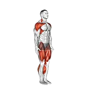 | [3220](../exercises/3220.json) | astride jumps (male) | body weight | cardiovascular system |
| 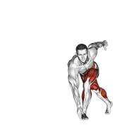 | [3672](../exercises/3672.json) | back and forth step | body weight | cardiovascular system |
| 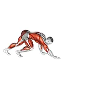 | [3360](../exercises/3360.json) | bear crawl | body weight | cardiovascular system |
| 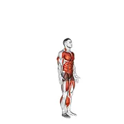 | [1160](../exercises/1160.json) | burpee | body weight | cardiovascular system |
| 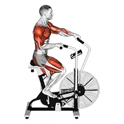 | [2331](../exercises/2331.json) | cycle cross trainer | leverage machine | cardiovascular system |
| 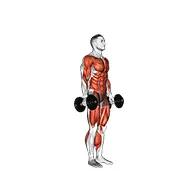 | [1201](../exercises/1201.json) | dumbbell burpee | dumbbell | cardiovascular system |
| 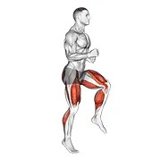 | [3221](../exercises/3221.json) | half knee bends (male) | body weight | cardiovascular system |
| 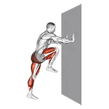 | [3636](../exercises/3636.json) | high knee against wall | body weight | cardiovascular system |
| 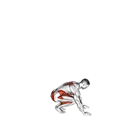 | [0501](../exercises/0501.json) | jack burpee | body weight | cardiovascular system |
| 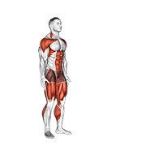 | [3224](../exercises/3224.json) | jack jump (male) | body weight | cardiovascular system |
| 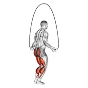 | [2612](../exercises/2612.json) | jump rope | rope | cardiovascular system |
| 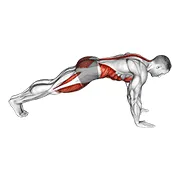 | [0630](../exercises/0630.json) | mountain climber | body weight | cardiovascular system |
| 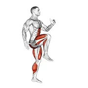 | [3638](../exercises/3638.json) | push to run | body weight | cardiovascular system |
| 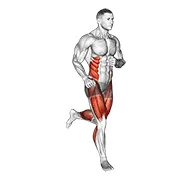 | [0685](../exercises/0685.json) | run | body weight | cardiovascular system |
| 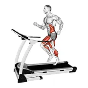 | [0684](../exercises/0684.json) | run (equipment) | body weight | cardiovascular system |
| 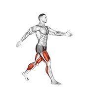 | [3219](../exercises/3219.json) | scissor jumps (male) | body weight | cardiovascular system |
| 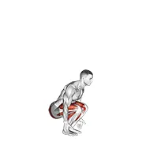 | [3222](../exercises/3222.json) | semi squat jump (male) | body weight | cardiovascular system |
| 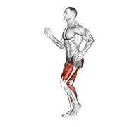 | [3656](../exercises/3656.json) | short stride run | body weight | cardiovascular system |
| 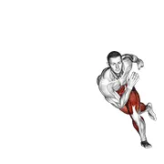 | [3361](../exercises/3361.json) | skater hops | body weight | cardiovascular system |
| 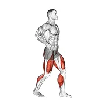 | [3671](../exercises/3671.json) | ski step | body weight | cardiovascular system |
| 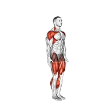 | [3223](../exercises/3223.json) | star jump (male) | body weight | cardiovascular system |
| 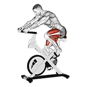 | [2138](../exercises/2138.json) | stationary bike run v. 3 | stationary bike | cardiovascular system |
| 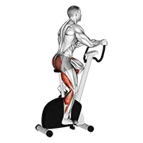 | [0798](../exercises/0798.json) | stationary bike walk | leverage machine | cardiovascular system |
| 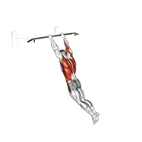 | [3318](../exercises/3318.json) | swing 360 | body weight | cardiovascular system |
| 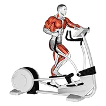 | [2141](../exercises/2141.json) | walk elliptical cross trainer | elliptical machine | cardiovascular system |
| 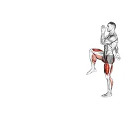 | [3655](../exercises/3655.json) | walking high knees lunge | body weight | cardiovascular system |
| 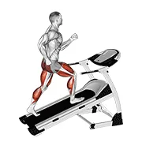 | [3666](../exercises/3666.json) | walking on incline treadmill | leverage machine | cardiovascular system |
| 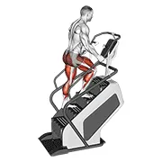 | [2311](../exercises/2311.json) | walking on stepmill | stepmill machine | cardiovascular system |
| 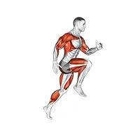 | [3637](../exercises/3637.json) | wheel run | body weight | cardiovascular system |
