# chest

Generated by `scripts/catalogue/build.mjs`, do not edit. Click an id to edit that exercise. Pictures © Gym visual, licensed for openGym only (see [NOTICE](../media/NOTICE.md)).

| | id | name | equipment | target |
|---|---|---|---|---|
| 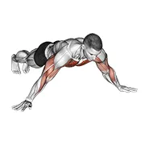 | [3294](../exercises/3294.json) | archer push up | body weight | pectorals |
| 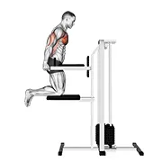 | [0009](../exercises/0009.json) | assisted chest dip (kneeling) | leverage machine | pectorals |
| 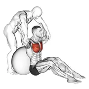 | [1716](../exercises/1716.json) | assisted seated pectoralis major stretch with stability ball | assisted | pectorals |
| 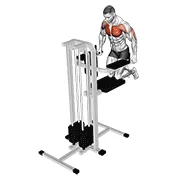 | [2364](../exercises/2364.json) | assisted wide-grip chest dip (kneeling) | leverage machine | pectorals |
| 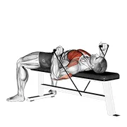 | [1254](../exercises/1254.json) | band bench press | band | pectorals |
| 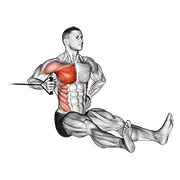 | [0989](../exercises/0989.json) | band one arm twisting chest press | band | pectorals |
| 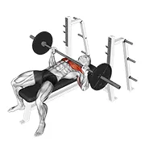 | [0025](../exercises/0025.json) | barbell bench press | barbell | pectorals |
| 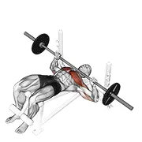 | [0033](../exercises/0033.json) | barbell decline bench press | barbell | pectorals |
| 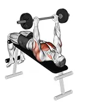 | [1255](../exercises/1255.json) | barbell decline pullover | barbell | pectorals |
| 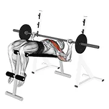 | [0036](../exercises/0036.json) | barbell decline wide-grip press | barbell | pectorals |
| 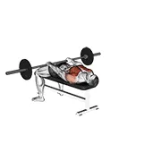 | [0040](../exercises/0040.json) | barbell front raise and pullover | barbell | pectorals |
| 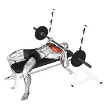 | [0045](../exercises/0045.json) | barbell guillotine bench press | barbell | pectorals |
| 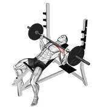 | [0047](../exercises/0047.json) | barbell incline bench press | barbell | pectorals |
| 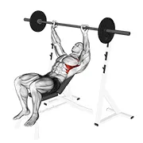 | [0050](../exercises/0050.json) | barbell incline shoulder raise | barbell | serratus anterior |
| 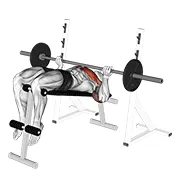 | [1256](../exercises/1256.json) | barbell reverse grip decline bench press | barbell | pectorals |
| 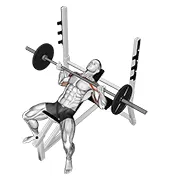 | [1257](../exercises/1257.json) | barbell reverse grip incline bench press | barbell | pectorals |
| 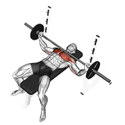 | [0122](../exercises/0122.json) | barbell wide bench press | barbell | pectorals |
| 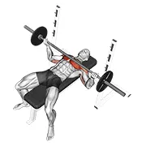 | [1258](../exercises/1258.json) | barbell wide reverse grip bench press | barbell | pectorals |
| 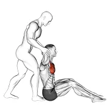 | [1259](../exercises/1259.json) | behind head chest stretch | assisted | pectorals |
| 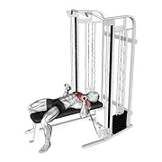 | [0151](../exercises/0151.json) | cable bench press | cable | pectorals |
| 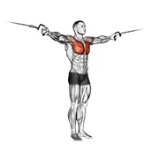 | [0155](../exercises/0155.json) | cable cross-over variation | cable | pectorals |
| 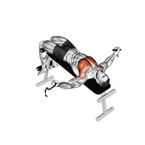 | [0158](../exercises/0158.json) | cable decline fly | cable | pectorals |
| 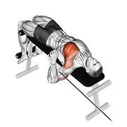 | [1260](../exercises/1260.json) | cable decline one arm press | cable | pectorals |
| 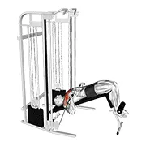 | [1261](../exercises/1261.json) | cable decline press | cable | pectorals |
| 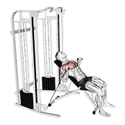 | [0169](../exercises/0169.json) | cable incline bench press | cable | pectorals |
| 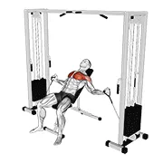 | [0171](../exercises/0171.json) | cable incline fly | cable | pectorals |
| 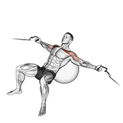 | [0170](../exercises/0170.json) | cable incline fly (on stability ball) | cable | pectorals |
| 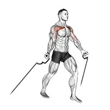 | [0179](../exercises/0179.json) | cable low fly | cable | pectorals |
| 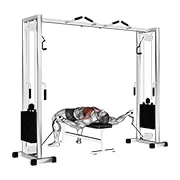 | [0185](../exercises/0185.json) | cable lying fly | cable | pectorals |
| 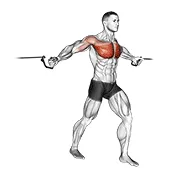 | [0188](../exercises/0188.json) | cable middle fly | cable | pectorals |
| 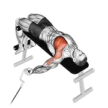 | [1262](../exercises/1262.json) | cable one arm decline chest fly | cable | pectorals |
| 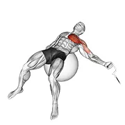 | [1263](../exercises/1263.json) | cable one arm fly on exercise ball | cable | pectorals |
| 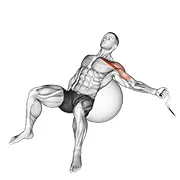 | [1264](../exercises/1264.json) | cable one arm incline fly on exercise ball | cable | pectorals |
| 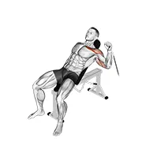 | [1265](../exercises/1265.json) | cable one arm incline press | cable | pectorals |
| 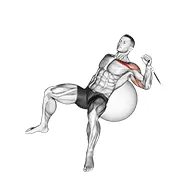 | [1266](../exercises/1266.json) | cable one arm incline press on exercise ball | cable | pectorals |
| 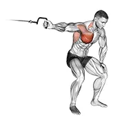 | [0191](../exercises/0191.json) | cable one arm lateral bent-over | cable | pectorals |
| 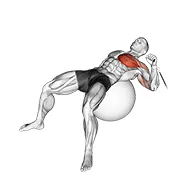 | [1267](../exercises/1267.json) | cable one arm press on exercise ball | cable | pectorals |
| 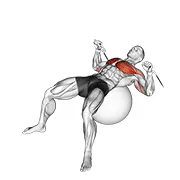 | [1268](../exercises/1268.json) | cable press on exercise ball | cable | pectorals |
| 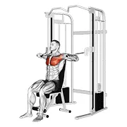 | [2144](../exercises/2144.json) | cable seated chest press | cable | pectorals |
| 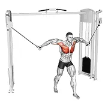 | [0227](../exercises/0227.json) | cable standing fly | cable | pectorals |
| 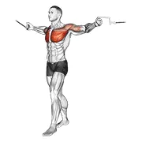 | [1269](../exercises/1269.json) | cable standing up straight crossovers | cable | pectorals |
| 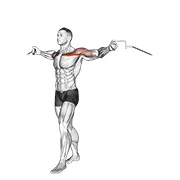 | [1270](../exercises/1270.json) | cable upper chest crossovers | cable | pectorals |
| 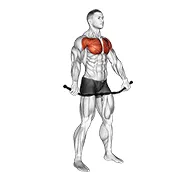 | [1271](../exercises/1271.json) | chest and front of shoulder stretch | body weight | pectorals |
| 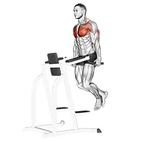 | [0251](../exercises/0251.json) | chest dip | body weight | pectorals |
| 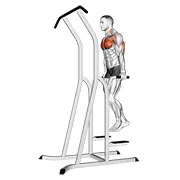 | [1430](../exercises/1430.json) | chest dip (on dip-pull-up cage) | body weight | pectorals |
| 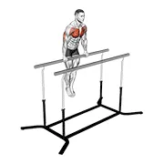 | [2462](../exercises/2462.json) | chest dip on straight bar | body weight | pectorals |
| 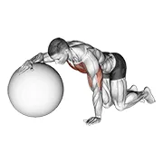 | [1272](../exercises/1272.json) | chest stretch with exercise ball | stability ball | pectorals |
| 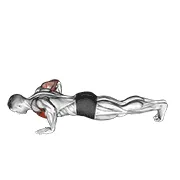 | [3216](../exercises/3216.json) | chest tap push-up (male) | body weight | pectorals |
| 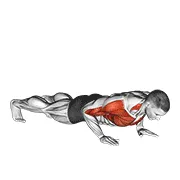 | [1273](../exercises/1273.json) | clap push up | body weight | pectorals |
| 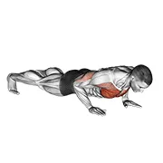 | [0258](../exercises/0258.json) | clock push-up | body weight | pectorals |
|  | [0279](../exercises/0279.json) | decline push-up | body weight | pectorals |
|  | [1274](../exercises/1274.json) | deep push up | dumbbell | pectorals |
|  | [1275](../exercises/1275.json) | drop push up | body weight | pectorals |
|  | [0288](../exercises/0288.json) | dumbbell around pullover | dumbbell | pectorals |
|  | [0289](../exercises/0289.json) | dumbbell bench press | dumbbell | pectorals |
|  | [0301](../exercises/0301.json) | dumbbell decline bench press | dumbbell | pectorals |
|  | [0302](../exercises/0302.json) | dumbbell decline fly | dumbbell | pectorals |
|  | [0303](../exercises/0303.json) | dumbbell decline hammer press | dumbbell | pectorals |
|  | [1276](../exercises/1276.json) | dumbbell decline one arm fly | dumbbell | pectorals |
|  | [0307](../exercises/0307.json) | dumbbell decline twist fly | dumbbell | pectorals |
|  | [0308](../exercises/0308.json) | dumbbell fly | dumbbell | pectorals |
|  | [1277](../exercises/1277.json) | dumbbell fly on exercise ball | dumbbell | pectorals |
|  | [3545](../exercises/3545.json) | dumbbell incline alternate press | dumbbell | pectorals |
|  | [0314](../exercises/0314.json) | dumbbell incline bench press | dumbbell | pectorals |
|  | [0316](../exercises/0316.json) | dumbbell incline breeding | dumbbell | pectorals |
|  | [0319](../exercises/0319.json) | dumbbell incline fly | dumbbell | pectorals |
|  | [1278](../exercises/1278.json) | dumbbell incline fly on exercise ball | dumbbell | pectorals |
|  | [0321](../exercises/0321.json) | dumbbell incline hammer press | dumbbell | pectorals |
|  | [1279](../exercises/1279.json) | dumbbell incline one arm fly | dumbbell | pectorals |
|  | [1280](../exercises/1280.json) | dumbbell incline one arm fly on exercise ball | dumbbell | pectorals |
|  | [1281](../exercises/1281.json) | dumbbell incline one arm press | dumbbell | pectorals |
|  | [1282](../exercises/1282.json) | dumbbell incline one arm press on exercise ball | dumbbell | pectorals |
|  | [0324](../exercises/0324.json) | dumbbell incline palm-in press | dumbbell | pectorals |
|  | [1283](../exercises/1283.json) | dumbbell incline press on exercise ball | dumbbell | pectorals |
|  | [0328](../exercises/0328.json) | dumbbell incline shoulder raise | dumbbell | serratus anterior |
|  | [0331](../exercises/0331.json) | dumbbell incline twisted flyes | dumbbell | pectorals |
|  | [0340](../exercises/0340.json) | dumbbell lying hammer press | dumbbell | pectorals |
|  | [0343](../exercises/0343.json) | dumbbell lying one arm press | dumbbell | pectorals |
|  | [0342](../exercises/0342.json) | dumbbell lying one arm press v. 2 | dumbbell | pectorals |
|  | [1284](../exercises/1284.json) | dumbbell lying pullover on exercise ball | dumbbell | pectorals |
|  | [1285](../exercises/1285.json) | dumbbell one arm bench fly | dumbbell | pectorals |
|  | [1286](../exercises/1286.json) | dumbbell one arm chest fly on exercise ball | dumbbell | pectorals |
|  | [1287](../exercises/1287.json) | dumbbell one arm decline chest press | dumbbell | pectorals |
|  | [1288](../exercises/1288.json) | dumbbell one arm fly on exercise ball | dumbbell | pectorals |
|  | [1289](../exercises/1289.json) | dumbbell one arm incline chest press | dumbbell | pectorals |
|  | [1290](../exercises/1290.json) | dumbbell one arm press on exercise ball | dumbbell | pectorals |
|  | [1291](../exercises/1291.json) | dumbbell one arm pullover on exercise ball | dumbbell | pectorals |
|  | [1622](../exercises/1622.json) | dumbbell one arm reverse grip press | dumbbell | pectorals |
|  | [1292](../exercises/1292.json) | dumbbell one leg fly on exercise ball | dumbbell | pectorals |
|  | [1293](../exercises/1293.json) | dumbbell press on exercise ball | dumbbell | pectorals |
|  | [0375](../exercises/0375.json) | dumbbell pullover | dumbbell | pectorals |
|  | [1294](../exercises/1294.json) | dumbbell pullover hip extension on exercise ball | dumbbell | pectorals |
|  | [1295](../exercises/1295.json) | dumbbell pullover on exercise ball | dumbbell | pectorals |
|  | [1624](../exercises/1624.json) | dumbbell reverse bench press | dumbbell | pectorals |
|  | [0433](../exercises/0433.json) | dumbbell straight arm pullover | dumbbell | pectorals |
|  | [1167](../exercises/1167.json) | dynamic chest stretch (male) | body weight | pectorals |
|  | [1296](../exercises/1296.json) | exercise ball pike push up | stability ball | pectorals |
|  | [0458](../exercises/0458.json) | floor fly (with barbell) | barbell | pectorals |
|  | [3327](../exercises/3327.json) | full planche push-up | body weight | pectorals |
|  | [2139](../exercises/2139.json) | hands bike | upper body ergometer | pectorals |
|  | [3234](../exercises/3234.json) | hyght dumbbell fly | dumbbell | pectorals |
|  | [0492](../exercises/0492.json) | incline push up depth jump | body weight | pectorals |
|  | [0493](../exercises/0493.json) | incline push-up | body weight | pectorals |
|  | [3785](../exercises/3785.json) | incline push-up (on box) | body weight | pectorals |
|  | [0494](../exercises/0494.json) | incline reverse grip push-up | body weight | pectorals |
|  | [3011](../exercises/3011.json) | incline scapula push up | body weight | serratus anterior |
|  | [1297](../exercises/1297.json) | isometric chest squeeze | body weight | pectorals |
|  | [0500](../exercises/0500.json) | isometric wipers | body weight | pectorals |
|  | [0519](../exercises/0519.json) | kettlebell alternating press on floor | kettlebell | pectorals |
|  | [0531](../exercises/0531.json) | kettlebell extended range one arm press on floor | kettlebell | pectorals |
|  | [1298](../exercises/1298.json) | kettlebell one arm floor press | kettlebell | pectorals |
|  | [0545](../exercises/0545.json) | kettlebell plyo push-up | kettlebell | pectorals |
|  | [3211](../exercises/3211.json) | kneeling push-up (male) | body weight | pectorals |
|  | [3288](../exercises/3288.json) | korean dips | body weight | pectorals |
|  | [0576](../exercises/0576.json) | lever chest press | leverage machine | pectorals |
|  | [0577](../exercises/0577.json) | lever chest press | leverage machine | pectorals |
|  | [1300](../exercises/1300.json) | lever decline chest press | leverage machine | pectorals |
|  | [1299](../exercises/1299.json) | lever incline chest press | leverage machine | pectorals |
|  | [1479](../exercises/1479.json) | lever incline chest press v. 2 | leverage machine | pectorals |
|  | [0596](../exercises/0596.json) | lever seated fly | leverage machine | pectorals |
|  | [3758](../exercises/3758.json) | lever standing chest press | leverage machine | pectorals |
|  | [1301](../exercises/1301.json) | machine inner chest press | leverage machine | pectorals |
|  | [1302](../exercises/1302.json) | medicine ball chest pass | medicine ball | pectorals |
|  | [1303](../exercises/1303.json) | medicine ball chest push from 3 point stance | medicine ball | pectorals |
|  | [1304](../exercises/1304.json) | medicine ball chest push multiple response | medicine ball | pectorals |
|  | [1305](../exercises/1305.json) | medicine ball chest push single response | medicine ball | pectorals |
|  | [1312](../exercises/1312.json) | medicine ball chest push with run release | medicine ball | pectorals |
|  | [3217](../exercises/3217.json) | modified hindu push-up (male) | body weight | pectorals |
|  | [1306](../exercises/1306.json) | plyo push up | body weight | pectorals |
|  | [1689](../exercises/1689.json) | push and pull bodyweight | body weight | pectorals |
|  | [1307](../exercises/1307.json) | push up on bosu ball | bosu ball | pectorals |
|  | [0662](../exercises/0662.json) | push-up | body weight | pectorals |
|  | [0653](../exercises/0653.json) | push-up (bosu ball) | bosu ball | pectorals |
|  | [0655](../exercises/0655.json) | push-up (on stability ball) | stability ball | pectorals |
|  | [0656](../exercises/0656.json) | push-up (on stability ball) | stability ball | pectorals |
|  | [0659](../exercises/0659.json) | push-up (wall) | body weight | pectorals |
|  | [0658](../exercises/0658.json) | push-up (wall) v. 2 | body weight | pectorals |
|  | [0663](../exercises/0663.json) | push-up medicine ball | medicine ball | pectorals |
|  | [3145](../exercises/3145.json) | push-up plus | body weight | pectorals |
|  | [0666](../exercises/0666.json) | raise single arm push-up | body weight | pectorals |
|  | [3124](../exercises/3124.json) | resistance band seated chest press | resistance band | pectorals |
|  | [2203](../exercises/2203.json) | roller seated shoulder flexor depresor retractor | roller | pectorals |
|  | [2209](../exercises/2209.json) | roller seated single leg shoulder flexor depresor retractor | roller | pectorals |
|  | [3021](../exercises/3021.json) | scapula push-up | body weight | serratus anterior |
|  | [0699](../exercises/0699.json) | shoulder tap push-up | body weight | pectorals |
|  | [0725](../exercises/0725.json) | single arm push-up | body weight | pectorals |
|  | [0748](../exercises/0748.json) | smith bench press | smith machine | pectorals |
|  | [0753](../exercises/0753.json) | smith decline bench press | smith machine | pectorals |
|  | [0754](../exercises/0754.json) | smith decline reverse-grip press | smith machine | pectorals |
|  | [0757](../exercises/0757.json) | smith incline bench press | smith machine | pectorals |
|  | [0758](../exercises/0758.json) | smith incline reverse-grip press | smith machine | pectorals |
|  | [0759](../exercises/0759.json) | smith incline shoulder raises | smith machine | serratus anterior |
|  | [1626](../exercises/1626.json) | smith machine reverse decline close grip bench press | smith machine | pectorals |
|  | [0764](../exercises/0764.json) | smith reverse-grip press | smith machine | pectorals |
|  | [1308](../exercises/1308.json) | smith wide grip bench press | smith machine | pectorals |
|  | [1309](../exercises/1309.json) | smith wide grip decline bench press | smith machine | pectorals |
|  | [0803](../exercises/0803.json) | superman push-up | body weight | pectorals |
|  | [0806](../exercises/0806.json) | suspended push-up | body weight | pectorals |
|  | [1310](../exercises/1310.json) | weighted drop push up | weighted | pectorals |
|  | [3313](../exercises/3313.json) | weighted straight bar dip | weighted | pectorals |
|  | [0856](../exercises/0856.json) | weighted svend press | weighted | pectorals |
|  | [1311](../exercises/1311.json) | wide hand push up | body weight | pectorals |
|  | [2363](../exercises/2363.json) | wide-grip chest dip on high parallel bars | body weight | pectorals |
