# full body

Generated by `scripts/catalogue/build.mjs`, do not edit. Click an id to edit that exercise. Pictures © Gym visual, licensed for openGym only (see [NOTICE](../media/NOTICE.md)).

| | id | name | equipment | target |
|---|---|---|---|---|
| 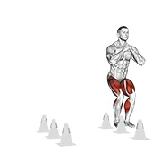 | [5965](../exercises/5965.json) | 1 2 stick drill | body weight | cardiovascular system |
| 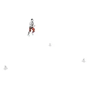 | [5984](../exercises/5984.json) | 123 back drill | body weight | cardiovascular system |
| 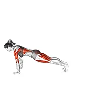 | [5887](../exercises/5887.json) | 3 leg dog pose | body weight | hamstrings |
| 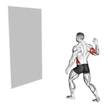 | [5967](../exercises/5967.json) | agility ball drill | body weight | cardiovascular system |
| 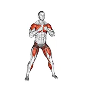 | [4437](../exercises/4437.json) | alternating hamstring curl with punches | body weight | hamstrings |
| 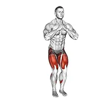 | [4436](../exercises/4436.json) | alternating step out | body weight | cardiovascular system |
| 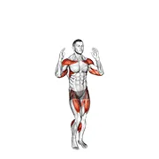 | [6014](../exercises/6014.json) | arm raise step in place | body weight | cardiovascular system |
| 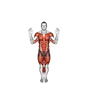 | [6097](../exercises/6097.json) | back kick overhead press | body weight | delts |
| 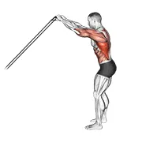 | [3779](../exercises/3779.json) | band skier | band | lats |
| 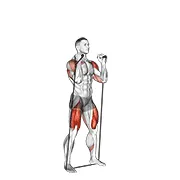 | [2970](../exercises/2970.json) | band thruster | band | quads |
| 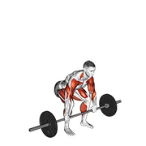 | [5122](../exercises/5122.json) | barbell clean and jerk | olympic barbell | traps |
| 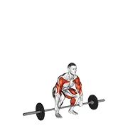 | [5190](../exercises/5190.json) | barbell clean and jerk v. 2 | olympic barbell | quads |
| 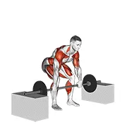 | [1516](../exercises/1516.json) | barbell clean from blocks | barbell | glutes |
| 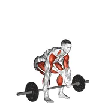 | [1517](../exercises/1517.json) | barbell clean pull | barbell | glutes |
| 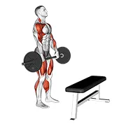 | [3328](../exercises/3328.json) | barbell complex stiff leg deadlift clean step | barbell | glutes |
| 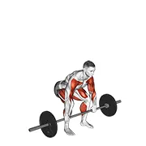 | [5287](../exercises/5287.json) | barbell full clean | barbell | quads |
| 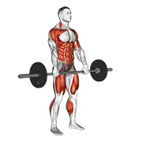 | [1520](../exercises/1520.json) | barbell hang clean | barbell | glutes |
| 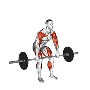 | [1521](../exercises/1521.json) | barbell hang clean below the knees | barbell | glutes |
| 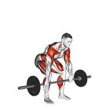 | [3183](../exercises/3183.json) | barbell hang clean below the knees v. 2 | olympic barbell | glutes |
| 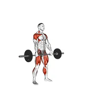 | [1522](../exercises/1522.json) | barbell hang snatch | barbell | glutes |
| 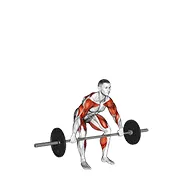 | [1523](../exercises/1523.json) | barbell hang snatch below the knees | barbell | glutes |
| 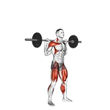 | [1524](../exercises/1524.json) | barbell heaving snatch balance | barbell | quads |
| 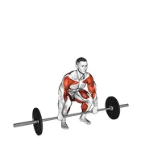 | [5075](../exercises/5075.json) | barbell muscle clean | olympic barbell | traps |
| 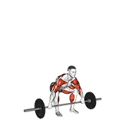 | [1526](../exercises/1526.json) | barbell muscle snatch | barbell | traps |
| 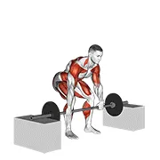 | [1528](../exercises/1528.json) | barbell power clean from blocks | barbell | glutes |
| 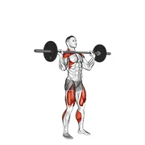 | [1529](../exercises/1529.json) | barbell power jerk | barbell | delts |
|  | [1530](../exercises/1530.json) | barbell power snatch | barbell | glutes |
| 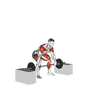 | [1531](../exercises/1531.json) | barbell power snatch from blocks | barbell | glutes |
| 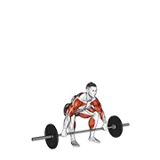 | [1533](../exercises/1533.json) | barbell snatch | barbell | glutes |
| 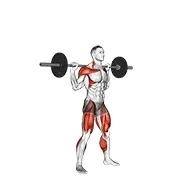 | [1534](../exercises/1534.json) | barbell snatch balance | barbell | quads |
| 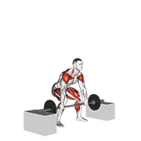 | [1536](../exercises/1536.json) | barbell snatch from blocks | barbell | glutes |
| 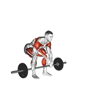 | [1537](../exercises/1537.json) | barbell split clean | barbell | glutes |
| 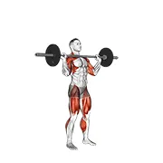 | [1538](../exercises/1538.json) | barbell split jerk | barbell | delts |
| 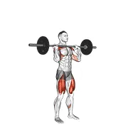 | [1540](../exercises/1540.json) | barbell squat to shoulder press | barbell | quads |
| 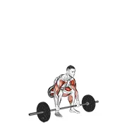 | [3316](../exercises/3316.json) | barbell weightlifting complex | barbell | cardiovascular system |
| 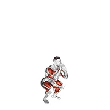 | [4709](../exercises/4709.json) | basketball shot jump | body weight | quads |
| 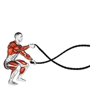 | [3370](../exercises/3370.json) | battling ropes alternate arms jump squat | rope | cardiovascular system |
| 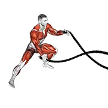 | [3372](../exercises/3372.json) | battling ropes alternate arms side lunge | rope | cardiovascular system |
| 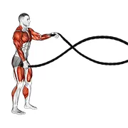 | [3369](../exercises/3369.json) | battling ropes alternate arms squat | rope | cardiovascular system |
| 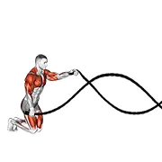 | [4131](../exercises/4131.json) | battling ropes alternating waves with kneeling get up | rope | cardiovascular system |
| 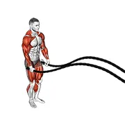 | [3376](../exercises/3376.json) | battling ropes jumping jack | rope | cardiovascular system |
| 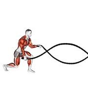 | [3378](../exercises/3378.json) | battling ropes split jump | rope | cardiovascular system |
| 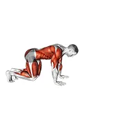 | [6599](../exercises/6599.json) | bear crawl low hip | body weight | cardiovascular system |
| 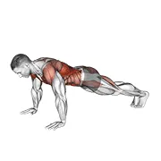 | [4500](../exercises/4500.json) | bodyweight front plank to downward dog | body weight | abs |
| 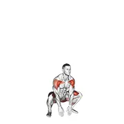 | [4499](../exercises/4499.json) | bodyweight full squat with overhead press | body weight | quads |
| 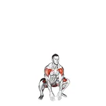 | [4703](../exercises/4703.json) | bodyweight full squat with overhead press (version 2) | body weight | quads |
| 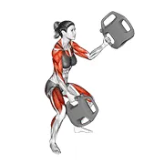 | [6056](../exercises/6056.json) | bottle weighted squatting alternate waves | weighted | quads |
| 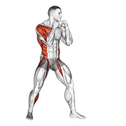 | [3171](../exercises/3171.json) | boxing right hook | body weight | delts |
| 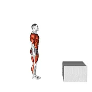 | [8704](../exercises/8704.json) | burpee jump box | body weight | cardiovascular system |
| 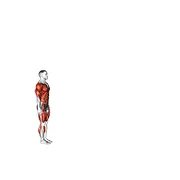 | [5187](../exercises/5187.json) | burpee long jump with push up | body weight | cardiovascular system |
| 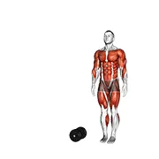 | [10182](../exercises/10182.json) | burpee over the dumbbell | dumbbell | cardiovascular system |
|  | [10193](../exercises/10193.json) | burpee power sled push | sled machine | cardiovascular system |
|  | [5337](../exercises/5337.json) | burpee push up mountain climber complex | body weight | cardiovascular system |
|  | [4548](../exercises/4548.json) | burpee squat | body weight | cardiovascular system |
|  | [5968](../exercises/5968.json) | burpee twist | body weight | cardiovascular system |
|  | [3457](../exercises/3457.json) | burpee with push up | body weight | cardiovascular system |
|  | [6010](../exercises/6010.json) | celebratory knee drives | body weight | quads |
|  | [5192](../exercises/5192.json) | cluster | barbell | quads |
|  | [5986](../exercises/5986.json) | cone drill | body weight | cardiovascular system |
|  | [5889](../exercises/5889.json) | corpse pose savasana | body weight | spine |
|  | [5881](../exercises/5881.json) | crab walk | body weight | glutes |
|  | [0946](../exercises/0946.json) | crane pose bakasana | body weight | forearms |
|  | [3950](../exercises/3950.json) | crawl to crab | body weight | abs |
|  | [4711](../exercises/4711.json) | criss cross jack | body weight | cardiovascular system |
|  | [11283](../exercises/11283.json) | criss cross tuck jump | body weight | cardiovascular system |
|  | [5233](../exercises/5233.json) | cross body punch in squat position | body weight | quads |
|  | [0948](../exercises/0948.json) | default pose | body weight | spine |
|  | [4824](../exercises/4824.json) | diagonal punch | body weight | delts |
|  | [7499](../exercises/7499.json) | double plank jack to 4 mountain climber | body weight | cardiovascular system |
|  | [3469](../exercises/3469.json) | downward facing dog | body weight | hamstrings |
|  | [0949](../exercises/0949.json) | downward facing dog adho mukha svanasana | body weight | hamstrings |
|  | [3527](../exercises/3527.json) | downward facing dog toe touch | body weight | hamstrings |
|  | [9693](../exercises/9693.json) | dumbbell alternating arm thruster | dumbbell | quads |
|  | [3400](../exercises/3400.json) | dumbbell clean and press | dumbbell | delts |
|  | [3886](../exercises/3886.json) | dumbbell complex push up row clean and press | dumbbell | cardiovascular system |
|  | [4736](../exercises/4736.json) | dumbbell deep push up and renegade row | dumbbell | pectorals |
|  | [4164](../exercises/4164.json) | dumbbell devils press | dumbbell | delts |
|  | [4738](../exercises/4738.json) | dumbbell goblet squat and biceps curl | dumbbell | quads |
|  | [4449](../exercises/4449.json) | dumbbell hang clean | dumbbell | glutes |
|  | [4377](../exercises/4377.json) | dumbbell hang clean and jerk | dumbbell | glutes |
|  | [4740](../exercises/4740.json) | dumbbell hang power clean and jerk | dumbbell | glutes |
|  | [10044](../exercises/10044.json) | dumbbell hang snatch | dumbbell | glutes |
|  | [1553](../exercises/1553.json) | dumbbell lateral lunge with bicep curl | dumbbell | quads |
|  | [6152](../exercises/6152.json) | dumbbell one arm snatch (left) | dumbbell | glutes |
|  | [4540](../exercises/4540.json) | dumbbell one arm thruster | dumbbell | quads |
|  | [4889](../exercises/4889.json) | dumbbell power clean | dumbbell | glutes |
|  | [4439](../exercises/4439.json) | dumbbell power clean and jerk | dumbbell | glutes |
|  | [4822](../exercises/4822.json) | dumbbell rdl to jump shrug | dumbbell | glutes |
|  | [4629](../exercises/4629.json) | dumbbell renegade row to squat | dumbbell | lats |
|  | [4753](../exercises/4753.json) | dumbbell side lunge with shoulder press | dumbbell | glutes |
|  | [5101](../exercises/5101.json) | dumbbell single power clean | dumbbell | glutes |
|  | [4564](../exercises/4564.json) | dumbbell squat lunges jump complex | dumbbell | quads |
|  | [5066](../exercises/5066.json) | dumbbell squat to overhead press | dumbbell | quads |
|  | [4758](../exercises/4758.json) | dumbbell step back lunge and row | dumbbell | quads |
|  | [2968](../exercises/2968.json) | dumbbell thruster | dumbbell | quads |
|  | [2969](../exercises/2969.json) | dumbbell thruster v. 2 | dumbbell | quads |
|  | [5989](../exercises/5989.json) | figure run | body weight | cardiovascular system |
|  | [10995](../exercises/10995.json) | forward and backward crab walk | body weight | abs |
|  | [3703](../exercises/3703.json) | frogger | body weight | cardiovascular system |
|  | [6013](../exercises/6013.json) | front leg kick | body weight | hamstrings |
|  | [5982](../exercises/5982.json) | half sun salutation | body weight | spine |
|  | [5970](../exercises/5970.json) | heel to toe walk | body weight | calves |
|  | [5990](../exercises/5990.json) | high hurdle jump to sprint and cut | body weight | quads |
|  | [5598](../exercises/5598.json) | inchworm and mountain climbers | body weight | cardiovascular system |
|  | [7619](../exercises/7619.json) | jack burpee v. 2 | body weight | cardiovascular system |
|  | [3970](../exercises/3970.json) | jack burpee with push up | body weight | cardiovascular system |
|  | [4438](../exercises/4438.json) | jack step | body weight | cardiovascular system |
|  | [0510](../exercises/0510.json) | jump lunge to feet jack | body weight | cardiovascular system |
|  | [4706](../exercises/4706.json) | jump step jump | body weight | cardiovascular system |
|  | [5966](../exercises/5966.json) | jump twist | body weight | quads |
|  | [10187](../exercises/10187.json) | jump up side jump | body weight | quads |
|  | [9692](../exercises/9692.json) | kettlebell alternating arm thruster | kettlebell | quads |
|  | [4230](../exercises/4230.json) | kettlebell bottoms up to knee turkish get up | kettlebell | abs |
|  | [3864](../exercises/3864.json) | kettlebell burpee | kettlebell | cardiovascular system |
|  | [4542](../exercises/4542.json) | kettlebell clean and jerk | kettlebell | delts |
|  | [1565](../exercises/1565.json) | kettlebell dead clean | kettlebell | glutes |
|  | [3579](../exercises/3579.json) | kettlebell deck squat | kettlebell | quads |
|  | [3576](../exercises/3576.json) | kettlebell farmers carry | kettlebell | forearms |
|  | [4528](../exercises/4528.json) | kettlebell farmers walk | kettlebell | forearms |
|  | [4533](../exercises/4533.json) | kettlebell forward lunge and press | kettlebell | quads |
|  | [3323](../exercises/3323.json) | kettlebell half turkish get up | kettlebell | abs |
|  | [3577](../exercises/3577.json) | kettlebell lunge clean and press | kettlebell | quads |
|  | [4543](../exercises/4543.json) | kettlebell one arm clean | kettlebell | glutes |
|  | [1568](../exercises/1568.json) | kettlebell one arm swing | kettlebell | glutes |
|  | [4541](../exercises/4541.json) | kettlebell one arm thruster | kettlebell | quads |
|  | [1567](../exercises/1567.json) | kettlebell open palm clean | kettlebell | glutes |
|  | [4244](../exercises/4244.json) | kettlebell overhead carry | kettlebell | delts |
|  | [4530](../exercises/4530.json) | kettlebell single arm clean | kettlebell | glutes |
|  | [4531](../exercises/4531.json) | kettlebell single arm clean and press | kettlebell | delts |
|  | [4518](../exercises/4518.json) | kettlebell single arm thruster | kettlebell | quads |
|  | [4532](../exercises/4532.json) | kettlebell snatch | kettlebell | glutes |
|  | [4132](../exercises/4132.json) | kettlebell sumo deadlift with high pull | kettlebell | glutes |
|  | [5335](../exercises/5335.json) | kettlebell swing clean grip front squat overhead press | kettlebell | glutes |
|  | [7548](../exercises/7548.json) | kettlebell swing to goblet squat | kettlebell | glutes |
|  | [4057](../exercises/4057.json) | kettlebell turkish get up to hand | kettlebell | delts |
|  | [5099](../exercises/5099.json) | kettlebell unilateral farmers walk | kettlebell | forearms |
|  | [2929](../exercises/2929.json) | kneeling battling ropes | rope | delts |
|  | [5971](../exercises/5971.json) | l drill | body weight | cardiovascular system |
|  | [5972](../exercises/5972.json) | ladder drill | body weight | cardiovascular system |
|  | [2976](../exercises/2976.json) | landmine squat and press | landmine | quads |
|  | [3529](../exercises/3529.json) | landmine stand up high knee | landmine | quads |
|  | [5973](../exercises/5973.json) | lateral ladder drill | body weight | abductors |
|  | [5885](../exercises/5885.json) | lotus pose breathing | body weight | spine |
|  | [0611](../exercises/0611.json) | lunge push up | body weight | pectorals |
|  | [1798](../exercises/1798.json) | lying whole body stretch | body weight | lats |
|  | [10109](../exercises/10109.json) | medicine ball backward overhead toss | medicine ball | glutes |
|  | [3439](../exercises/3439.json) | medicine ball backward throw | medicine ball | glutes |
|  | [10118](../exercises/10118.json) | medicine ball overhead slam circle | medicine ball | abs |
|  | [4243](../exercises/4243.json) | medicine ball overhead throw | medicine ball | abs |
|  | [10108](../exercises/10108.json) | medicine ball overhead toss | medicine ball | abs |
|  | [4383](../exercises/4383.json) | medicine ball step behind rotational throw | medicine ball | abs |
|  | [5894](../exercises/5894.json) | meditation | body weight | spine |
|  | [5895](../exercises/5895.json) | mindful breathing meditation | body weight | spine |
|  | [9048](../exercises/9048.json) | mountain climber cross kick | body weight | abs |
|  | [0629](../exercises/0629.json) | mountain climber lunge | body weight | cardiovascular system |
|  | [5896](../exercises/5896.json) | mountain pose | body weight | spine |
|  | [2814](../exercises/2814.json) | one arm twisted clean and press | dumbbell | delts |
|  | [5991](../exercises/5991.json) | partner shuffle | body weight | abductors |
|  | [2792](../exercises/2792.json) | plank jump | body weight | cardiovascular system |
|  | [10326](../exercises/10326.json) | plank jump in squat | body weight | quads |
|  | [2961](../exercises/2961.json) | plank push up row | dumbbell | lats |
|  | [2793](../exercises/2793.json) | plank walk up | body weight | abs |
|  | [5974](../exercises/5974.json) | plyometric agility drill | body weight | cardiovascular system |
|  | [5188](../exercises/5188.json) | power clean thruster | barbell | quads |
|  | [5143](../exercises/5143.json) | power sled drag | sled machine | hamstrings |
|  | [4428](../exercises/4428.json) | power sled push | sled machine | quads |
|  | [6027](../exercises/6027.json) | punch step forward | body weight | cardiovascular system |
|  | [2933](../exercises/2933.json) | rear lunge with battling ropes | rope | quads |
|  | [3795](../exercises/3795.json) | resistance band skier | resistance band | lats |
|  | [2943](../exercises/2943.json) | resistance band spider crawls | resistance band | pectorals |
|  | [3965](../exercises/3965.json) | side bear crawl | body weight | quads |
|  | [3153](../exercises/3153.json) | side kick burpee | body weight | cardiovascular system |
|  | [5680](../exercises/5680.json) | side mountain climber | body weight | cardiovascular system |
|  | [8916](../exercises/8916.json) | side to side hop v. 2 | body weight | cardiovascular system |
|  | [5039](../exercises/5039.json) | silent burpee | body weight | cardiovascular system |
|  | [5975](../exercises/5975.json) | single leg balance cross punch | body weight | abs |
|  | [5142](../exercises/5142.json) | smith hang clean | smith machine | traps |
|  | [0785](../exercises/0785.json) | squat jacks | body weight | cardiovascular system |
|  | [3705](../exercises/3705.json) | squat thrust | body weight | cardiovascular system |
|  | [3673](../exercises/3673.json) | standing pose (form check) front view | body weight | spine |
|  | [3674](../exercises/3674.json) | standing pose (form check) side view | body weight | spine |
|  | [4328](../exercises/4328.json) | standing scissors | body weight | cardiovascular system |
|  | [3659](../exercises/3659.json) | static position standing | body weight | spine |
|  | [2733](../exercises/2733.json) | strongman apollons axle | barbell | forearms |
|  | [2724](../exercises/2724.json) | strongman atlas stones | weight plate | glutes |
|  | [2734](../exercises/2734.json) | strongman barbell farmers walk | barbell | forearms |
|  | [3317](../exercises/3317.json) | strongman car flip | weighted | glutes |
|  | [2716](../exercises/2716.json) | strongman circle of conan | weight plate | spine |
|  | [2732](../exercises/2732.json) | strongman dumbbell one arm clean and jerk | dumbbell | delts |
|  | [3306](../exercises/3306.json) | strongman fingal's fingers | body weight | forearms |
|  | [2726](../exercises/2726.json) | strongman hercules hold | weight plate | forearms |
|  | [2722](../exercises/2722.json) | strongman hood stones | weight plate | glutes |
|  | [2714](../exercises/2714.json) | strongman iceland cross | weight plate | delts |
|  | [3307](../exercises/3307.json) | strongman keg toss | weighted | glutes |
|  | [2721](../exercises/2721.json) | strongman loading | weight plate | glutes |
|  | [2707](../exercises/2707.json) | strongman log lift | weight plate | delts |
|  | [2708](../exercises/2708.json) | strongman mas wrestling | weight plate | forearms |
|  | [2725](../exercises/2725.json) | strongman power stairs | weight plate | quads |
|  | [2712](../exercises/2712.json) | strongman sandbag walk | sandbag | spine |
|  | [2727](../exercises/2727.json) | strongman shield carry | weight plate | spine |
|  | [2715](../exercises/2715.json) | strongman timber carry | weight plate | spine |
|  | [2730](../exercises/2730.json) | strongman tire flip | tire | glutes |
|  | [2710](../exercises/2710.json) | strongman truck pull | rope | quads |
|  | [2731](../exercises/2731.json) | strongman weight for height | weighted | upper back |
|  | [2723](../exercises/2723.json) | strongman wheelbarrow | weight plate | quads |
|  | [2735](../exercises/2735.json) | strongman yoke walk | barbell | traps |
|  | [5980](../exercises/5980.json) | sun salutation a | body weight | hamstrings |
|  | [5981](../exercises/5981.json) | sun salutation b | body weight | quads |
|  | [10050](../exercises/10050.json) | superman to push up | body weight | pectorals |
|  | [9704](../exercises/9704.json) | suspender headstand | suspension trainer | delts |
|  | [6944](../exercises/6944.json) | swimming crawl style | body weight | cardiovascular system |
|  | [5976](../exercises/5976.json) | t drill | body weight | cardiovascular system |
|  | [5977](../exercises/5977.json) | tight rope walk | body weight | calves |
|  | [2525](../exercises/2525.json) | vibrate plate standing | weighted | quads |
|  | [5983](../exercises/5983.json) | vinyasa | body weight | triceps |
|  | [2458](../exercises/2458.json) | wall ball | medicine ball | quads |
|  | [10676](../exercises/10676.json) | weighted backpack walking | weighted | quads |
|  | [5529](../exercises/5529.json) | weighted full squat with overhead press | weighted | quads |
|  | [10189](../exercises/10189.json) | weighted plate deadlift rear lunge with overhead press | weight plate | glutes |
|  | [10387](../exercises/10387.json) | weighted sandbag carry (bear hug) | sandbag | abs |
|  | [10386](../exercises/10386.json) | weighted sandbag carry (shoulders) | sandbag | traps |
|  | [10385](../exercises/10385.json) | weighted sandbag shouldering | sandbag | glutes |
|  | [4633](../exercises/4633.json) | world's greatest stretch | body weight | glutes |
|  | [5979](../exercises/5979.json) | x drill | body weight | cardiovascular system |
