# lower arms

Generated by `scripts/catalogue/build.mjs`, do not edit. Click an id to edit that exercise. Pictures © Gym visual, licensed for openGym only (see [NOTICE](../media/NOTICE.md)).

| | id | name | equipment | target |
|---|---|---|---|---|
| 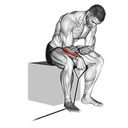 | [0994](../exercises/0994.json) | band reverse wrist curl | band | forearms |
| 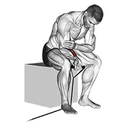 | [1016](../exercises/1016.json) | band wrist curl | band | forearms |
| 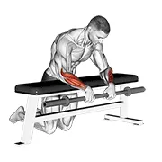 | [1411](../exercises/1411.json) | barbell palms down wrist curl over a bench | barbell | forearms |
| 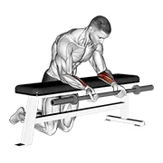 | [1412](../exercises/1412.json) | barbell palms up wrist curl over a bench | barbell | forearms |
| 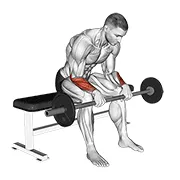 | [0079](../exercises/0079.json) | barbell revers wrist curl v. 2 | barbell | forearms |
| 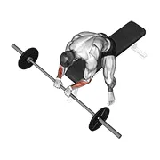 | [0082](../exercises/0082.json) | barbell reverse wrist curl | barbell | forearms |
| 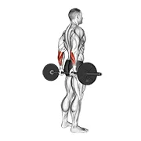 | [0104](../exercises/0104.json) | barbell standing back wrist curl | barbell | forearms |
| 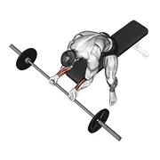 | [0126](../exercises/0126.json) | barbell wrist curl | barbell | forearms |
| 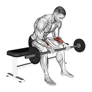 | [0125](../exercises/0125.json) | barbell wrist curl v. 2 | barbell | forearms |
| 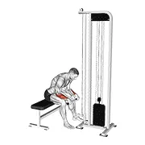 | [0210](../exercises/0210.json) | cable reverse wrist curl | cable | forearms |
| 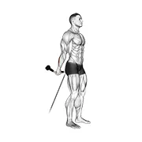 | [0224](../exercises/0224.json) | cable standing back wrist curl | cable | forearms |
| 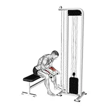 | [0247](../exercises/0247.json) | cable wrist curl | cable | forearms |
| 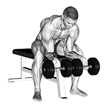 | [1437](../exercises/1437.json) | dumbbell finger curls | dumbbell | forearms |
| 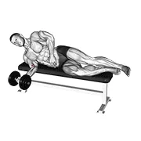 | [0347](../exercises/0347.json) | dumbbell lying pronation | dumbbell | forearms |
| 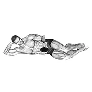 | [2705](../exercises/2705.json) | dumbbell lying pronation on floor | dumbbell | forearms |
| 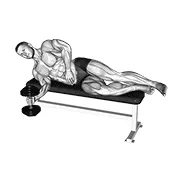 | [0349](../exercises/0349.json) | dumbbell lying supination | dumbbell | forearms |
| 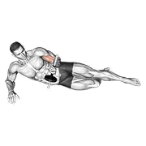 | [2706](../exercises/2706.json) | dumbbell lying supination on floor | dumbbell | forearms |
| 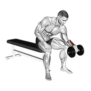 | [0358](../exercises/0358.json) | dumbbell one arm reverse wrist curl | dumbbell | forearms |
| 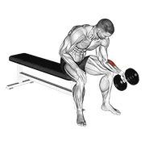 | [1415](../exercises/1415.json) | dumbbell one arm seated neutral wrist curl | dumbbell | forearms |
| 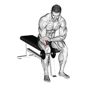 | [0364](../exercises/0364.json) | dumbbell one arm wrist curl | dumbbell | forearms |
| 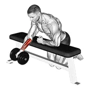 | [1441](../exercises/1441.json) | dumbbell over bench one arm reverse wrist curl | dumbbell | forearms |
| 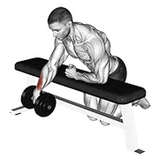 | [0367](../exercises/0367.json) | dumbbell over bench one arm wrist curl | dumbbell | forearms |
| 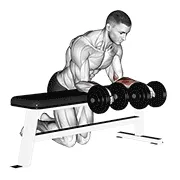 | [0368](../exercises/0368.json) | dumbbell over bench revers wrist curl | dumbbell | forearms |
| 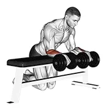 | [0369](../exercises/0369.json) | dumbbell over bench wrist curl | dumbbell | forearms |
| 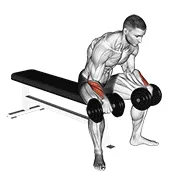 | [0385](../exercises/0385.json) | dumbbell reverse wrist curl | dumbbell | forearms |
| 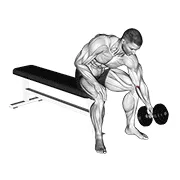 | [0399](../exercises/0399.json) | dumbbell seated one arm rotate | dumbbell | forearms |
| 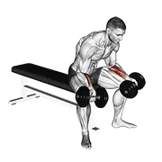 | [0401](../exercises/0401.json) | dumbbell seated palms up wrist curl | dumbbell | forearms |
| 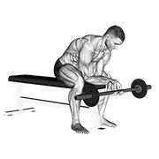 | [0455](../exercises/0455.json) | finger curls | barbell | forearms |
| 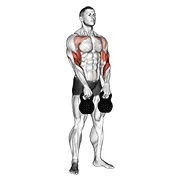 | [0518](../exercises/0518.json) | kettlebell alternating hang clean | kettlebell | forearms |
| 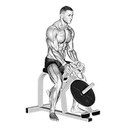 | [2288](../exercises/2288.json) | lever gripper hands | leverage machine | forearms |
| 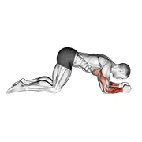 | [1421](../exercises/1421.json) | modified push up to lower arms | body weight | forearms |
| 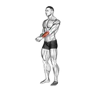 | [0721](../exercises/0721.json) | side wrist pull stretch | body weight | forearms |
| 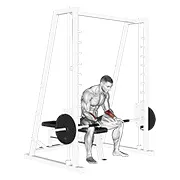 | [1426](../exercises/1426.json) | smith seated wrist curl | smith machine | forearms |
| 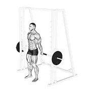 | [0771](../exercises/0771.json) | smith standing back wrist curl | smith machine | forearms |
| 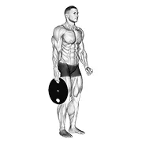 | [0854](../exercises/0854.json) | weighted standing hand squeeze | weighted | forearms |
| 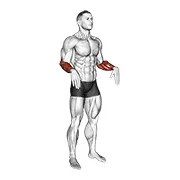 | [1428](../exercises/1428.json) | wrist circles | body weight | forearms |
| 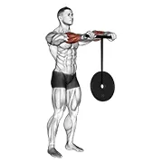 | [0859](../exercises/0859.json) | wrist rollerer | weighted | forearms |
