# lower legs

Generated by `scripts/catalogue/build.mjs`, do not edit. Click an id to edit that exercise. Pictures © Gym visual, licensed for openGym only (see [NOTICE](../media/NOTICE.md)).

| | id | name | equipment | target |
|---|---|---|---|---|
| 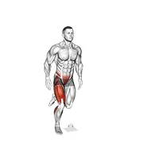 | [9066](../exercises/9066.json) | 4 way single leg hop | body weight | calves |
|  | [1368](../exercises/1368.json) | ankle circles | body weight | calves |
| 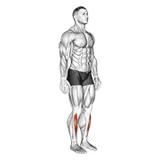 | [2761](../exercises/2761.json) | ankle dorsal flexion | body weight | calves |
| 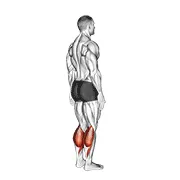 | [2762](../exercises/2762.json) | ankle plantar flexion | body weight | calves |
|  | [1708](../exercises/1708.json) | assisted lying calves stretch | assisted | calves |
| 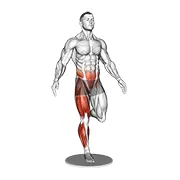 | [10733](../exercises/10733.json) | balance board single leg balance | body weight | calves |
| 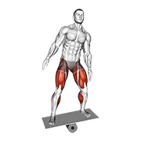 | [5302](../exercises/5302.json) | balance board v. 2 | body weight | calves |
| 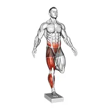 | [10734](../exercises/10734.json) | balance pad single leg balance | body weight | calves |
| 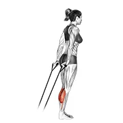 | [0894](../exercises/0894.json) | band calf raise | band | calves |
| 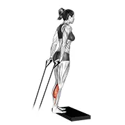 | [0973](../exercises/0973.json) | band calf raise v. 2 | band | calves |
| 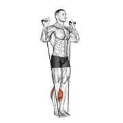 | [1505](../exercises/1505.json) | band calf raise v. 3 | band | calves |
|  | [0999](../exercises/0999.json) | band single leg calf raise | band | calves |
|  | [1000](../exercises/1000.json) | band single leg reverse calf raise | band | calves |
|  | [1369](../exercises/1369.json) | band two legs calf raise - (band under both legs) v. 2 | band | calves |
|  | [1370](../exercises/1370.json) | barbell floor calf raise | barbell | calves |
|  | [0088](../exercises/0088.json) | barbell seated calf raise | barbell | calves |
|  | [1371](../exercises/1371.json) | barbell seated calf raise | barbell | calves |
| 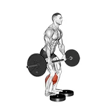 | [9410](../exercises/9410.json) | barbell standing bent knee calf raise from deficit | barbell | calves |
|  | [1372](../exercises/1372.json) | barbell standing calf raise | barbell | calves |
|  | [0108](../exercises/0108.json) | barbell standing leg calf raise | barbell | calves |
|  | [0111](../exercises/0111.json) | barbell standing rocking leg calf raise | barbell | calves |
| 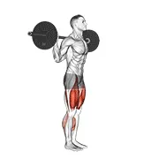 | [2990](../exercises/2990.json) | barbell walk calves activation | barbell | calves |
| 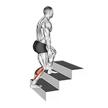 | [11649](../exercises/11649.json) | bent knee calves stretch | body weight | calves |
|  | [1373](../exercises/1373.json) | bodyweight standing calf raise | body weight | calves |
| 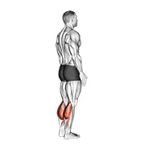 | [3534](../exercises/3534.json) | bodyweight standing pulse calf raise | body weight | calves |
| 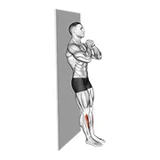 | [8536](../exercises/8536.json) | bodyweight tibialis raise wall supported | body weight | calves |
| 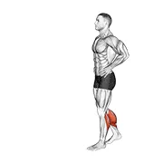 | [5700](../exercises/5700.json) | bodyweight walking calf raise | body weight | calves |
|  | [1374](../exercises/1374.json) | box jump down with one leg stabilization | body weight | calves |
| 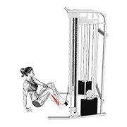 | [6745](../exercises/6745.json) | cable seated foot eversion | cable | calves |
| 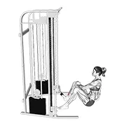 | [6746](../exercises/6746.json) | cable seated foot inversion | cable | calves |
|  | [1375](../exercises/1375.json) | cable standing calf raise | cable | calves |
|  | [1376](../exercises/1376.json) | cable standing one leg calf raise | cable | calves |
| 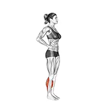 | [10756](../exercises/10756.json) | calf forward jump | body weight | calves |
| 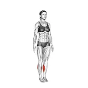 | [10751](../exercises/10751.json) | calf jump | body weight | calves |
|  | [1407](../exercises/1407.json) | calf push stretch with hands against wall | body weight | calves |
| 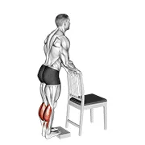 | [3390](../exercises/3390.json) | calf raise from deficit with chair supported | body weight | calves |
| 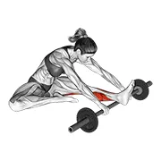 | [2992](../exercises/2992.json) | calf self massage with barbell | barbell | calves |
| 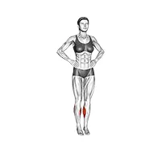 | [10757](../exercises/10757.json) | calf side to side jump | body weight | calves |
|  | [1377](../exercises/1377.json) | calf stretch with hands against wall | body weight | calves |
|  | [1378](../exercises/1378.json) | calf stretch with rope | rope | calves |
| 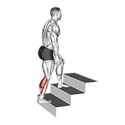 | [4510](../exercises/4510.json) | calves stretch | body weight | calves |
| 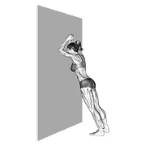 | [1848](../exercises/1848.json) | calves stretch static position | body weight | calves |
| 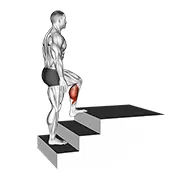 | [11452](../exercises/11452.json) | calves stretch v. 2 | body weight | calves |
|  | [0257](../exercises/0257.json) | circles knee stretch | body weight | calves |
| 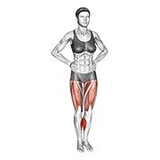 | [4278](../exercises/4278.json) | circles knee stretch v. 2 | body weight | calves |
| 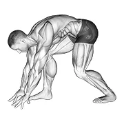 | [1890](../exercises/1890.json) | crouching heel back achilles stretch | body weight | calves |
| 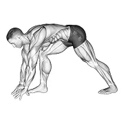 | [1930](../exercises/1930.json) | crouching heel back calf stretch | body weight | calves |
|  | [0284](../exercises/0284.json) | donkey calf raise | body weight | calves |
| 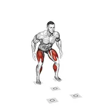 | [5969](../exercises/5969.json) | dot drill | body weight | calves |
| 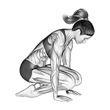 | [1960](../exercises/1960.json) | double kneeling shin stretch | body weight | calves |
|  | [1379](../exercises/1379.json) | dumbbell seated calf raise | dumbbell | calves |
|  | [0400](../exercises/0400.json) | dumbbell seated one leg calf raise | dumbbell | calves |
|  | [1380](../exercises/1380.json) | dumbbell seated one leg calf raise - hammer grip | dumbbell | calves |
|  | [1381](../exercises/1381.json) | dumbbell seated one leg calf raise - palm up | dumbbell | calves |
|  | [0409](../exercises/0409.json) | dumbbell single leg calf raise | dumbbell | calves |
| 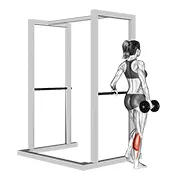 | [3973](../exercises/3973.json) | dumbbell single leg calf raise v. 2 | dumbbell | calves |
| 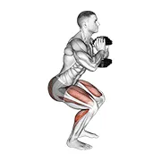 | [4563](../exercises/4563.json) | dumbbell squat hold calf raise | dumbbell | calves |
|  | [0417](../exercises/0417.json) | dumbbell standing calf raise | dumbbell | calves |
| 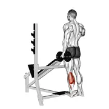 | [1178](../exercises/1178.json) | dumbbell standing single leg calf raise | dumbbell | calves |
| 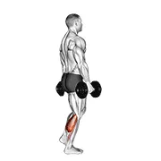 | [3713](../exercises/3713.json) | dumbbell standing single leg calf raise v. 2 | dumbbell | calves |
| 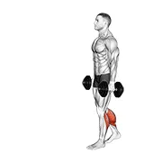 | [5698](../exercises/5698.json) | dumbbell walking calf raise | dumbbell | calves |
| 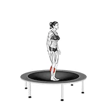 | [10890](../exercises/10890.json) | elastic bed toe jump | body weight | calves |
| 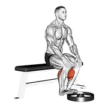 | [4900](../exercises/4900.json) | elevated seated calf raise | body weight | calves |
|  | [4760](../exercises/4760.json) | elevated standing calf raise | body weight | calves |
| 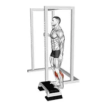 | [5009](../exercises/5009.json) | elevated standing calf raise v. 2 | body weight | calves |
| 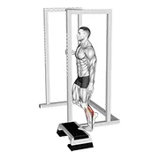 | [4761](../exercises/4761.json) | elevated standing single leg calf raise | body weight | calves |
|  | [1382](../exercises/1382.json) | exercise ball on the wall calf raise | dumbbell | calves |
|  | [3241](../exercises/3241.json) | exercise ball on the wall calf raise (tennis ball between ankles) | dumbbell | calves |
|  | [3240](../exercises/3240.json) | exercise ball on the wall calf raise (tennis ball between knees) | dumbbell | calves |
| 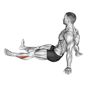 | [4283](../exercises/4283.json) | feet and ankles rotation stretch | body weight | calves |
| 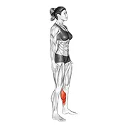 | [3245](../exercises/3245.json) | feet and ankles side to side stretch | body weight | calves |
| 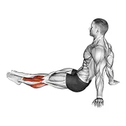 | [4282](../exercises/4282.json) | feet and ankles stretch | body weight | calves |
| 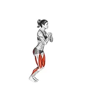 | [7543](../exercises/7543.json) | forward backward hop | body weight | calves |
| 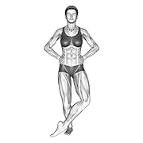 | [2101](../exercises/2101.json) | front cross over shin stretch | body weight | calves |
|  | [1383](../exercises/1383.json) | hack calf raise | sled machine | calves |
|  | [1384](../exercises/1384.json) | hack one leg calf raise | sled machine | calves |
| 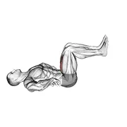 | [3872](../exercises/3872.json) | heel drops | body weight | calves |
| 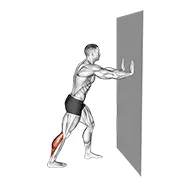 | [5059](../exercises/5059.json) | heel press | body weight | calves |
| 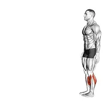 | [10294](../exercises/10294.json) | heel walk | body weight | calves |
| 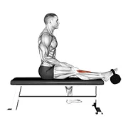 | [10367](../exercises/10367.json) | kettlebell sitting tibialis press | kettlebell | calves |
| 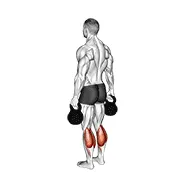 | [5854](../exercises/5854.json) | kettlebell standing calf raise | kettlebell | calves |
| 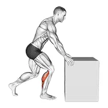 | [10563](../exercises/10563.json) | knee to box calf stretch | body weight | calves |
|  | [1892](../exercises/1892.json) | kneeling heel down achilles stretch | body weight | calves |
|  | [0565](../exercises/0565.json) | lateral speed step | body weight | calves |
|  | [2104](../exercises/2104.json) | leaning heel back achilles stretch | body weight | calves |
|  | [2289](../exercises/2289.json) | lever calf press | leverage machine | calves |
|  | [1220](../exercises/1220.json) | lever calf raise (bench press machine) | leverage machine | calves |
|  | [1447](../exercises/1447.json) | lever calf stretch (plate loaded) | leverage machine | calves |
|  | [1253](../exercises/1253.json) | lever donkey calf raise | leverage machine | calves |
|  | [2315](../exercises/2315.json) | lever rotary calf | leverage machine | calves |
|  | [2335](../exercises/2335.json) | lever seated calf press | leverage machine | calves |
|  | [7176](../exercises/7176.json) | lever seated calf press v. 2 | leverage machine | calves |
|  | [0594](../exercises/0594.json) | lever seated calf raise | leverage machine | calves |
|  | [2666](../exercises/2666.json) | lever seated calf raise (plate loaded) v. 2 | leverage machine | calves |
|  | [1216](../exercises/1216.json) | lever seated one leg calf raise | leverage machine | calves |
|  | [7177](../exercises/7177.json) | lever seated single calf press | leverage machine | calves |
|  | [1385](../exercises/1385.json) | lever seated squat calf raise on leg press machine | leverage machine | calves |
|  | [9509](../exercises/9509.json) | lever sitting toe raise | leverage machine | calves |
|  | [0605](../exercises/0605.json) | lever standing calf raise | leverage machine | calves |
|  | [1054](../exercises/1054.json) | lunging straight leg calf stretch | body weight | calves |
|  | [10540](../exercises/10540.json) | lying bent knee tibialis press | body weight | calves |
|  | [4929](../exercises/4929.json) | lying calf stretch | body weight | calves |
|  | [1969](../exercises/1969.json) | mobilization of ankle stretch | body weight | calves |
|  | [1386](../exercises/1386.json) | one leg donkey calf raise | body weight | calves |
|  | [1387](../exercises/1387.json) | one leg floor calf raise | body weight | calves |
|  | [1388](../exercises/1388.json) | peroneals stretch | rope | calves |
|  | [10848](../exercises/10848.json) | pilates machine lying running | leverage machine | calves |
|  | [1920](../exercises/1920.json) | plantar flexion stretch | body weight | calves |
|  | [1926](../exercises/1926.json) | plantar flexor and foot everter stretch | body weight | calves |
|  | [1927](../exercises/1927.json) | plantar flexor and foot inverter stretch | body weight | calves |
|  | [9070](../exercises/9070.json) | pogo jump 2 foot | body weight | calves |
|  | [1389](../exercises/1389.json) | posterior tibialis stretch | rope | calves |
|  | [1959](../exercises/1959.json) | raised foot shin stretch | body weight | calves |
|  | [2425](../exercises/2425.json) | resistance band calf raise | band | calves |
|  | [3127](../exercises/3127.json) | resistance band foot eversion | resistance band | calves |
|  | [3125](../exercises/3125.json) | resistance band foot external rotation | resistance band | calves |
|  | [3128](../exercises/3128.json) | resistance band foot inversion | resistance band | calves |
|  | [3126](../exercises/3126.json) | resistance band foot plantar flexion | resistance band | calves |
|  | [5480](../exercises/5480.json) | resistance band seated calf stretch | resistance band | calves |
|  | [8611](../exercises/8611.json) | resistance band seated eversion foot | band | calves |
|  | [8612](../exercises/8612.json) | resistance band seated inversion foot | band | calves |
|  | [10003](../exercises/10003.json) | resistance band sitting floor ankle dorsi flexion | resistance band | calves |
|  | [10366](../exercises/10366.json) | resistance band sitting floor tibialis press | resistance band | calves |
|  | [2999](../exercises/2999.json) | resistance band standing back achilles stretch | resistance band | calves |
|  | [3000](../exercises/3000.json) | resistance band standing forward achilles stretch | resistance band | calves |
|  | [10761](../exercises/10761.json) | resistance band toe side walk | band | calves |
|  | [10760](../exercises/10760.json) | resistance band toe walk | band | calves |
|  | [2936](../exercises/2936.json) | rocking ankle stretch | body weight | calves |
|  | [2947](../exercises/2947.json) | roll anterior calf foam rolling | roller | calves |
|  | [4465](../exercises/4465.json) | roll ball calf | roller | calves |
|  | [4462](../exercises/4462.json) | roll ball foot | roller | calves |
|  | [4463](../exercises/4463.json) | roll ball peroneus | roller | calves |
|  | [6766](../exercises/6766.json) | roll ball posterior tibialis (single leg) side lying on floor | roller | calves |
|  | [4464](../exercises/4464.json) | roll ball tibialis anterior | roller | calves |
|  | [4467](../exercises/4467.json) | roll ball tibialis posterior | roller | calves |
|  | [5398](../exercises/5398.json) | roll foot | roller | calves |
|  | [5397](../exercises/5397.json) | roll peroneal (single leg) side lying on floor | roller | calves |
|  | [5396](../exercises/5396.json) | roll peroneal side lying on floor | roller | calves |
|  | [5394](../exercises/5394.json) | roll tibialis anterior | roller | calves |
|  | [5395](../exercises/5395.json) | roll tibialis anterior (single leg) lying on floor | roller | calves |
|  | [2998](../exercises/2998.json) | seated ankle stretch | body weight | calves |
|  | [1390](../exercises/1390.json) | seated calf stretch (male) | body weight | calves |
|  | [4928](../exercises/4928.json) | seated calf stretch v. 2 | body weight | calves |
|  | [10909](../exercises/10909.json) | seated feet circle | body weight | calves |
|  | [5481](../exercises/5481.json) | seated foot slide | body weight | calves |
|  | [10564](../exercises/10564.json) | seated pronation supination foot | body weight | calves |
|  | [11650](../exercises/11650.json) | seated single leg calf raise on a chair | body weight | calves |
|  | [10908](../exercises/10908.json) | seated single leg foot circle | body weight | calves |
|  | [10910](../exercises/10910.json) | seated single leg foot side to side | body weight | calves |
|  | [10919](../exercises/10919.json) | seated single leg foot side to side v. 2 | body weight | calves |
|  | [10912](../exercises/10912.json) | seated single leg squeezing toes | body weight | calves |
|  | [10918](../exercises/10918.json) | seated single leg squeezing toes v. 2 | body weight | calves |
|  | [10535](../exercises/10535.json) | seated single leg tibialis press | body weight | calves |
|  | [10917](../exercises/10917.json) | seated single leg tibialis press v. 2 | body weight | calves |
|  | [10920](../exercises/10920.json) | seated single leg toes press | body weight | calves |
|  | [10911](../exercises/10911.json) | seated squeezing toes | body weight | calves |
|  | [0693](../exercises/0693.json) | seated straight leg calf stretch | body weight | calves |
|  | [6759](../exercises/6759.json) | seated tibialis anterior press | body weight | calves |
|  | [1963](../exercises/1963.json) | seated toe extensor and foot everter stretch | body weight | calves |
|  | [1964](../exercises/1964.json) | seated toe extensor and foot inverter stretch | body weight | calves |
|  | [1962](../exercises/1962.json) | seated toe extensor stretch | body weight | calves |
|  | [1966](../exercises/1966.json) | seated toe flexor and foot everter stretch | body weight | calves |
|  | [1967](../exercises/1967.json) | seated toe flexor and foot inverter stretch | body weight | calves |
|  | [1965](../exercises/1965.json) | seated toe flexor stretch | body weight | calves |
|  | [2994](../exercises/2994.json) | self anterior calf foam rolling | roller | calves |
|  | [2103](../exercises/2103.json) | separation between fingers stretch | body weight | calves |
|  | [5153](../exercises/5153.json) | side to side hop | body weight | calves |
|  | [1886](../exercises/1886.json) | single heel drop achilles stretch | body weight | calves |
|  | [1925](../exercises/1925.json) | single heel drop calf stretch | body weight | calves |
|  | [10754](../exercises/10754.json) | single leg calf jump | body weight | calves |
|  | [10755](../exercises/10755.json) | single leg calf jump step box supported | body weight | calves |
|  | [0727](../exercises/0727.json) | single leg calf raise (on a dumbbell) | dumbbell | calves |
|  | [5052](../exercises/5052.json) | single leg calf raise off step | body weight | calves |
|  | [4931](../exercises/4931.json) | single leg calf stretch | body weight | calves |
|  | [11647](../exercises/11647.json) | single leg pogo jump | body weight | calves |
|  | [9272](../exercises/9272.json) | sitting floor tibialis raise | body weight | calves |
|  | [1889](../exercises/1889.json) | sitting toe pull achilles stretch | body weight | calves |
|  | [2102](../exercises/2102.json) | sitting toe pull calf stretch | body weight | calves |
|  | [0738](../exercises/0738.json) | sled 45° calf press | sled machine | calves |
|  | [1391](../exercises/1391.json) | sled calf press on leg press | sled machine | calves |
|  | [0742](../exercises/0742.json) | sled forward angled calf raise | sled machine | calves |
|  | [2334](../exercises/2334.json) | sled lying calf press | sled machine | calves |
|  | [1392](../exercises/1392.json) | sled one leg calf press on leg press | sled machine | calves |
|  | [1050](../exercises/1050.json) | smith calf raise (with block) | smith machine | calves |
|  | [1164](../exercises/1164.json) | smith calf raise v. 2 | smith machine | calves |
|  | [1393](../exercises/1393.json) | smith one leg floor calf raise | smith machine | calves |
|  | [0763](../exercises/0763.json) | smith reverse calf raises | smith machine | calves |
|  | [1394](../exercises/1394.json) | smith reverse calf raises | smith machine | calves |
|  | [4370](../exercises/4370.json) | smith seated calf raise | smith machine | calves |
|  | [1395](../exercises/1395.json) | smith seated one leg calf raise | smith machine | calves |
|  | [0773](../exercises/0773.json) | smith standing leg calf raise | smith machine | calves |
|  | [1396](../exercises/1396.json) | smith toe raise | smith machine | calves |
|  | [10819](../exercises/10819.json) | split stance single leg calf raise | body weight | calves |
|  | [4160](../exercises/4160.json) | squat hold calf raise | body weight | calves |
|  | [1893](../exercises/1893.json) | squatting achilles stretch | body weight | calves |
|  | [1961](../exercises/1961.json) | squatting toe stretch | body weight | calves |
|  | [1888](../exercises/1888.json) | standing achilles stretch | body weight | calves |
|  | [11289](../exercises/11289.json) | standing ankle and hip drill | body weight | calves |
|  | [8188](../exercises/8188.json) | standing ankle circles v. 2 | body weight | calves |
|  | [10922](../exercises/10922.json) | standing back achilles stretch | body weight | calves |
|  | [9411](../exercises/9411.json) | standing bent knee alternating calf raise with a chair support | body weight | calves |
|  | [9409](../exercises/9409.json) | standing bent knee calf raise with a chair support | body weight | calves |
|  | [3018](../exercises/3018.json) | standing calf raise | body weight | calves |
|  | [1490](../exercises/1490.json) | standing calf raise (on a staircase) | body weight | calves |
|  | [4895](../exercises/4895.json) | standing calf raise circle | body weight | calves |
|  | [3120](../exercises/3120.json) | standing calf raise with support | body weight | calves |
|  | [1397](../exercises/1397.json) | standing calves | body weight | calves |
|  | [1398](../exercises/1398.json) | standing calves calf stretch | body weight | calves |
|  | [10859](../exercises/10859.json) | standing floor tibialis raise wall supported | body weight | calves |
|  | [6775](../exercises/6775.json) | standing foot muscles activation | body weight | calves |
|  | [1887](../exercises/1887.json) | standing heel back achilles stretch | body weight | calves |
|  | [9310](../exercises/9310.json) | standing isometric hold calf raise | body weight | calves |
|  | [6772](../exercises/6772.json) | standing peroneus muscles stretch | body weight | calves |
|  | [1957](../exercises/1957.json) | standing shin stretch | body weight | calves |
|  | [5003](../exercises/5003.json) | standing single leg calf raise (on a staircase) | body weight | calves |
|  | [4796](../exercises/4796.json) | standing single leg calf raise balance | body weight | calves |
|  | [3712](../exercises/3712.json) | standing single leg calf raise with support | body weight | calves |
|  | [10547](../exercises/10547.json) | standing single leg calf rock | body weight | calves |
|  | [10548](../exercises/10548.json) | standing single leg concentration calf raise | body weight | calves |
|  | [6773](../exercises/6773.json) | standing tibialis anterior stretch | body weight | calves |
|  | [9803](../exercises/9803.json) | standing tibialis raise wall supported | body weight | calves |
|  | [1958](../exercises/1958.json) | standing toe extensor stretch | body weight | calves |
|  | [1968](../exercises/1968.json) | standing toe flexor stretch | body weight | calves |
|  | [1885](../exercises/1885.json) | standing toe up achilles stretch | body weight | calves |
|  | [1924](../exercises/1924.json) | standing toe up calf stretch | body weight | calves |
|  | [9986](../exercises/9986.json) | standing towel foot crunch | body weight | calves |
|  | [1154](../exercises/1154.json) | suspender calf raise | suspension trainer | calves |
|  | [1928](../exercises/1928.json) | tibial flexion stretch on wall bar | body weight | calves |
|  | [1929](../exercises/1929.json) | tibial stretch with semi flexed knee | body weight | calves |
|  | [4223](../exercises/4223.json) | tiger tail peroneal | roller | calves |
|  | [4904](../exercises/4904.json) | toe jump | body weight | calves |
|  | [10762](../exercises/10762.json) | toe side walk | body weight | calves |
|  | [1891](../exercises/1891.json) | toe squat stretch | body weight | calves |
|  | [4802](../exercises/4802.json) | toe walk | body weight | calves |
|  | [0833](../exercises/0833.json) | weighted donkey calf raise | weighted | calves |
|  | [6559](../exercises/6559.json) | weighted plate tibialis anterior curl | weight plate | calves |
|  | [4155](../exercises/4155.json) | weighted seated calf raise | weighted | calves |
|  | [5483](../exercises/5483.json) | weighted seated calf raise v. 2 | weighted | calves |
|  | [5484](../exercises/5484.json) | weighted seated single calf raise v. 2 | weighted | calves |
