# lower legs

Generated by `scripts/catalogue/build.mjs`, do not edit. Click an id to edit that exercise. Pictures © Gym visual, licensed for openGym only (see [NOTICE](../media/NOTICE.md)).

| | id | name | equipment | target |
|---|---|---|---|---|
| 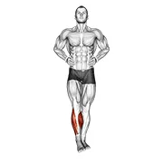 | [1368](../exercises/1368.json) | ankle circles | body weight | calves |
| 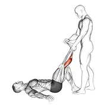 | [1708](../exercises/1708.json) | assisted lying calves stretch | assisted | calves |
| 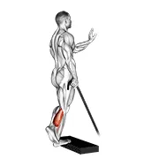 | [0999](../exercises/0999.json) | band single leg calf raise | band | calves |
| 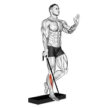 | [1000](../exercises/1000.json) | band single leg reverse calf raise | band | calves |
| 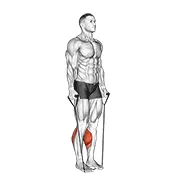 | [1369](../exercises/1369.json) | band two legs calf raise - (band under both legs) v. 2 | band | calves |
| 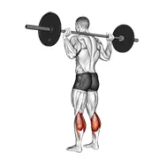 | [1370](../exercises/1370.json) | barbell floor calf raise | barbell | calves |
| 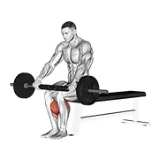 | [0088](../exercises/0088.json) | barbell seated calf raise | barbell | calves |
| 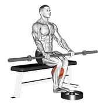 | [1371](../exercises/1371.json) | barbell seated calf raise | barbell | calves |
| 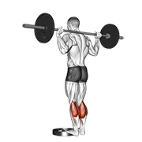 | [1372](../exercises/1372.json) | barbell standing calf raise | barbell | calves |
| 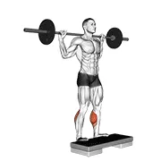 | [0108](../exercises/0108.json) | barbell standing leg calf raise | barbell | calves |
| 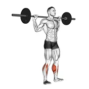 | [0111](../exercises/0111.json) | barbell standing rocking leg calf raise | barbell | calves |
|  | [1373](../exercises/1373.json) | bodyweight standing calf raise | body weight | calves |
| 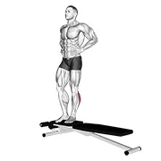 | [1374](../exercises/1374.json) | box jump down with one leg stabilization | body weight | calves |
| 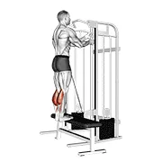 | [1375](../exercises/1375.json) | cable standing calf raise | cable | calves |
| 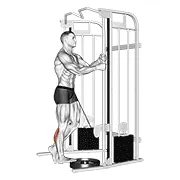 | [1376](../exercises/1376.json) | cable standing one leg calf raise | cable | calves |
| 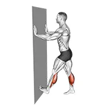 | [1407](../exercises/1407.json) | calf push stretch with hands against wall | body weight | calves |
| 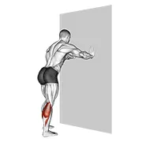 | [1377](../exercises/1377.json) | calf stretch with hands against wall | body weight | calves |
| 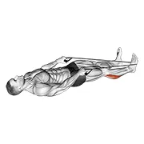 | [1378](../exercises/1378.json) | calf stretch with rope | rope | calves |
| 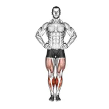 | [0257](../exercises/0257.json) | circles knee stretch | body weight | calves |
| 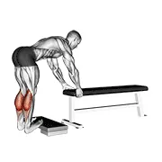 | [0284](../exercises/0284.json) | donkey calf raise | body weight | calves |
| 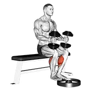 | [1379](../exercises/1379.json) | dumbbell seated calf raise | dumbbell | calves |
| 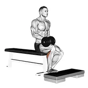 | [0400](../exercises/0400.json) | dumbbell seated one leg calf raise | dumbbell | calves |
| 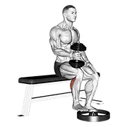 | [1380](../exercises/1380.json) | dumbbell seated one leg calf raise - hammer grip | dumbbell | calves |
| 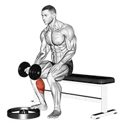 | [1381](../exercises/1381.json) | dumbbell seated one leg calf raise - palm up | dumbbell | calves |
| 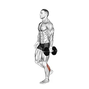 | [0409](../exercises/0409.json) | dumbbell single leg calf raise | dumbbell | calves |
| 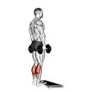 | [0417](../exercises/0417.json) | dumbbell standing calf raise | dumbbell | calves |
| 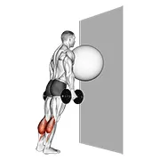 | [1382](../exercises/1382.json) | exercise ball on the wall calf raise | dumbbell | calves |
| 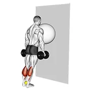 | [3241](../exercises/3241.json) | exercise ball on the wall calf raise (tennis ball between ankles) | dumbbell | calves |
| 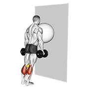 | [3240](../exercises/3240.json) | exercise ball on the wall calf raise (tennis ball between knees) | dumbbell | calves |
| 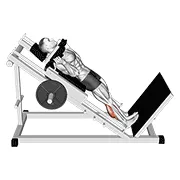 | [1383](../exercises/1383.json) | hack calf raise | sled machine | calves |
| 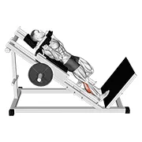 | [1384](../exercises/1384.json) | hack one leg calf raise | sled machine | calves |
| 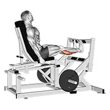 | [2289](../exercises/2289.json) | lever calf press | leverage machine | calves |
| 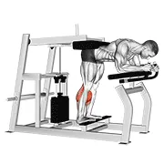 | [1253](../exercises/1253.json) | lever donkey calf raise | leverage machine | calves |
| 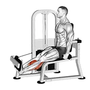 | [2315](../exercises/2315.json) | lever rotary calf | leverage machine | calves |
| 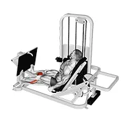 | [2335](../exercises/2335.json) | lever seated calf press | leverage machine | calves |
| 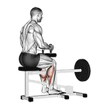 | [0594](../exercises/0594.json) | lever seated calf raise | leverage machine | calves |
| 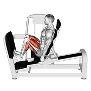 | [1385](../exercises/1385.json) | lever seated squat calf raise on leg press machine | leverage machine | calves |
| 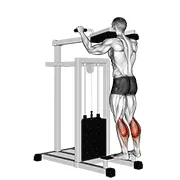 | [0605](../exercises/0605.json) | lever standing calf raise | leverage machine | calves |
| 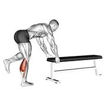 | [1386](../exercises/1386.json) | one leg donkey calf raise | body weight | calves |
| 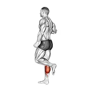 | [1387](../exercises/1387.json) | one leg floor calf raise | body weight | calves |
| 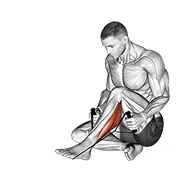 | [1388](../exercises/1388.json) | peroneals stretch | rope | calves |
| 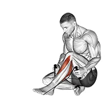 | [1389](../exercises/1389.json) | posterior tibialis stretch | rope | calves |
| 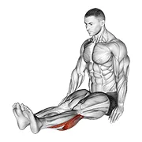 | [1390](../exercises/1390.json) | seated calf stretch (male) | body weight | calves |
| 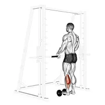 | [0727](../exercises/0727.json) | single leg calf raise (on a dumbbell) | dumbbell | calves |
| 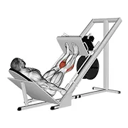 | [0738](../exercises/0738.json) | sled 45° calf press | sled machine | calves |
| 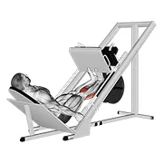 | [1391](../exercises/1391.json) | sled calf press on leg press | sled machine | calves |
| 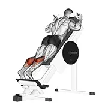 | [0742](../exercises/0742.json) | sled forward angled calf raise | sled machine | calves |
| 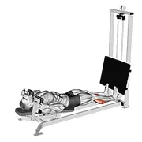 | [2334](../exercises/2334.json) | sled lying calf press | sled machine | calves |
| 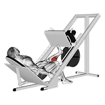 | [1392](../exercises/1392.json) | sled one leg calf press on leg press | sled machine | calves |
| 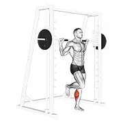 | [1393](../exercises/1393.json) | smith one leg floor calf raise | smith machine | calves |
| 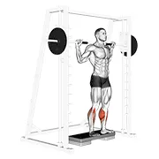 | [0763](../exercises/0763.json) | smith reverse calf raises | smith machine | calves |
|  | [1394](../exercises/1394.json) | smith reverse calf raises | smith machine | calves |
|  | [1395](../exercises/1395.json) | smith seated one leg calf raise | smith machine | calves |
|  | [0773](../exercises/0773.json) | smith standing leg calf raise | smith machine | calves |
|  | [1396](../exercises/1396.json) | smith toe raise | smith machine | calves |
|  | [1490](../exercises/1490.json) | standing calf raise (on a staircase) | body weight | calves |
|  | [1397](../exercises/1397.json) | standing calves | body weight | calves |
|  | [1398](../exercises/1398.json) | standing calves calf stretch | body weight | calves |
|  | [0833](../exercises/0833.json) | weighted donkey calf raise | weighted | calves |
