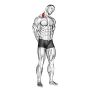
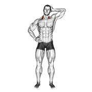

# neck

Generated by `scripts/catalogue/build.mjs`, do not edit. Click an id to edit that exercise. Pictures © Gym visual, licensed for openGym only (see [NOTICE](../media/NOTICE.md)).

| | id | name | equipment | target |
|---|---|---|---|---|
|  | [1403](../exercises/1403.json) | neck side stretch | body weight | levator scapulae |
|  | [0716](../exercises/0716.json) | side push neck stretch | body weight | levator scapulae |
