# neck

Generated by `scripts/catalogue/build.mjs`, do not edit. Click an id to edit that exercise. Pictures © Gym visual, licensed for openGym only (see [NOTICE](../media/NOTICE.md)).

| | id | name | equipment | target |
|---|---|---|---|---|
| 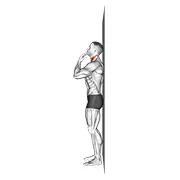 | [3150](../exercises/3150.json) | assisted chin tuck | assisted | levator scapulae |
| 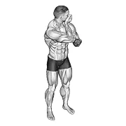 | [1843](../exercises/1843.json) | assisted rotating neck stretch | body weight | levator scapulae |
| 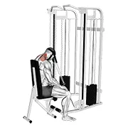 | [2411](../exercises/2411.json) | cable seated neck extension (with head harness) | cable | levator scapulae |
| 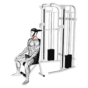 | [2412](../exercises/2412.json) | cable seated neck flexion (with head harness) | cable | levator scapulae |
| 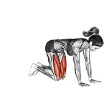 | [0250](../exercises/0250.json) | ceiling look stretch | body weight | levator scapulae |
| 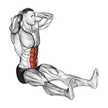 | [4509](../exercises/4509.json) | chin to chest stretch | body weight | levator scapulae |
| 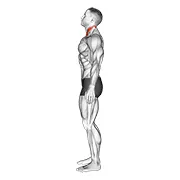 | [3149](../exercises/3149.json) | chin tuck | body weight | levator scapulae |
| 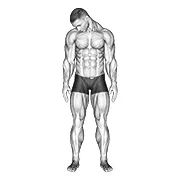 | [1832](../exercises/1832.json) | diagonal flexion neck stretch | body weight | levator scapulae |
| 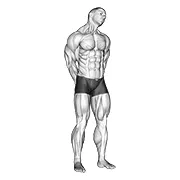 | [1844](../exercises/1844.json) | extension and inclination neck stretch | body weight | levator scapulae |
| 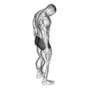 | [1836](../exercises/1836.json) | forward flexion neck stretch | body weight | levator scapulae |
| 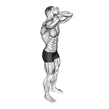 | [0462](../exercises/0462.json) | front and back neck stretch | body weight | levator scapulae |
| 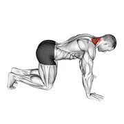 | [5058](../exercises/5058.json) | kneeling neck stretch | body weight | levator scapulae |
| 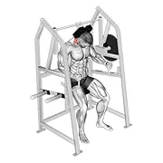 | [2282](../exercises/2282.json) | lever neck extension (plate loaded) | leverage machine | levator scapulae |
| 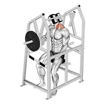 | [2283](../exercises/2283.json) | lever neck left side flexion (plate loaded) | leverage machine | levator scapulae |
| 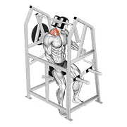 | [2284](../exercises/2284.json) | lever neck right side flexion (plate loaded) | leverage machine | levator scapulae |
| 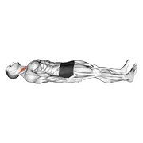 | [5062](../exercises/5062.json) | lying chin tucks | body weight | levator scapulae |
| 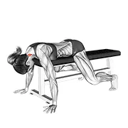 | [10781](../exercises/10781.json) | lying neck extension | body weight | levator scapulae |
| 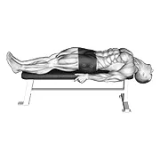 | [1842](../exercises/1842.json) | lying neck extension stretch | body weight | levator scapulae |
| 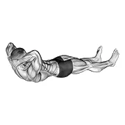 | [1841](../exercises/1841.json) | lying neck extensor stretch | body weight | levator scapulae |
| 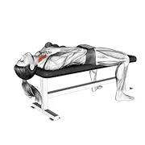 | [10780](../exercises/10780.json) | lying neck flexion | body weight | levator scapulae |
| 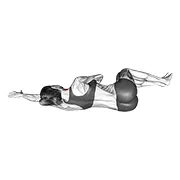 | [6753](../exercises/6753.json) | lying scalene muscles activation | body weight | levator scapulae |
| 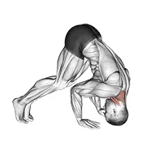 | [0633](../exercises/0633.json) | neck bridge prone | body weight | levator scapulae |
| 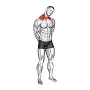 | [3994](../exercises/3994.json) | neck circle stretch | body weight | levator scapulae |
| 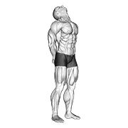 | [1833](../exercises/1833.json) | neck extension stretch | body weight | levator scapulae |
| 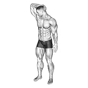 | [1838](../exercises/1838.json) | neck extensor and rotational stretch | body weight | levator scapulae |
| 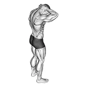 | [1837](../exercises/1837.json) | neck extensor stretch | body weight | levator scapulae |
| 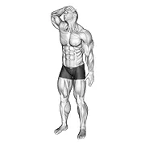 | [1840](../exercises/1840.json) | neck flexor and rotational stretch | body weight | levator scapulae |
| 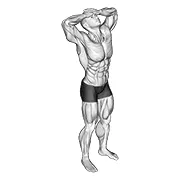 | [1839](../exercises/1839.json) | neck flexor stretch | body weight | levator scapulae |
| 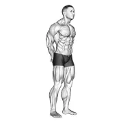 | [1834](../exercises/1834.json) | neck protraction stretch | body weight | levator scapulae |
|  | [1403](../exercises/1403.json) | neck side stretch | body weight | levator scapulae |
| 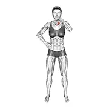 | [6765](../exercises/6765.json) | neck stretch with hand assisted | body weight | levator scapulae |
| 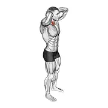 | [5145](../exercises/5145.json) | posterior neck isometric | body weight | levator scapulae |
| 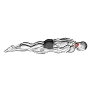 | [5060](../exercises/5060.json) | prone cervical extension | body weight | levator scapulae |
| 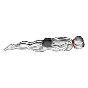 | [5061](../exercises/5061.json) | prone cervical extension isometric hold | body weight | levator scapulae |
| 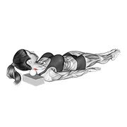 | [6769](../exercises/6769.json) | roll ball lying semispinalis capitis muscle activation | roller | levator scapulae |
| 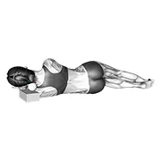 | [6767](../exercises/6767.json) | roll ball side lying scalene muscles activation | roller | levator scapulae |
| 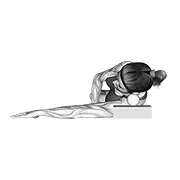 | [6768](../exercises/6768.json) | roll ball side lying scalene muscles activation (side pov) | roller | levator scapulae |
| 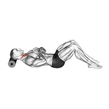 | [5372](../exercises/5372.json) | roll neck decompress lying on floor | roller | levator scapulae |
| 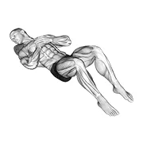 | [5371](../exercises/5371.json) | roll neck rotation lying on floor | roller | levator scapulae |
| 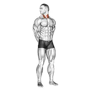 | [1831](../exercises/1831.json) | rotating neck stretch | body weight | levator scapulae |
| 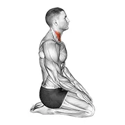 | [5063](../exercises/5063.json) | seated chin tuck | body weight | levator scapulae |
| 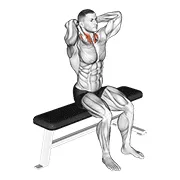 | [3441](../exercises/3441.json) | seated flexion and extension neck | body weight | levator scapulae |
| 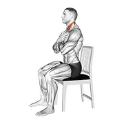 | [10555](../exercises/10555.json) | seated neck flexion to extension on chair | body weight | levator scapulae |
| 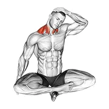 | [5195](../exercises/5195.json) | seated neck side stretch | body weight | levator scapulae |
| 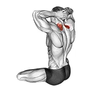 | [5162](../exercises/5162.json) | seated neck stretch | body weight | levator scapulae |
| 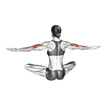 | [5131](../exercises/5131.json) | seated neck tap | body weight | levator scapulae |
| 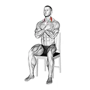 | [10557](../exercises/10557.json) | seated side to side neck bend on chair | body weight | levator scapulae |
| 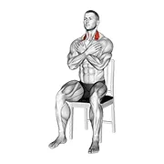 | [10556](../exercises/10556.json) | seated side to side neck twist on chair | body weight | levator scapulae |
| 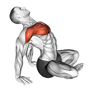 | [5081](../exercises/5081.json) | seated sky look | body weight | levator scapulae |
| 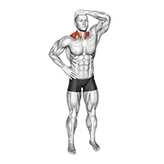 | [0713](../exercises/0713.json) | side neck stretch | body weight | levator scapulae |
|  | [0716](../exercises/0716.json) | side push neck stretch | body weight | levator scapulae |
| 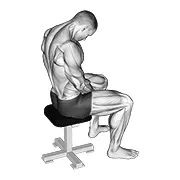 | [1835](../exercises/1835.json) | sitting neck flexion stretch | body weight | levator scapulae |
|  | [7306](../exercises/7306.json) | standing side neck stretch | body weight | levator scapulae |
|  | [4222](../exercises/4222.json) | tiger tail neck | roller | levator scapulae |
|  | [1791](../exercises/1791.json) | trap and neck stretch | body weight | traps |
|  | [1042](../exercises/1042.json) | weighted lying neck extension | weighted | traps |
|  | [2408](../exercises/2408.json) | weighted lying neck extension (with head harness) | weighted | levator scapulae |
|  | [1043](../exercises/1043.json) | weighted lying neck flexion | weighted | traps |
|  | [2409](../exercises/2409.json) | weighted lying neck flexion (with head harness) | weighted | levator scapulae |
|  | [4432](../exercises/4432.json) | weighted lying neck head twist | weighted | levator scapulae |
|  | [4431](../exercises/4431.json) | weighted lying neck side to side | weighted | levator scapulae |
|  | [0838](../exercises/0838.json) | weighted lying side lifting head (with head harness) | weighted | levator scapulae |
|  | [4429](../exercises/4429.json) | weighted lying side neck raise | weighted | levator scapulae |
|  | [0848](../exercises/0848.json) | weighted seated neck extension (with head harness) | weighted | levator scapulae |
|  | [4430](../exercises/4430.json) | weighted side lying side neck raise | weighted | levator scapulae |
|  | [2410](../exercises/2410.json) | weighted standing neck extension (with head harness) | weighted | levator scapulae |
