# shoulders

Generated by `scripts/catalogue/build.mjs`, do not edit. Click an id to edit that exercise. Pictures © Gym visual, licensed for openGym only (see [NOTICE](../media/NOTICE.md)).

| | id | name | equipment | target |
|---|---|---|---|---|
| 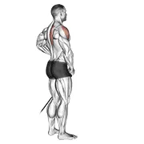 | [0977](../exercises/0977.json) | band front lateral raise | band | delts |
| 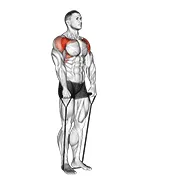 | [0978](../exercises/0978.json) | band front raise | band | delts |
| 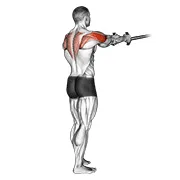 | [0993](../exercises/0993.json) | band reverse fly | band | delts |
| 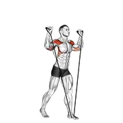 | [0997](../exercises/0997.json) | band shoulder press | band | delts |
| 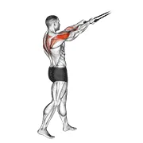 | [1022](../exercises/1022.json) | band standing rear delt row | band | delts |
| 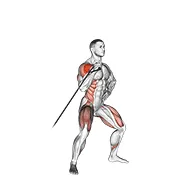 | [1012](../exercises/1012.json) | band twisting overhead press | band | delts |
| 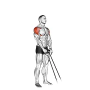 | [1017](../exercises/1017.json) | band y-raise | band | delts |
| 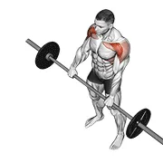 | [0041](../exercises/0041.json) | barbell front raise | barbell | delts |
| 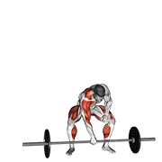 | [0067](../exercises/0067.json) | barbell one arm snatch | barbell | delts |
| 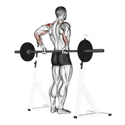 | [0075](../exercises/0075.json) | barbell rear delt raise | barbell | delts |
| 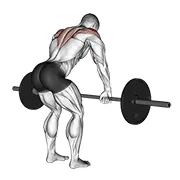 | [0076](../exercises/0076.json) | barbell rear delt row | barbell | delts |
| 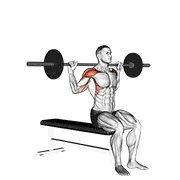 | [0086](../exercises/0086.json) | barbell seated behind head military press | barbell | delts |
| 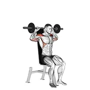 | [0087](../exercises/0087.json) | barbell seated bradford rocky press | barbell | delts |
| 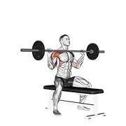 | [0091](../exercises/0091.json) | barbell seated overhead press | barbell | delts |
| 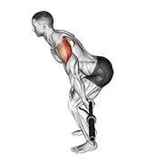 | [0100](../exercises/0100.json) | barbell skier | barbell | delts |
| 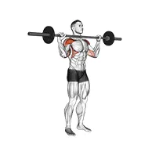 | [0105](../exercises/0105.json) | barbell standing bradford press | barbell | delts |
| 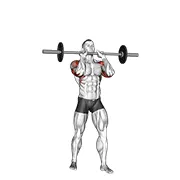 | [1456](../exercises/1456.json) | barbell standing close grip military press | barbell | delts |
| 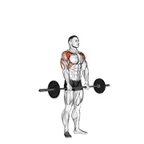 | [0107](../exercises/0107.json) | barbell standing front raise over head | barbell | delts |
| 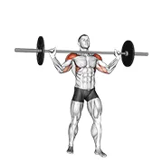 | [1457](../exercises/1457.json) | barbell standing wide military press | barbell | delts |
| 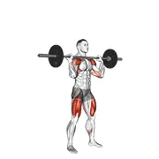 | [3305](../exercises/3305.json) | barbell thruster | barbell | delts |
| 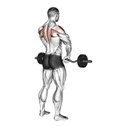 | [0120](../exercises/0120.json) | barbell upright row | barbell | delts |
| 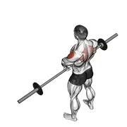 | [0119](../exercises/0119.json) | barbell upright row v. 2 | barbell | delts |
| 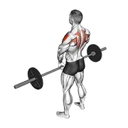 | [0121](../exercises/0121.json) | barbell upright row v. 3 | barbell | delts |
| 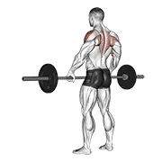 | [0123](../exercises/0123.json) | barbell wide-grip upright row | barbell | delts |
| 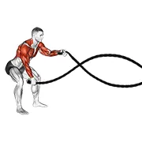 | [0128](../exercises/0128.json) | battling ropes | rope | delts |
| 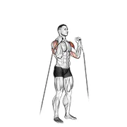 | [0148](../exercises/0148.json) | cable alternate shoulder press | cable | delts |
| 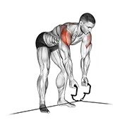 | [0154](../exercises/0154.json) | cable cross-over revers fly | cable | delts |
| 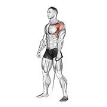 | [0161](../exercises/0161.json) | cable forward raise | cable | delts |
| 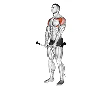 | [0162](../exercises/0162.json) | cable front raise | cable | delts |
| 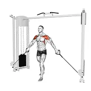 | [0164](../exercises/0164.json) | cable front shoulder raise | cable | delts |
| 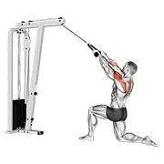 | [3697](../exercises/3697.json) | cable kneeling rear delt row (with rope) (male) | cable | delts |
| 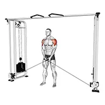 | [0178](../exercises/0178.json) | cable lateral raise | cable | delts |
| 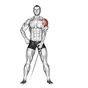 | [0192](../exercises/0192.json) | cable one arm lateral raise | cable | delts |
| 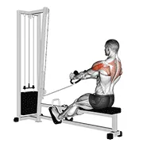 | [0202](../exercises/0202.json) | cable rear delt row (stirrups) | cable | delts |
| 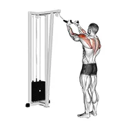 | [0203](../exercises/0203.json) | cable rear delt row (with rope) | cable | delts |
| 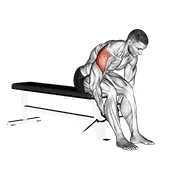 | [0215](../exercises/0215.json) | cable seated rear lateral raise | cable | delts |
| 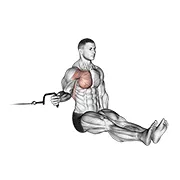 | [0216](../exercises/0216.json) | cable seated shoulder internal rotation | cable | delts |
| 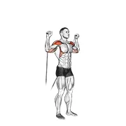 | [0219](../exercises/0219.json) | cable shoulder press | cable | delts |
| 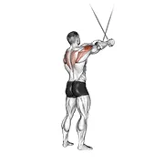 | [0225](../exercises/0225.json) | cable standing cross-over high reverse fly | cable | delts |
| 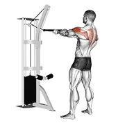 | [0233](../exercises/0233.json) | cable standing rear delt row (with rope) | cable | delts |
| 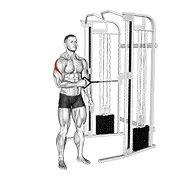 | [0235](../exercises/0235.json) | cable standing shoulder external rotation | cable | delts |
| 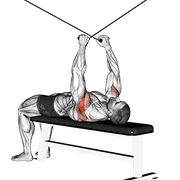 | [0240](../exercises/0240.json) | cable supine reverse fly | cable | delts |
| 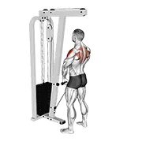 | [0246](../exercises/0246.json) | cable upright row | cable | delts |
| 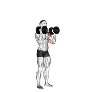 | [0286](../exercises/0286.json) | dumbbell alternate side press | dumbbell | delts |
| 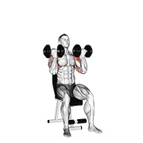 | [2137](../exercises/2137.json) | dumbbell arnold press | dumbbell | delts |
| 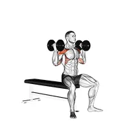 | [0287](../exercises/0287.json) | dumbbell arnold press v. 2 | dumbbell | delts |
| 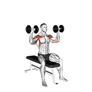 | [0290](../exercises/0290.json) | dumbbell bench seated press | dumbbell | delts |
| 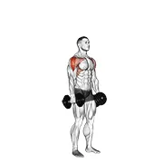 | [0299](../exercises/0299.json) | dumbbell cuban press | dumbbell | delts |
| 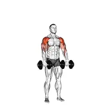 | [2136](../exercises/2136.json) | dumbbell cuban press v. 2 | dumbbell | delts |
| 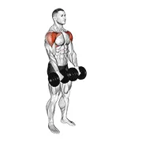 | [0310](../exercises/0310.json) | dumbbell front raise | dumbbell | delts |
|  | [0309](../exercises/0309.json) | dumbbell front raise v. 2 | dumbbell | delts |
|  | [0311](../exercises/0311.json) | dumbbell full can lateral raise | dumbbell | delts |
|  | [0323](../exercises/0323.json) | dumbbell incline one arm lateral raise | dumbbell | delts |
|  | [0325](../exercises/0325.json) | dumbbell incline raise | dumbbell | delts |
|  | [0326](../exercises/0326.json) | dumbbell incline rear lateral raise | dumbbell | delts |
|  | [3542](../exercises/3542.json) | dumbbell incline t-raise | dumbbell | delts |
|  | [0332](../exercises/0332.json) | dumbbell iron cross | dumbbell | delts |
|  | [0334](../exercises/0334.json) | dumbbell lateral raise | dumbbell | delts |
|  | [0335](../exercises/0335.json) | dumbbell lateral to front raise | dumbbell | delts |
|  | [0863](../exercises/0863.json) | dumbbell lying external shoulder rotation | dumbbell | delts |
|  | [2470](../exercises/2470.json) | dumbbell lying on floor rear delt raise | dumbbell | delts |
|  | [0341](../exercises/0341.json) | dumbbell lying one arm deltoid rear | dumbbell | delts |
|  | [0345](../exercises/0345.json) | dumbbell lying one arm rear lateral raise | dumbbell | delts |
|  | [0348](../exercises/0348.json) | dumbbell lying rear lateral raise | dumbbell | delts |
|  | [0355](../exercises/0355.json) | dumbbell one arm lateral raise | dumbbell | delts |
|  | [0356](../exercises/0356.json) | dumbbell one arm lateral raise with support | dumbbell | delts |
|  | [0359](../exercises/0359.json) | dumbbell one arm reverse fly (with support) | dumbbell | delts |
|  | [0361](../exercises/0361.json) | dumbbell one arm shoulder press | dumbbell | delts |
|  | [0360](../exercises/0360.json) | dumbbell one arm shoulder press v. 2 | dumbbell | delts |
|  | [0363](../exercises/0363.json) | dumbbell one arm upright row | dumbbell | delts |
|  | [1700](../exercises/1700.json) | dumbbell push press | dumbbell | delts |
|  | [0376](../exercises/0376.json) | dumbbell raise | dumbbell | delts |
|  | [2292](../exercises/2292.json) | dumbbell rear delt raise | dumbbell | delts |
|  | [0377](../exercises/0377.json) | dumbbell rear delt row_shoulder | dumbbell | delts |
|  | [0378](../exercises/0378.json) | dumbbell rear fly | dumbbell | delts |
|  | [0380](../exercises/0380.json) | dumbbell rear lateral raise | dumbbell | delts |
|  | [0379](../exercises/0379.json) | dumbbell rear lateral raise (support head) | dumbbell | delts |
|  | [0383](../exercises/0383.json) | dumbbell reverse fly | dumbbell | delts |
|  | [0386](../exercises/0386.json) | dumbbell rotation reverse fly | dumbbell | delts |
|  | [2397](../exercises/2397.json) | dumbbell scott press | dumbbell | delts |
|  | [0387](../exercises/0387.json) | dumbbell seated alternate front raise | dumbbell | delts |
|  | [0388](../exercises/0388.json) | dumbbell seated alternate press | dumbbell | delts |
|  | [3546](../exercises/3546.json) | dumbbell seated alternate shoulder | dumbbell | delts |
|  | [2317](../exercises/2317.json) | dumbbell seated bent arm lateral raise | dumbbell | delts |
|  | [0392](../exercises/0392.json) | dumbbell seated front raise | dumbbell | delts |
|  | [0396](../exercises/0396.json) | dumbbell seated lateral raise | dumbbell | delts |
|  | [0395](../exercises/0395.json) | dumbbell seated lateral raise v. 2 | dumbbell | delts |
|  | [0405](../exercises/0405.json) | dumbbell seated shoulder press | dumbbell | delts |
|  | [0404](../exercises/0404.json) | dumbbell seated shoulder press (parallel grip) | dumbbell | delts |
|  | [0408](../exercises/0408.json) | dumbbell side lying one hand raise | dumbbell | delts |
|  | [3548](../exercises/3548.json) | dumbbell single arm overhead carry | dumbbell | delts |
|  | [0414](../exercises/0414.json) | dumbbell standing alternate overhead press | dumbbell | delts |
|  | [0415](../exercises/0415.json) | dumbbell standing alternate raise | dumbbell | delts |
|  | [2143](../exercises/2143.json) | dumbbell standing around world | dumbbell | delts |
|  | [0419](../exercises/0419.json) | dumbbell standing front raise above head | dumbbell | delts |
|  | [0424](../exercises/0424.json) | dumbbell standing one arm palm in press | dumbbell | delts |
|  | [0426](../exercises/0426.json) | dumbbell standing overhead press | dumbbell | delts |
|  | [0427](../exercises/0427.json) | dumbbell standing palms in press | dumbbell | delts |
|  | [0437](../exercises/0437.json) | dumbbell upright row | dumbbell | delts |
|  | [1765](../exercises/1765.json) | dumbbell upright row (back pov) | dumbbell | delts |
|  | [0864](../exercises/0864.json) | dumbbell upright shoulder external rotation | dumbbell | delts |
|  | [0438](../exercises/0438.json) | dumbbell w-press | dumbbell | delts |
|  | [0445](../exercises/0445.json) | ez barbell anti gravity press | ez barbell | delts |
|  | [0520](../exercises/0520.json) | kettlebell alternating press | kettlebell | delts |
|  | [0523](../exercises/0523.json) | kettlebell arnold press | kettlebell | delts |
|  | [0527](../exercises/0527.json) | kettlebell double jerk | kettlebell | delts |
|  | [0528](../exercises/0528.json) | kettlebell double push press | kettlebell | delts |
|  | [0529](../exercises/0529.json) | kettlebell double snatch | kettlebell | delts |
|  | [0537](../exercises/0537.json) | kettlebell one arm clean and jerk | kettlebell | delts |
|  | [0538](../exercises/0538.json) | kettlebell one arm jerk | kettlebell | delts |
|  | [0539](../exercises/0539.json) | kettlebell one arm military press to the side | kettlebell | delts |
|  | [0540](../exercises/0540.json) | kettlebell one arm push press | kettlebell | delts |
|  | [0542](../exercises/0542.json) | kettlebell one arm snatch | kettlebell | delts |
|  | [0543](../exercises/0543.json) | kettlebell pirate supper legs | kettlebell | delts |
|  | [0546](../exercises/0546.json) | kettlebell seated press | kettlebell | delts |
|  | [1438](../exercises/1438.json) | kettlebell seated two arm military press | kettlebell | delts |
|  | [0547](../exercises/0547.json) | kettlebell seesaw press | kettlebell | delts |
|  | [0550](../exercises/0550.json) | kettlebell thruster | kettlebell | delts |
|  | [0552](../exercises/0552.json) | kettlebell two arm clean | kettlebell | delts |
|  | [0553](../exercises/0553.json) | kettlebell two arm military press | kettlebell | delts |
|  | [3237](../exercises/3237.json) | landmine lateral raise | barbell | delts |
|  | [2271](../exercises/2271.json) | left hook. boxing | body weight | delts |
|  | [0584](../exercises/0584.json) | lever lateral raise | leverage machine | delts |
|  | [0587](../exercises/0587.json) | lever military press | leverage machine | delts |
|  | [0590](../exercises/0590.json) | lever one arm shoulder press | leverage machine | delts |
|  | [0602](../exercises/0602.json) | lever seated reverse fly | leverage machine | delts |
|  | [0601](../exercises/0601.json) | lever seated reverse fly (parallel grip) | leverage machine | delts |
|  | [0603](../exercises/0603.json) | lever shoulder press | leverage machine | delts |
|  | [0869](../exercises/0869.json) | lever shoulder press v. 2 | leverage machine | delts |
|  | [2318](../exercises/2318.json) | lever shoulder press v. 3 | leverage machine | delts |
|  | [0669](../exercises/0669.json) | rear deltoid stretch | body weight | delts |
|  | [3122](../exercises/3122.json) | resistance band seated shoulder press | resistance band | delts |
|  | [0747](../exercises/0747.json) | smith behind neck press | smith machine | delts |
|  | [0762](../exercises/0762.json) | smith rear delt row | smith machine | delts |
|  | [0765](../exercises/0765.json) | smith seated shoulder press | smith machine | delts |
|  | [0766](../exercises/0766.json) | smith shoulder press | smith machine | delts |
|  | [0772](../exercises/0772.json) | smith standing behind head military press | smith machine | delts |
|  | [0774](../exercises/0774.json) | smith standing military press | smith machine | delts |
|  | [0775](../exercises/0775.json) | smith upright row | smith machine | delts |
|  | [0788](../exercises/0788.json) | standing behind neck press | barbell | delts |
|  | [0834](../exercises/0834.json) | weighted front raise | weighted | delts |
|  | [3641](../exercises/3641.json) | weighted kneeling step with swing | weighted | delts |
|  | [0844](../exercises/0844.json) | weighted round arm | weighted | delts |
