# shoulders

Generated by `scripts/catalogue/build.mjs`, do not edit. Click an id to edit that exercise. Pictures © Gym visual, licensed for openGym only (see [NOTICE](../media/NOTICE.md)).

| | id | name | equipment | target |
|---|---|---|---|---|
| 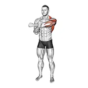 | [1980](../exercises/1980.json) | across chest shoulder stretch | body weight | delts |
| 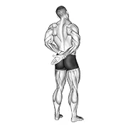 | [1977](../exercises/1977.json) | adduction of arm in back stretch | body weight | delts |
| 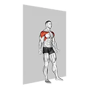 | [4394](../exercises/4394.json) | alternate shoulder flexion back to wall | body weight | delts |
| 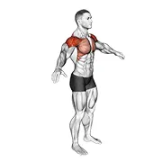 | [3905](../exercises/3905.json) | arm circles | body weight | delts |
| 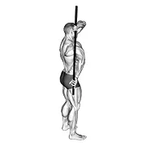 | [1987](../exercises/1987.json) | arm down rotator stretch | body weight | delts |
| 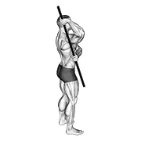 | [1986](../exercises/1986.json) | arm up rotator stretch | body weight | delts |
| 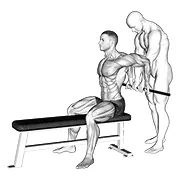 | [1973](../exercises/1973.json) | assisted sitting reverse shoulder stretch | assisted | delts |
| 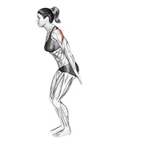 | [4663](../exercises/4663.json) | backhand raise | body weight | delts |
| 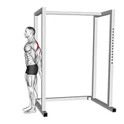 | [11795](../exercises/11795.json) | backward press shoulders mobilization | body weight | delts |
| 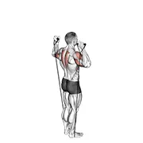 | [1499](../exercises/1499.json) | band behind neck shoulder press | band | delts |
| 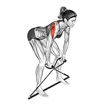 | [4682](../exercises/4682.json) | band bent over rear delt fly | band | delts |
| 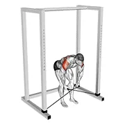 | [3971](../exercises/3971.json) | band bent over rear lateral raise | band | delts |
| 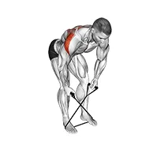 | [6486](../exercises/6486.json) | band bent over rear lateral raise v. 2 | band | delts |
| 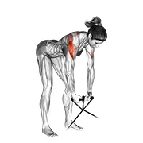 | [0893](../exercises/0893.json) | band bent over rear lateral raise v. 3 | band | delts |
| 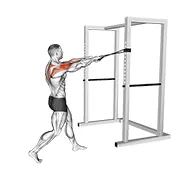 | [5607](../exercises/5607.json) | band face pull | band | delts |
|  | [0977](../exercises/0977.json) | band front lateral raise | band | delts |
|  | [0978](../exercises/0978.json) | band front raise | band | delts |
| 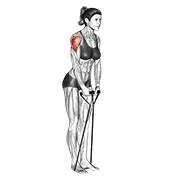 | [0907](../exercises/0907.json) | band lateral raise | band | delts |
| 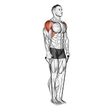 | [1508](../exercises/1508.json) | band lateral raise v. 2 | band | delts |
| 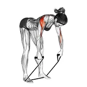 | [1006](../exercises/1006.json) | band rear delt row | band | delts |
|  | [0993](../exercises/0993.json) | band reverse fly | band | delts |
|  | [0997](../exercises/0997.json) | band shoulder press | band | delts |
| 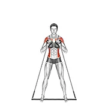 | [4700](../exercises/4700.json) | band side bend press | band | delts |
| 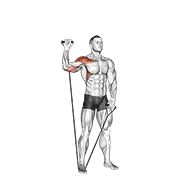 | [2996](../exercises/2996.json) | band single arm shoulder press | band | delts |
| 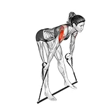 | [4697](../exercises/4697.json) | band skier v. 2 | band | delts |
| 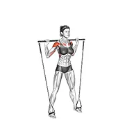 | [4686](../exercises/4686.json) | band standing behind head military press | band | delts |
| 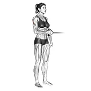 | [0921](../exercises/0921.json) | band standing external shoulder rotation | band | delts |
| 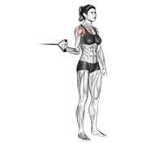 | [0924](../exercises/0924.json) | band standing internal shoulder rotation | band | delts |
| 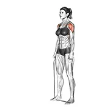 | [0793](../exercises/0793.json) | band standing lateral raise | band | delts |
|  | [1022](../exercises/1022.json) | band standing rear delt row | band | delts |
| 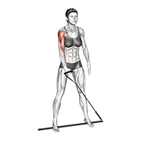 | [4695](../exercises/4695.json) | band standing single arm upright row | band | delts |
|  | [1012](../exercises/1012.json) | band twisting overhead press | band | delts |
| 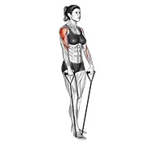 | [0934](../exercises/0934.json) | band upright row | band | delts |
| 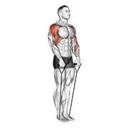 | [1500](../exercises/1500.json) | band upright row (under two feet) | band | delts |
| 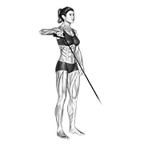 | [0935](../exercises/0935.json) | band upright shoulder external rotation | band | delts |
| 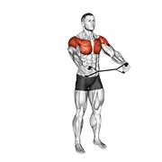 | [4516](../exercises/4516.json) | band warm up shoulder stretch | band | delts |
|  | [1017](../exercises/1017.json) | band y-raise | band | delts |
| 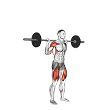 | [4857](../exercises/4857.json) | barbell behind the back push press | barbell | delts |
| 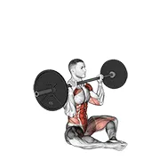 | [10049](../exercises/10049.json) | barbell butterfly z press | barbell | delts |
|  | [0041](../exercises/0041.json) | barbell front raise | barbell | delts |
| 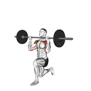 | [9694](../exercises/9694.json) | barbell half kneeling shoulders press | barbell | delts |
| 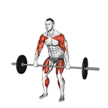 | [10107](../exercises/10107.json) | barbell hang clean high pull | barbell | traps |
| 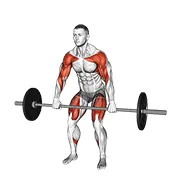 | [10106](../exercises/10106.json) | barbell high pull | barbell | traps |
| 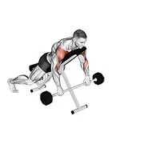 | [3722](../exercises/3722.json) | barbell incline lying rear delt raise | barbell | delts |
| 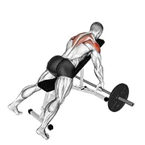 | [5853](../exercises/5853.json) | barbell incline rear delt row | barbell | delts |
| 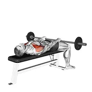 | [10588](../exercises/10588.json) | barbell lying front raise | barbell | delts |
| 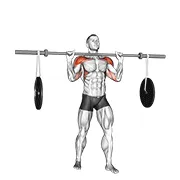 | [3186](../exercises/3186.json) | barbell military press (with hanging band technique) | barbell | delts |
|  | [0067](../exercises/0067.json) | barbell one arm snatch | barbell | delts |
| 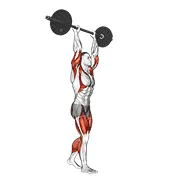 | [2914](../exercises/2914.json) | barbell overhead carry | barbell | delts |
|  | [0075](../exercises/0075.json) | barbell rear delt raise | barbell | delts |
|  | [0076](../exercises/0076.json) | barbell rear delt row | barbell | delts |
|  | [0086](../exercises/0086.json) | barbell seated behind head military press | barbell | delts |
|  | [0087](../exercises/0087.json) | barbell seated bradford rocky press | barbell | delts |
| 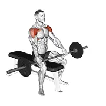 | [3726](../exercises/3726.json) | barbell seated front raise | barbell | delts |
| 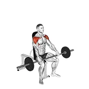 | [4411](../exercises/4411.json) | barbell seated high front raise | barbell | delts |
| 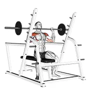 | [1045](../exercises/1045.json) | barbell seated military press (inside squat cage) | barbell | delts |
|  | [0091](../exercises/0091.json) | barbell seated overhead press | barbell | delts |
| 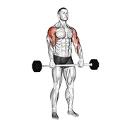 | [5632](../exercises/5632.json) | barbell shoulder grip upright row | barbell | delts |
|  | [0100](../exercises/0100.json) | barbell skier | barbell | delts |
|  | [0105](../exercises/0105.json) | barbell standing bradford press | barbell | delts |
|  | [1456](../exercises/1456.json) | barbell standing close grip military press | barbell | delts |
|  | [0107](../exercises/0107.json) | barbell standing front raise over head | barbell | delts |
| 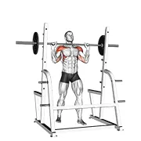 | [1162](../exercises/1162.json) | barbell standing military press | barbell | delts |
| 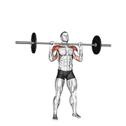 | [1165](../exercises/1165.json) | barbell standing military press (without rack) | barbell | delts |
| 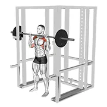 | [5668](../exercises/5668.json) | barbell standing shoulder pin press | barbell | delts |
| 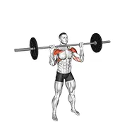 | [5328](../exercises/5328.json) | barbell standing shoulders press | barbell | delts |
|  | [1457](../exercises/1457.json) | barbell standing wide military press | barbell | delts |
|  | [3305](../exercises/3305.json) | barbell thruster | barbell | delts |
|  | [0120](../exercises/0120.json) | barbell upright row | barbell | delts |
|  | [0119](../exercises/0119.json) | barbell upright row v. 2 | barbell | delts |
|  | [0121](../exercises/0121.json) | barbell upright row v. 3 | barbell | delts |
|  | [0123](../exercises/0123.json) | barbell wide-grip upright row | barbell | delts |
| 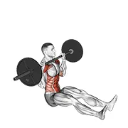 | [4866](../exercises/4866.json) | barbell z press | barbell | delts |
|  | [0128](../exercises/0128.json) | battling ropes | rope | delts |
| 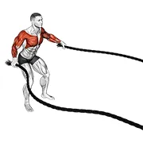 | [3375](../exercises/3375.json) | battling ropes fly | rope | delts |
|  | [3379](../exercises/3379.json) | battling ropes high waves | rope | cardiovascular system |
|  | [3373](../exercises/3373.json) | battling ropes inside circle | rope | cardiovascular system |
|  | [3374](../exercises/3374.json) | battling ropes outside circle | rope | cardiovascular system |
|  | [2828](../exercises/2828.json) | battling ropes side raise | rope | delts |
|  | [3371](../exercises/3371.json) | battling ropes side to side arms | rope | cardiovascular system |
|  | [1981](../exercises/1981.json) | bent arm shoulder stretch | body weight | delts |
|  | [11798](../exercises/11798.json) | bent over back to side to front arms raise | body weight | delts |
|  | [6438](../exercises/6438.json) | bent over shoulder pendulum | body weight | delts |
|  | [4172](../exercises/4172.json) | bodyweight bent over rear delt fly | body weight | delts |
|  | [6754](../exercises/6754.json) | bodyweight lying shoulder external rotation | body weight | delts |
|  | [4612](../exercises/4612.json) | bodyweight standing around the world (wall supported) | body weight | delts |
|  | [4346](../exercises/4346.json) | bodyweight standing military press | body weight | delts |
|  | [4613](../exercises/4613.json) | bodyweight standing military press (wall supported) | body weight | delts |
|  | [8342](../exercises/8342.json) | bodyweight standing scapular external rotation | body weight | delts |
|  | [6075](../exercises/6075.json) | bottle weighted alternate front raise | weighted | delts |
|  | [6072](../exercises/6072.json) | bottle weighted armpit row | weighted | delts |
|  | [6061](../exercises/6061.json) | bottle weighted bent over reverse fly | weighted | delts |
|  | [6073](../exercises/6073.json) | bottle weighted front raise | weighted | delts |
|  | [6077](../exercises/6077.json) | bottle weighted halo | weighted | delts |
|  | [6074](../exercises/6074.json) | bottle weighted lateral raise | weighted | delts |
|  | [6076](../exercises/6076.json) | bottle weighted shoulder press | weighted | delts |
|  | [6071](../exercises/6071.json) | bottle weighted upright row | weighted | delts |
|  | [4581](../exercises/4581.json) | boxing block | body weight | delts |
|  | [2272](../exercises/2272.json) | boxing jab | body weight | delts |
|  | [4582](../exercises/4582.json) | boxing jab (with boxing bag) | body weight | delts |
|  | [4589](../exercises/4589.json) | boxing jab (with partner) | body weight | delts |
|  | [2275](../exercises/2275.json) | boxing left uppercut | body weight | delts |
|  | [4590](../exercises/4590.json) | boxing left uppercut (with partner) | body weight | delts |
|  | [2273](../exercises/2273.json) | boxing right cross | body weight | delts |
|  | [4583](../exercises/4583.json) | boxing right cross (with boxing bag) | body weight | delts |
|  | [4591](../exercises/4591.json) | boxing right cross (with partner) | body weight | delts |
|  | [4584](../exercises/4584.json) | boxing right hook (with boxing bag) | body weight | delts |
|  | [4592](../exercises/4592.json) | boxing right hook (with partner) | body weight | delts |
|  | [2274](../exercises/2274.json) | boxing right uppercut | body weight | delts |
|  | [4593](../exercises/4593.json) | boxing right uppercut (with partner) | body weight | delts |
|  | [8878](../exercises/8878.json) | cable 45 degrees reverse fly | cable | delts |
|  | [9867](../exercises/9867.json) | cable 45 degrees reverse grip reverse fly | cable | delts |
|  | [9868](../exercises/9868.json) | cable 45 degrees single arm reverse fly | cable | delts |
|  | [9869](../exercises/9869.json) | cable 45 degrees single arm reverse grip reverse fly | cable | delts |
|  | [10597](../exercises/10597.json) | cable 90 degrees internal rotation catch | cable | delts |
|  | [0148](../exercises/0148.json) | cable alternate shoulder press | cable | delts |
|  | [3912](../exercises/3912.json) | cable bent over one arm lateral raise | cable | delts |
|  | [0154](../exercises/0154.json) | cable cross-over revers fly | cable | delts |
|  | [11060](../exercises/11060.json) | cable face pull with external rotation | cable | delts |
|  | [0161](../exercises/0161.json) | cable forward raise | cable | delts |
|  | [0162](../exercises/0162.json) | cable front raise | cable | delts |
|  | [6543](../exercises/6543.json) | cable front raise (rope attachment) | cable | delts |
|  | [2515](../exercises/2515.json) | cable front raise v. 2 | cable | delts |
|  | [0164](../exercises/0164.json) | cable front shoulder raise | cable | delts |
|  | [4194](../exercises/4194.json) | cable half kneeling external rotation | cable | delts |
|  | [8879](../exercises/8879.json) | cable half kneeling external rotation press | cable | delts |
|  | [7743](../exercises/7743.json) | cable half kneeling face pull | cable | delts |
|  | [6648](../exercises/6648.json) | cable high pull with rope attachment | cable | delts |
|  | [8662](../exercises/8662.json) | cable incline close grip shoulder press with v bar | cable | delts |
|  | [4012](../exercises/4012.json) | cable incline cross rear fly | cable | delts |
|  | [7592](../exercises/7592.json) | cable incline rear delt fly with back support | cable | delts |
|  | [9870](../exercises/9870.json) | cable incline single arm y raise with back support | cable | delts |
|  | [9871](../exercises/9871.json) | cable incline single arm y raise wrist straps with back support | cable | delts |
|  | [8661](../exercises/8661.json) | cable incline y raise with back support | cable | delts |
|  | [8663](../exercises/8663.json) | cable incline y raise wrist straps with back support | cable | delts |
|  | [11260](../exercises/11260.json) | cable kneeling military press v. 3 | cable | delts |
|  | [3697](../exercises/3697.json) | cable kneeling rear delt row (with rope) (male) | cable | delts |
|  | [5821](../exercises/5821.json) | cable kneeling shoulder 90 degrees external rotation press | cable | delts |
|  | [6755](../exercises/6755.json) | cable kneeling shoulder external rotation | cable | delts |
|  | [6756](../exercises/6756.json) | cable kneeling shoulder internal rotation | cable | delts |
|  | [4010](../exercises/4010.json) | cable kneeling shoulder press | cable | delts |
|  | [0178](../exercises/0178.json) | cable lateral raise | cable | delts |
|  | [3880](../exercises/3880.json) | cable leaning lateral raise | cable | delts |
|  | [9872](../exercises/9872.json) | cable lying bench cross lateral raise | cable | delts |
|  | [9873](../exercises/9873.json) | cable lying bench single arm cross lateral raise | cable | delts |
|  | [4013](../exercises/4013.json) | cable lying cross lateral raise | cable | delts |
|  | [7591](../exercises/7591.json) | cable lying face pull | cable | delts |
|  | [9705](../exercises/9705.json) | cable lying floor front raise | cable | delts |
|  | [4227](../exercises/4227.json) | cable lying front raise | cable | delts |
|  | [9874](../exercises/9874.json) | cable lying single arm cross lateral raise | cable | delts |
|  | [4225](../exercises/4225.json) | cable lying upright row | cable | delts |
|  | [9492](../exercises/9492.json) | cable lying upright row (sz bar) | cable | delts |
|  | [2689](../exercises/2689.json) | cable one arm front raise | cable | delts |
|  | [0192](../exercises/0192.json) | cable one arm lateral raise | cable | delts |
|  | [4122](../exercises/4122.json) | cable one arm reverse fly | cable | delts |
|  | [3914](../exercises/3914.json) | cable rear delt row | cable | delts |
|  | [6035](../exercises/6035.json) | cable rear delt row (parallel bar) | cable | delts |
|  | [0202](../exercises/0202.json) | cable rear delt row (stirrups) | cable | delts |
|  | [0203](../exercises/0203.json) | cable rear delt row (with rope) | cable | delts |
|  | [5658](../exercises/5658.json) | cable seated face pull (with rope) | cable | delts |
|  | [3943](../exercises/3943.json) | cable seated rear delt fly with chest support | cable | delts |
|  | [0215](../exercises/0215.json) | cable seated rear lateral raise | cable | delts |
|  | [0216](../exercises/0216.json) | cable seated shoulder internal rotation | cable | delts |
|  | [5087](../exercises/5087.json) | cable shoulder 90 degrees external rotation | cable | delts |
|  | [5089](../exercises/5089.json) | cable shoulder 90 degrees internal rotation | cable | delts |
|  | [5088](../exercises/5088.json) | cable shoulder internal rotation | cable | delts |
|  | [0219](../exercises/0219.json) | cable shoulder press | cable | delts |
|  | [2924](../exercises/2924.json) | cable side lying lateral raise | cable | delts |
|  | [9491](../exercises/9491.json) | cable side lying single arm lateral raise | cable | delts |
|  | [8901](../exercises/8901.json) | cable single arm lateral raise v. 2 | cable | delts |
|  | [5943](../exercises/5943.json) | cable single arm neutral grip front raise | cable | delts |
|  | [11272](../exercises/11272.json) | cable standing biceps curl to arnold press v. 3 | cable | delts |
|  | [0225](../exercises/0225.json) | cable standing cross-over high reverse fly | cable | delts |
|  | [5609](../exercises/5609.json) | cable standing face pull | cable | delts |
|  | [5656](../exercises/5656.json) | cable standing face pull (with rope) | cable | delts |
|  | [11277](../exercises/11277.json) | cable standing front raise v. 3 | cable | delts |
|  | [4014](../exercises/4014.json) | cable standing front raise variation | cable | delts |
|  | [8880](../exercises/8880.json) | cable standing jab | cable | pectorals |
|  | [8900](../exercises/8900.json) | cable standing jab v. 2 | cable | pectorals |
|  | [5524](../exercises/5524.json) | cable standing one arm face pull | cable | delts |
|  | [3232](../exercises/3232.json) | cable standing rear delt horizontal row (with rope) | cable | delts |
|  | [0233](../exercises/0233.json) | cable standing rear delt row (with rope) | cable | delts |
|  | [11254](../exercises/11254.json) | cable standing reverse fly v. 3 | cable | delts |
|  | [0235](../exercises/0235.json) | cable standing shoulder external rotation | cable | delts |
|  | [6776](../exercises/6776.json) | cable standing single delt row | cable | delts |
|  | [7744](../exercises/7744.json) | cable standing supinated face pull (with rope) | cable | delts |
|  | [8899](../exercises/8899.json) | cable standing y raise v. 2 | cable | delts |
|  | [0240](../exercises/0240.json) | cable supine reverse fly | cable | delts |
|  | [1209](../exercises/1209.json) | cable twisting overhead press | cable | delts |
|  | [0246](../exercises/0246.json) | cable upright row | cable | delts |
|  | [3342](../exercises/3342.json) | cable y raise | cable | delts |
|  | [3996](../exercises/3996.json) | circles arm | body weight | delts |
|  | [6902](../exercises/6902.json) | cow face yoga pose gomukhasana | body weight | triceps |
|  | [5054](../exercises/5054.json) | crab pose | body weight | pectorals |
|  | [1793](../exercises/1793.json) | cross over shoulder stretch | body weight | delts |
|  | [3915](../exercises/3915.json) | decline pike press (between benches) | body weight | delts |
|  | [1989](../exercises/1989.json) | depression in parallel bars stretch | body weight | lats |
|  | [6288](../exercises/6288.json) | dolphin pose | body weight | delts |
|  | [6986](../exercises/6986.json) | downward dog push up against wall | body weight | delts |
|  | [4211](../exercises/4211.json) | dumbbell 4 ways lateral raise | dumbbell | delts |
|  | [4871](../exercises/4871.json) | dumbbell 6 ways raise | dumbbell | delts |
|  | [4067](../exercises/4067.json) | dumbbell alternate arnold press | dumbbell | delts |
|  | [4341](../exercises/4341.json) | dumbbell alternate front raise | dumbbell | delts |
|  | [4852](../exercises/4852.json) | dumbbell alternate lateral raise | dumbbell | delts |
|  | [3972](../exercises/3972.json) | dumbbell alternate shoulder press | dumbbell | delts |
|  | [0286](../exercises/0286.json) | dumbbell alternate side press | dumbbell | delts |
|  | [6891](../exercises/6891.json) | dumbbell alternate z press | dumbbell | delts |
|  | [3783](../exercises/3783.json) | dumbbell archer | dumbbell | delts |
|  | [2137](../exercises/2137.json) | dumbbell arnold press | dumbbell | delts |
|  | [0287](../exercises/0287.json) | dumbbell arnold press v. 2 | dumbbell | delts |
|  | [0290](../exercises/0290.json) | dumbbell bench seated press | dumbbell | delts |
|  | [3693](../exercises/3693.json) | dumbbell bench supported external rotation | dumbbell | delts |
|  | [5635](../exercises/5635.json) | dumbbell bent arm lateral raise | dumbbell | delts |
|  | [3696](../exercises/3696.json) | dumbbell bent over alternate rear delt fly | dumbbell | delts |
|  | [11799](../exercises/11799.json) | dumbbell bent over back to side to front arms raise | dumbbell | delts |
|  | [5665](../exercises/5665.json) | dumbbell bent over face pull | dumbbell | delts |
|  | [7995](../exercises/7995.json) | dumbbell bent over y raise | dumbbell | delts |
|  | [3685](../exercises/3685.json) | dumbbell chest supported lateral raises | dumbbell | delts |
|  | [0299](../exercises/0299.json) | dumbbell cuban press | dumbbell | delts |
|  | [2136](../exercises/2136.json) | dumbbell cuban press v. 2 | dumbbell | delts |
|  | [5819](../exercises/5819.json) | dumbbell empty can exercise | dumbbell | delts |
|  | [3684](../exercises/3684.json) | dumbbell external rotation | dumbbell | delts |
|  | [4125](../exercises/4125.json) | dumbbell face down lying shoulder press | dumbbell | delts |
|  | [3968](../exercises/3968.json) | dumbbell flat around the world | dumbbell | delts |
|  | [0310](../exercises/0310.json) | dumbbell front raise | dumbbell | delts |
|  | [0309](../exercises/0309.json) | dumbbell front raise v. 2 | dumbbell | delts |
|  | [3428](../exercises/3428.json) | dumbbell front raise v. 3 | dumbbell | delts |
|  | [0311](../exercises/0311.json) | dumbbell full can lateral raise | dumbbell | delts |
|  | [10559](../exercises/10559.json) | dumbbell full front raise catch | dumbbell | delts |
|  | [4577](../exercises/4577.json) | dumbbell half kneeling military press | dumbbell | delts |
|  | [10117](../exercises/10117.json) | dumbbell half kneeling single arm clean press | dumbbell | delts |
|  | [11016](../exercises/11016.json) | dumbbell half kneeling single arm shoulder press | dumbbell | delts |
|  | [5666](../exercises/5666.json) | dumbbell high pull | dumbbell | delts |
|  | [3694](../exercises/3694.json) | dumbbell incline alternate reverse fly | dumbbell | delts |
|  | [3967](../exercises/3967.json) | dumbbell incline around the world | dumbbell | delts |
|  | [1176](../exercises/1176.json) | dumbbell incline front raise | dumbbell | delts |
|  | [3980](../exercises/3980.json) | dumbbell incline front raise with chest support | dumbbell | delts |
|  | [4071](../exercises/4071.json) | dumbbell incline one arm front raise with chest support | dumbbell | delts |
|  | [0323](../exercises/0323.json) | dumbbell incline one arm lateral raise | dumbbell | delts |
|  | [7252](../exercises/7252.json) | dumbbell incline powell raise | dumbbell | delts |
|  | [0325](../exercises/0325.json) | dumbbell incline raise | dumbbell | delts |
|  | [2500](../exercises/2500.json) | dumbbell incline rear fly | dumbbell | delts |
|  | [0326](../exercises/0326.json) | dumbbell incline rear lateral raise | dumbbell | delts |
|  | [5261](../exercises/5261.json) | dumbbell incline shoulders press | dumbbell | delts |
|  | [7231](../exercises/7231.json) | dumbbell incline single arm y raise | dumbbell | delts |
|  | [3542](../exercises/3542.json) | dumbbell incline t-raise | dumbbell | delts |
|  | [4236](../exercises/4236.json) | dumbbell incline two front raise with chest support | dumbbell | delts |
|  | [0332](../exercises/0332.json) | dumbbell iron cross | dumbbell | delts |
|  | [4745](../exercises/4745.json) | dumbbell kneeling arnold press | dumbbell | delts |
|  | [10200](../exercises/10200.json) | dumbbell kneeling around head rotation | dumbbell | delts |
|  | [8502](../exercises/8502.json) | dumbbell kneeling opposite shoulder press | dumbbell | delts |
|  | [11017](../exercises/11017.json) | dumbbell kneeling single arm shoulder press | dumbbell | delts |
|  | [0334](../exercises/0334.json) | dumbbell lateral raise | dumbbell | delts |
|  | [0335](../exercises/0335.json) | dumbbell lateral to front raise | dumbbell | delts |
|  | [10858](../exercises/10858.json) | dumbbell lu raise | dumbbell | delts |
|  | [0863](../exercises/0863.json) | dumbbell lying external shoulder rotation | dumbbell | delts |
|  | [2470](../exercises/2470.json) | dumbbell lying on floor rear delt raise | dumbbell | delts |
|  | [0341](../exercises/0341.json) | dumbbell lying one arm deltoid rear | dumbbell | delts |
|  | [0345](../exercises/0345.json) | dumbbell lying one arm rear lateral raise | dumbbell | delts |
|  | [1048](../exercises/1048.json) | dumbbell lying one arm rear lateral raise v. 2 | dumbbell | delts |
|  | [1443](../exercises/1443.json) | dumbbell lying pronated grip maltese hold | dumbbell | delts |
|  | [0348](../exercises/0348.json) | dumbbell lying rear lateral raise | dumbbell | delts |
|  | [3913](../exercises/3913.json) | dumbbell one arm front raise | dumbbell | delts |
|  | [0355](../exercises/0355.json) | dumbbell one arm lateral raise | dumbbell | delts |
|  | [2690](../exercises/2690.json) | dumbbell one arm lateral raise v. 2 | dumbbell | delts |
|  | [0356](../exercises/0356.json) | dumbbell one arm lateral raise with support | dumbbell | delts |
|  | [0359](../exercises/0359.json) | dumbbell one arm reverse fly (with support) | dumbbell | delts |
|  | [4239](../exercises/4239.json) | dumbbell one arm reverse fly (with support) v. 2 | dumbbell | delts |
|  | [0361](../exercises/0361.json) | dumbbell one arm shoulder press | dumbbell | delts |
|  | [0360](../exercises/0360.json) | dumbbell one arm shoulder press v. 2 | dumbbell | delts |
|  | [2381](../exercises/2381.json) | dumbbell one arm shoulder press v. 3 | dumbbell | delts |
|  | [0363](../exercises/0363.json) | dumbbell one arm upright row | dumbbell | delts |
|  | [5002](../exercises/5002.json) | dumbbell one arm y elevation | dumbbell | delts |
|  | [2913](../exercises/2913.json) | dumbbell overhead carry | dumbbell | delts |
|  | [4191](../exercises/4191.json) | dumbbell partials lateral raise | dumbbell | delts |
|  | [3879](../exercises/3879.json) | dumbbell poliquin lateral raise | dumbbell | delts |
|  | [10330](../exercises/10330.json) | dumbbell powell raise | dumbbell | delts |
|  | [5820](../exercises/5820.json) | dumbbell prone full can exercise | dumbbell | delts |
|  | [5606](../exercises/5606.json) | dumbbell prone rear delt swing | dumbbell | delts |
|  | [7747](../exercises/7747.json) | dumbbell prone w raise | dumbbell | delts |
|  | [4389](../exercises/4389.json) | dumbbell push jerk | dumbbell | delts |
|  | [1700](../exercises/1700.json) | dumbbell push press | dumbbell | delts |
|  | [0376](../exercises/0376.json) | dumbbell raise | dumbbell | delts |
|  | [2487](../exercises/2487.json) | dumbbell rear delt fly | dumbbell | delts |
|  | [5303](../exercises/5303.json) | dumbbell rear delt fly (45 degrees) | dumbbell | delts |
|  | [2292](../exercises/2292.json) | dumbbell rear delt raise | dumbbell | delts |
|  | [0377](../exercises/0377.json) | dumbbell rear delt row_shoulder | dumbbell | delts |
|  | [0378](../exercises/0378.json) | dumbbell rear fly | dumbbell | delts |
|  | [0380](../exercises/0380.json) | dumbbell rear lateral raise | dumbbell | delts |
|  | [0379](../exercises/0379.json) | dumbbell rear lateral raise (support head) | dumbbell | delts |
|  | [0383](../exercises/0383.json) | dumbbell reverse fly | dumbbell | delts |
|  | [0386](../exercises/0386.json) | dumbbell rotation reverse fly | dumbbell | delts |
|  | [2397](../exercises/2397.json) | dumbbell scott press | dumbbell | delts |
|  | [0387](../exercises/0387.json) | dumbbell seated alternate front raise | dumbbell | delts |
|  | [0388](../exercises/0388.json) | dumbbell seated alternate press | dumbbell | delts |
|  | [3546](../exercises/3546.json) | dumbbell seated alternate shoulder | dumbbell | delts |
|  | [9933](../exercises/9933.json) | dumbbell seated alternating lateral raise | dumbbell | delts |
|  | [2317](../exercises/2317.json) | dumbbell seated bent arm lateral raise | dumbbell | delts |
|  | [4066](../exercises/4066.json) | dumbbell seated bent over alternate rear delt fly | dumbbell | delts |
|  | [4235](../exercises/4235.json) | dumbbell seated bent over rear delt row | dumbbell | delts |
|  | [4237](../exercises/4237.json) | dumbbell seated close grip press | dumbbell | delts |
|  | [4183](../exercises/4183.json) | dumbbell seated cuban press | dumbbell | delts |
|  | [6140](../exercises/6140.json) | dumbbell seated external rotation | dumbbell | delts |
|  | [5001](../exercises/5001.json) | dumbbell seated external shoulder rotation | dumbbell | delts |
|  | [4157](../exercises/4157.json) | dumbbell seated front and back tate press | dumbbell | triceps |
|  | [0392](../exercises/0392.json) | dumbbell seated front raise | dumbbell | delts |
|  | [0396](../exercises/0396.json) | dumbbell seated lateral raise | dumbbell | delts |
|  | [4055](../exercises/4055.json) | dumbbell seated lateral raise on stability ball | dumbbell | delts |
|  | [0395](../exercises/0395.json) | dumbbell seated lateral raise v. 2 | dumbbell | delts |
|  | [4238](../exercises/4238.json) | dumbbell seated lateral to front raise | dumbbell | delts |
|  | [3690](../exercises/3690.json) | dumbbell seated on exercise ball shoulder press | dumbbell | delts |
|  | [4120](../exercises/4120.json) | dumbbell seated one arm arnold press | dumbbell | delts |
|  | [3689](../exercises/3689.json) | dumbbell seated one arm front raise | dumbbell | delts |
|  | [1231](../exercises/1231.json) | dumbbell seated one arm shoulder press | dumbbell | delts |
|  | [6142](../exercises/6142.json) | dumbbell seated reverse arnold press | dumbbell | delts |
|  | [0405](../exercises/0405.json) | dumbbell seated shoulder press | dumbbell | delts |
|  | [0404](../exercises/0404.json) | dumbbell seated shoulder press (parallel grip) | dumbbell | delts |
|  | [6143](../exercises/6143.json) | dumbbell seated single arm front raise | dumbbell | delts |
|  | [5065](../exercises/5065.json) | dumbbell shoulder internal rotation at 90 abduction | dumbbell | delts |
|  | [10196](../exercises/10196.json) | dumbbell shoulders complex | dumbbell | delts |
|  | [5817](../exercises/5817.json) | dumbbell side lying external rotation (on a bench) | dumbbell | delts |
|  | [0408](../exercises/0408.json) | dumbbell side lying one hand raise | dumbbell | delts |
|  | [2415](../exercises/2415.json) | dumbbell single arm leaning lateral raise | dumbbell | delts |
|  | [5944](../exercises/5944.json) | dumbbell single arm neutral grip front raise | dumbbell | delts |
|  | [3548](../exercises/3548.json) | dumbbell single arm overhead carry | dumbbell | delts |
|  | [5092](../exercises/5092.json) | dumbbell single arm underhand front raise | dumbbell | delts |
|  | [10043](../exercises/10043.json) | dumbbell single arm z press | dumbbell | delts |
|  | [4065](../exercises/4065.json) | dumbbell standing alternate arnold press | dumbbell | delts |
|  | [0414](../exercises/0414.json) | dumbbell standing alternate overhead press | dumbbell | delts |
|  | [0415](../exercises/0415.json) | dumbbell standing alternate raise | dumbbell | delts |
|  | [1230](../exercises/1230.json) | dumbbell standing alternate vertical front raises | dumbbell | delts |
|  | [10040](../exercises/10040.json) | dumbbell standing alternating cross raise | dumbbell | delts |
|  | [4108](../exercises/4108.json) | dumbbell standing arnold press | dumbbell | delts |
|  | [2143](../exercises/2143.json) | dumbbell standing around world | dumbbell | delts |
|  | [5631](../exercises/5631.json) | dumbbell standing bent arm lateral raise | dumbbell | delts |
|  | [10094](../exercises/10094.json) | dumbbell standing cross clean | dumbbell | delts |
|  | [6141](../exercises/6141.json) | dumbbell standing driver | dumbbell | delts |
|  | [7449](../exercises/7449.json) | dumbbell standing front and lateral raise | dumbbell | delts |
|  | [0419](../exercises/0419.json) | dumbbell standing front raise above head | dumbbell | delts |
|  | [2234](../exercises/2234.json) | dumbbell standing lateral raise | dumbbell | delts |
|  | [0424](../exercises/0424.json) | dumbbell standing one arm palm in press | dumbbell | delts |
|  | [0426](../exercises/0426.json) | dumbbell standing overhead press | dumbbell | delts |
|  | [0427](../exercises/0427.json) | dumbbell standing palms in press | dumbbell | delts |
|  | [4833](../exercises/4833.json) | dumbbell standing single arm arnold press | dumbbell | delts |
|  | [11014](../exercises/11014.json) | dumbbell underhand front raise | dumbbell | delts |
|  | [0437](../exercises/0437.json) | dumbbell upright row | dumbbell | delts |
|  | [1765](../exercises/1765.json) | dumbbell upright row (back pov) | dumbbell | delts |
|  | [0864](../exercises/0864.json) | dumbbell upright shoulder external rotation | dumbbell | delts |
|  | [0438](../exercises/0438.json) | dumbbell w-press | dumbbell | delts |
|  | [5667](../exercises/5667.json) | dumbbell z press | dumbbell | delts |
|  | [6890](../exercises/6890.json) | dumbbell z press v. 2 | dumbbell | delts |
|  | [0256](../exercises/0256.json) | elbow arm circles | body weight | delts |
|  | [1985](../exercises/1985.json) | elbow out rotator stretch | body weight | delts |
|  | [10665](../exercises/10665.json) | elbow planche | body weight | delts |
|  | [11793](../exercises/11793.json) | external press shoulders mobilization | body weight | delts |
|  | [11796](../exercises/11796.json) | external rotation shoulders mobilization | body weight | delts |
|  | [1990](../exercises/1990.json) | external shoulder rotation stretch | body weight | delts |
|  | [3986](../exercises/3986.json) | ez bar front twist raise | ez barbell | delts |
|  | [3989](../exercises/3989.json) | ez bar incline front raise | ez barbell | delts |
|  | [3990](../exercises/3990.json) | ez bar seated close grip shoulder press | ez barbell | delts |
|  | [0445](../exercises/0445.json) | ez barbell anti gravity press | ez barbell | delts |
|  | [1226](../exercises/1226.json) | ez barbell standing overhead press | ez barbell | delts |
|  | [7114](../exercises/7114.json) | ez barbell standing upright row | ez barbell | delts |
|  | [2941](../exercises/2941.json) | forearm wall slide | body weight | serratus anterior |
|  | [6880](../exercises/6880.json) | forearms stand yoga pose pincha mayurasana | body weight | delts |
|  | [11797](../exercises/11797.json) | forward press shoulders mobilization | body weight | delts |
|  | [6545](../exercises/6545.json) | handstand hold on wall | body weight | delts |
|  | [3916](../exercises/3916.json) | handstand shoulder press with wall (between benches) | body weight | delts |
|  | [4376](../exercises/4376.json) | handstand walk | body weight | delts |
|  | [11785](../exercises/11785.json) | internal rotation shoulders mobilization | body weight | delts |
|  | [1991](../exercises/1991.json) | internal shoulder rotation stretch | body weight | delts |
|  | [0520](../exercises/0520.json) | kettlebell alternating press | kettlebell | delts |
|  | [2942](../exercises/2942.json) | kettlebell angled press | kettlebell | delts |
|  | [0523](../exercises/0523.json) | kettlebell arnold press | kettlebell | delts |
|  | [2939](../exercises/2939.json) | kettlebell around head rotation | kettlebell | delts |
|  | [9697](../exercises/9697.json) | kettlebell bottoms up single arm overhead carry | kettlebell | delts |
|  | [5855](../exercises/5855.json) | kettlebell clean and press | kettlebell | delts |
|  | [0527](../exercises/0527.json) | kettlebell double jerk | kettlebell | delts |
|  | [0528](../exercises/0528.json) | kettlebell double push press | kettlebell | delts |
|  | [0529](../exercises/0529.json) | kettlebell double snatch | kettlebell | delts |
|  | [5859](../exercises/5859.json) | kettlebell front raise | kettlebell | delts |
|  | [8331](../exercises/8331.json) | kettlebell half kneeling halo | kettlebell | delts |
|  | [4446](../exercises/4446.json) | kettlebell half kneeling one arm bottoms up press | kettlebell | delts |
|  | [2934](../exercises/2934.json) | kettlebell half kneeling shoulder press | kettlebell | delts |
|  | [2927](../exercises/2927.json) | kettlebell kneeling one arm bottoms up press | kettlebell | delts |
|  | [2932](../exercises/2932.json) | kettlebell kneeling one arm shoulder press | kettlebell | delts |
|  | [3740](../exercises/3740.json) | kettlebell lateral raise | kettlebell | delts |
|  | [0537](../exercises/0537.json) | kettlebell one arm clean and jerk | kettlebell | delts |
|  | [0538](../exercises/0538.json) | kettlebell one arm jerk | kettlebell | delts |
|  | [0539](../exercises/0539.json) | kettlebell one arm military press to the side | kettlebell | delts |
|  | [0540](../exercises/0540.json) | kettlebell one arm push press | kettlebell | delts |
|  | [0542](../exercises/0542.json) | kettlebell one arm snatch | kettlebell | delts |
|  | [0543](../exercises/0543.json) | kettlebell pirate supper legs | kettlebell | delts |
|  | [6833](../exercises/6833.json) | kettlebell seated lateral raise | kettlebell | delts |
|  | [3737](../exercises/3737.json) | kettlebell seated one arm military press | kettlebell | delts |
|  | [0546](../exercises/0546.json) | kettlebell seated press | kettlebell | delts |
|  | [1438](../exercises/1438.json) | kettlebell seated two arm military press | kettlebell | delts |
|  | [0547](../exercises/0547.json) | kettlebell seesaw press | kettlebell | delts |
|  | [3578](../exercises/3578.json) | kettlebell slingshot | kettlebell | delts |
|  | [3573](../exercises/3573.json) | kettlebell sots press | kettlebell | delts |
|  | [3736](../exercises/3736.json) | kettlebell standing bottoms up one arm shoulder press | kettlebell | delts |
|  | [4534](../exercises/4534.json) | kettlebell standing slingshots | kettlebell | delts |
|  | [3572](../exercises/3572.json) | kettlebell strict press | kettlebell | delts |
|  | [0550](../exercises/0550.json) | kettlebell thruster | kettlebell | delts |
|  | [0552](../exercises/0552.json) | kettlebell two arm clean | kettlebell | delts |
|  | [0553](../exercises/0553.json) | kettlebell two arm military press | kettlebell | delts |
|  | [4408](../exercises/4408.json) | kettlebell upright row | kettlebell | delts |
|  | [9703](../exercises/9703.json) | kettlebell z press | kettlebell | delts |
|  | [5151](../exercises/5151.json) | kipping handstand push up | body weight | delts |
|  | [1988](../exercises/1988.json) | kneeling one arm cross body stretch | body weight | delts |
|  | [10056](../exercises/10056.json) | landmine banded press | landmine | delts |
|  | [9695](../exercises/9695.json) | landmine half kneeling shoulders press | landmine | delts |
|  | [3525](../exercises/3525.json) | landmine kneeling one arm shoulder press | landmine | delts |
|  | [5636](../exercises/5636.json) | landmine kneeling one arm shoulder press v. 2 | landmine | delts |
|  | [5282](../exercises/5282.json) | landmine kneeling thruster press | landmine | delts |
|  | [3237](../exercises/3237.json) | landmine lateral raise | barbell | delts |
|  | [5074](../exercises/5074.json) | landmine press | landmine | delts |
|  | [4202](../exercises/4202.json) | landmine resistance band one arm shoulder press | landmine | delts |
|  | [5094](../exercises/5094.json) | landmine single arm press | landmine | delts |
|  | [10190](../exercises/10190.json) | landmine single arm push press | landmine | delts |
|  | [4967](../exercises/4967.json) | lateral raise arms (form check) | dumbbell | delts |
|  | [3741](../exercises/3741.json) | lateral raise with towel | body weight | delts |
|  | [2271](../exercises/2271.json) | left hook. boxing | body weight | delts |
|  | [1862](../exercises/1862.json) | lever cable shoulder press | leverage machine | delts |
|  | [11718](../exercises/11718.json) | lever incline chest supported reverse delt fly (plate loaded) | leverage machine | delts |
|  | [0584](../exercises/0584.json) | lever lateral raise | leverage machine | delts |
|  | [1876](../exercises/1876.json) | lever lateral raise (plate loaded) | leverage machine | delts |
|  | [3343](../exercises/3343.json) | lever lateral raise v. 2 | leverage machine | delts |
|  | [0587](../exercises/0587.json) | lever military press | leverage machine | delts |
|  | [0590](../exercises/0590.json) | lever one arm shoulder press | leverage machine | delts |
|  | [4174](../exercises/4174.json) | lever reverse shoulder press (plate loaded) | leverage machine | delts |
|  | [5527](../exercises/5527.json) | lever seated bent over rear delt fly | leverage machine | delts |
|  | [2962](../exercises/2962.json) | lever seated hammer grip shoulder press | leverage machine | delts |
|  | [0602](../exercises/0602.json) | lever seated reverse fly | leverage machine | delts |
|  | [0601](../exercises/0601.json) | lever seated reverse fly (parallel grip) | leverage machine | delts |
|  | [1454](../exercises/1454.json) | lever seated shoulder press | leverage machine | delts |
|  | [0603](../exercises/0603.json) | lever shoulder press | leverage machine | delts |
|  | [0869](../exercises/0869.json) | lever shoulder press v. 2 | leverage machine | delts |
|  | [2318](../exercises/2318.json) | lever shoulder press v. 3 | leverage machine | delts |
|  | [8990](../exercises/8990.json) | lever side seated single arm rear delt fly | leverage machine | delts |
|  | [8847](../exercises/8847.json) | lever standing lateral raise | leverage machine | delts |
|  | [3826](../exercises/3826.json) | lying around the world | body weight | delts |
|  | [4832](../exercises/4832.json) | lying rear lateral raise | dumbbell | delts |
|  | [3413](../exercises/3413.json) | lying shoulder sweep | body weight | delts |
|  | [4375](../exercises/4375.json) | medicine ball around head rotation | medicine ball | delts |
|  | [5161](../exercises/5161.json) | medicine ball throw squat with wall | medicine ball | delts |
|  | [3825](../exercises/3825.json) | mid air lateral raises with switching palms | dumbbell | delts |
|  | [1976](../exercises/1976.json) | one arm shoulder flexor stretch | body weight | delts |
|  | [4665](../exercises/4665.json) | overhead clap | body weight | delts |
|  | [5080](../exercises/5080.json) | palm up palm down rotation | body weight | delts |
|  | [3904](../exercises/3904.json) | pike press (between benches) | body weight | delts |
|  | [2921](../exercises/2921.json) | pike push up | body weight | delts |
|  | [3401](../exercises/3401.json) | pike push up (between benches) | body weight | delts |
|  | [3402](../exercises/3402.json) | pike push up (between chairs) | body weight | delts |
|  | [2831](../exercises/2831.json) | pike push up (on bench) | body weight | delts |
|  | [3383](../exercises/3383.json) | pike push up (on bench) v. 2 | body weight | delts |
|  | [9488](../exercises/9488.json) | pike stand | body weight | delts |
|  | [3960](../exercises/3960.json) | pike to cobra | body weight | delts |
|  | [10854](../exercises/10854.json) | pilates machine arm circle | leverage machine | delts |
|  | [10664](../exercises/10664.json) | planche press | body weight | delts |
|  | [2909](../exercises/2909.json) | power sled high pull | sled machine | delts |
|  | [2905](../exercises/2905.json) | power sled rear fly | sled machine | delts |
|  | [4876](../exercises/4876.json) | prayer push | body weight | delts |
|  | [4966](../exercises/4966.json) | press under | barbell | delts |
|  | [1200](../exercises/1200.json) | push press | barbell | delts |
|  | [4602](../exercises/4602.json) | pvc external rotation | body weight | delts |
|  | [4607](../exercises/4607.json) | pvc pass through | body weight | delts |
|  | [3588](../exercises/3588.json) | quickly swing arms in place | body weight | delts |
|  | [1983](../exercises/1983.json) | reaching up shoulder stretch | body weight | delts |
|  | [3744](../exercises/3744.json) | rear delt fly with bed sheet | body weight | delts |
|  | [0669](../exercises/0669.json) | rear deltoid stretch | body weight | delts |
|  | [4114](../exercises/4114.json) | resistance band bent over rear delt fly | resistance band | delts |
|  | [2151](../exercises/2151.json) | resistance band external rotation | resistance band | delts |
|  | [4195](../exercises/4195.json) | resistance band half kneeling face pull | resistance band | delts |
|  | [5205](../exercises/5205.json) | resistance band overhead shoulder press | resistance band | delts |
|  | [8364](../exercises/8364.json) | resistance band overhead shoulder press v. 2 | resistance band | delts |
|  | [8365](../exercises/8365.json) | resistance band pass through | resistance band | delts |
|  | [4568](../exercises/4568.json) | resistance band pull apart | resistance band | delts |
|  | [5317](../exercises/5317.json) | resistance band pull apart (45 degrees) | resistance band | delts |
|  | [4412](../exercises/4412.json) | resistance band pullapart (pronated at 90 degrees) | resistance band | delts |
|  | [2930](../exercises/2930.json) | resistance band pullapart (supination at 90 degrees) | resistance band | delts |
|  | [4182](../exercises/4182.json) | resistance band rear delt row | resistance band | delts |
|  | [3321](../exercises/3321.json) | resistance band rear fly | resistance band | delts |
|  | [4445](../exercises/4445.json) | resistance band seated face pull | resistance band | delts |
|  | [3122](../exercises/3122.json) | resistance band seated shoulder press | resistance band | delts |
|  | [6437](../exercises/6437.json) | resistance band shoulder adduction | resistance band | lats |
|  | [3513](../exercises/3513.json) | resistance band shoulder stretch behind the back | resistance band | delts |
|  | [5204](../exercises/5204.json) | resistance band single arm overhead shoulder press | resistance band | delts |
|  | [4028](../exercises/4028.json) | resistance band squatting front warming up | resistance band | delts |
|  | [8363](../exercises/8363.json) | resistance band standing 90 degrees shoulder external rotation | resistance band | delts |
|  | [4025](../exercises/4025.json) | resistance band standing down warming up | resistance band | delts |
|  | [6441](../exercises/6441.json) | resistance band standing external rotation | resistance band | delts |
|  | [4026](../exercises/4026.json) | resistance band standing front warming up | resistance band | delts |
|  | [4024](../exercises/4024.json) | resistance band standing overhead warming up | resistance band | delts |
|  | [8361](../exercises/8361.json) | resistance band standing shoulder external rotation | resistance band | delts |
|  | [8360](../exercises/8360.json) | resistance band standing shoulder internal rotation | resistance band | delts |
|  | [8362](../exercises/8362.json) | resistance band standing single arm lateral raise | resistance band | delts |
|  | [6440](../exercises/6440.json) | resistance band standing single arm lateral shoulder extension | resistance band | delts |
|  | [6439](../exercises/6439.json) | resistance band standing single arm shoulder flexion | resistance band | delts |
|  | [1971](../exercises/1971.json) | reverse shoulder stretch | body weight | delts |
|  | [9316](../exercises/9316.json) | ring elevated pike push up from deficit | suspension trainer | delts |
|  | [6252](../exercises/6252.json) | ring face pull | suspension trainer | delts |
|  | [4923](../exercises/4923.json) | ring reverse fly | suspension trainer | delts |
|  | [6259](../exercises/6259.json) | ring single arm rear delt row | suspension trainer | delts |
|  | [4611](../exercises/4611.json) | roll ball deltoid posterior | roller | delts |
|  | [5379](../exercises/5379.json) | roll posterior shoulder lying on floor | roller | delts |
|  | [5380](../exercises/5380.json) | roll shoulder back rotation lying on floor | roller | delts |
|  | [2991](../exercises/2991.json) | rollball seated single leg shoulder flexor depressor retractor | stability ball | delts |
|  | [1982](../exercises/1982.json) | rotation shoulder stretch | body weight | delts |
|  | [1984](../exercises/1984.json) | rotator cuff stretch | body weight | delts |
|  | [5134](../exercises/5134.json) | seated ballerina | body weight | delts |
|  | [8617](../exercises/8617.json) | seated external rotation on a chair | body weight | delts |
|  | [8634](../exercises/8634.json) | seated rotating boxing rolls on a chair | body weight | cardiovascular system |
|  | [1975](../exercises/1975.json) | seated shoulder flexor depressor retractor stretch | body weight | delts |
|  | [3564](../exercises/3564.json) | seated shoulder flexor depressor retractor stretch (bent knee) | body weight | delts |
|  | [8633](../exercises/8633.json) | seated shoulder press on a chair | body weight | delts |
|  | [8652](../exercises/8652.json) | seated shoulder tap on a chair | body weight | delts |
|  | [8655](../exercises/8655.json) | seated underhand arm circle on a chair | body weight | delts |
|  | [2775](../exercises/2775.json) | shoulder abduction | body weight | delts |
|  | [2776](../exercises/2776.json) | shoulder adduction | body weight | lats |
|  | [1979](../exercises/1979.json) | shoulder adductor elevator and protractor stretch | body weight | delts |
|  | [2087](../exercises/2087.json) | shoulder adductor protractor and elevator stretch | body weight | delts |
|  | [3516](../exercises/3516.json) | shoulder backbend stretch | body weight | delts |
|  | [2777](../exercises/2777.json) | shoulder extension | body weight | lats |
|  | [1978](../exercises/1978.json) | shoulder extensor adductor and retractor stretch | body weight | delts |
|  | [6790](../exercises/6790.json) | shoulder external rotation test | body weight | delts |
|  | [2778](../exercises/2778.json) | shoulder flexion | body weight | delts |
|  | [2931](../exercises/2931.json) | shoulder flexion back to wall | body weight | delts |
|  | [6791](../exercises/6791.json) | shoulder internal rotation test | body weight | delts |
|  | [2779](../exercises/2779.json) | shoulder lateral rotation (external rotation) | body weight | delts |
|  | [6792](../exercises/6792.json) | shoulder level test | body weight | delts |
|  | [2780](../exercises/2780.json) | shoulder medial rotation (internal rotation) | body weight | delts |
|  | [0698](../exercises/0698.json) | shoulder press (with band) | band | delts |
|  | [1488](../exercises/1488.json) | shoulder stretch behind the back | body weight | delts |
|  | [10932](../exercises/10932.json) | shoulder stretch behind the back with towel | body weight | delts |
|  | [2088](../exercises/2088.json) | shoulder stretch with towel behind the back | body weight | delts |
|  | [2781](../exercises/2781.json) | shoulder transverse abduction | body weight | delts |
|  | [2782](../exercises/2782.json) | shoulder transverse adduction | body weight | pectorals |
|  | [2783](../exercises/2783.json) | shoulder transverse extension | body weight | delts |
|  | [2784](../exercises/2784.json) | shoulder transverse flexion | body weight | pectorals |
|  | [10933](../exercises/10933.json) | side lying external rotation | body weight | delts |
|  | [7213](../exercises/7213.json) | side lying internal rotation | body weight | delts |
|  | [6011](../exercises/6011.json) | side step rear delt row | body weight | delts |
|  | [1972](../exercises/1972.json) | sitting shoulders stretch on bench | body weight | delts |
|  | [8197](../exercises/8197.json) | sitting swimmer on a chair | body weight | delts |
|  | [11374](../exercises/11374.json) | sleepers stretch | body weight | delts |
|  | [0747](../exercises/0747.json) | smith behind neck press | smith machine | delts |
|  | [0762](../exercises/0762.json) | smith rear delt row | smith machine | delts |
|  | [0765](../exercises/0765.json) | smith seated shoulder press | smith machine | delts |
|  | [10863](../exercises/10863.json) | smith seated single arm neutral grip shoulders press | smith machine | delts |
|  | [0766](../exercises/0766.json) | smith shoulder press | smith machine | delts |
|  | [0772](../exercises/0772.json) | smith standing behind head military press | smith machine | delts |
|  | [0774](../exercises/0774.json) | smith standing military press | smith machine | delts |
|  | [1224](../exercises/1224.json) | smith standing shoulder press | smith machine | delts |
|  | [0775](../exercises/0775.json) | smith upright row | smith machine | delts |
|  | [3259](../exercises/3259.json) | standing alternate arms circling | body weight | delts |
|  | [9185](../exercises/9185.json) | standing alternating shoulder flexion with rope | rope | delts |
|  | [3258](../exercises/3258.json) | standing arms circling | body weight | delts |
|  | [3260](../exercises/3260.json) | standing arms flinging | body weight | delts |
|  | [0788](../exercises/0788.json) | standing behind neck press | barbell | delts |
|  | [10126](../exercises/10126.json) | standing isometric shoulder external rotation with towel | body weight | delts |
|  | [9990](../exercises/9990.json) | standing isometric shoulder internal rotation against wall | body weight | delts |
|  | [3257](../exercises/3257.json) | standing one arm circling | body weight | delts |
|  | [3409](../exercises/3409.json) | standing phelps | body weight | delts |
|  | [1225](../exercises/1225.json) | standing plate presses | weight plate | delts |
|  | [1974](../exercises/1974.json) | standing reverse shoulder stretch | body weight | delts |
|  | [3416](../exercises/3416.json) | standing shoulder circling | body weight | delts |
|  | [7745](../exercises/7745.json) | standing supinated face pull (with towels) | body weight | delts |
|  | [3404](../exercises/3404.json) | standing t raise | body weight | upper back |
|  | [1970](../exercises/1970.json) | standing upright shoulders stretch | body weight | delts |
|  | [3405](../exercises/3405.json) | standing w raise | body weight | upper back |
|  | [10937](../exercises/10937.json) | standing wall shoulder rotation | body weight | delts |
|  | [3403](../exercises/3403.json) | standing y raise | body weight | traps |
|  | [10411](../exercises/10411.json) | steel mace halo (weighted) | macebell | delts |
|  | [9980](../exercises/9980.json) | stick assisted standing shoulder flexion | assisted | delts |
|  | [9989](../exercises/9989.json) | stick assisted standing shoulder internal rotation | assisted | delts |
|  | [10589](../exercises/10589.json) | stick lying front raise | body weight | delts |
|  | [5404](../exercises/5404.json) | stick pass around stretch | body weight | delts |
|  | [9184](../exercises/9184.json) | stick shoulder mobilization in abduction | body weight | delts |
|  | [10935](../exercises/10935.json) | stick shoulder mobilization in abduction behind back | body weight | delts |
|  | [10936](../exercises/10936.json) | stick shoulder rotation over head | body weight | delts |
|  | [5401](../exercises/5401.json) | stick shoulders stretch | body weight | delts |
|  | [9187](../exercises/9187.json) | stick standing front raise | body weight | delts |
|  | [9180](../exercises/9180.json) | stick standing shoulder mobilization in extension | body weight | delts |
|  | [9181](../exercises/9181.json) | stick standing shoulder mobilization in external rotation | body weight | delts |
|  | [2717](../exercises/2717.json) | strongman crucifix hold | weight plate | delts |
|  | [2718](../exercises/2718.json) | strongman front hold | weight plate | delts |
|  | [2713](../exercises/2713.json) | strongman iron block press | weight plate | delts |
|  | [2719](../exercises/2719.json) | strongman viking press | weight plate | delts |
|  | [6879](../exercises/6879.json) | supported headstand yoga pose sirsasana | body weight | delts |
|  | [1113](../exercises/1113.json) | suspender face pull | suspension trainer | delts |
|  | [4094](../exercises/4094.json) | suspender forward lunge with rear fly | suspension trainer | delts |
|  | [1075](../exercises/1075.json) | suspender front raise | suspension trainer | delts |
|  | [1120](../exercises/1120.json) | suspender middle row | suspension trainer | upper back |
|  | [9503](../exercises/9503.json) | suspender rear delt row | suspension trainer | delts |
|  | [1133](../exercises/1133.json) | suspender single arm rear delt row | suspension trainer | delts |
|  | [1139](../exercises/1139.json) | suspender split fly | suspension trainer | delts |
|  | [1107](../exercises/1107.json) | suspender y lateral raise | suspension trainer | delts |
|  | [1090](../exercises/1090.json) | suspension reverse fly | suspension trainer | delts |
|  | [1096](../exercises/1096.json) | suspension shoulder external rotation | suspension trainer | delts |
|  | [7287](../exercises/7287.json) | trap bar overhead press | trap bar | delts |
|  | [10997](../exercises/10997.json) | wall assisted handstand to tuck planche negative | body weight | delts |
|  | [0255](../exercises/0255.json) | wall ball circles | stability ball | delts |
|  | [10998](../exercises/10998.json) | wall facing single leg split handstand hold | body weight | delts |
|  | [5234](../exercises/5234.json) | wall walks | body weight | delts |
|  | [0834](../exercises/0834.json) | weighted front raise | weighted | delts |
|  | [7588](../exercises/7588.json) | weighted front raise hold | weight plate | delts |
|  | [5818](../exercises/5818.json) | weighted full can exercise | weighted | delts |
|  | [3641](../exercises/3641.json) | weighted kneeling step with swing | weighted | delts |
|  | [10114](../exercises/10114.json) | weighted plate lu raise | weight plate | delts |
|  | [6549](../exercises/6549.json) | weighted plate standing around the world | weight plate | delts |
|  | [4847](../exercises/4847.json) | weighted plate standing high front raise | weight plate | delts |
|  | [6485](../exercises/6485.json) | weighted plate standing lateral raise | weight plate | delts |
|  | [0844](../exercises/0844.json) | weighted round arm | weighted | delts |
|  | [10388](../exercises/10388.json) | weighted sandbag military press | sandbag | delts |
|  | [4175](../exercises/4175.json) | weighted standing shoulder press | weighted | delts |
|  | [11716](../exercises/11716.json) | weighted stone standing power overhead press | weighted | delts |
|  | [1792](../exercises/1792.json) | wrap around shoulder stretch | body weight | delts |
