# upper arms

Generated by `scripts/catalogue/build.mjs`, do not edit. Click an id to edit that exercise. Pictures © Gym visual, licensed for openGym only (see [NOTICE](../media/NOTICE.md)).

| | id | name | equipment | target |
|---|---|---|---|---|
| 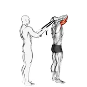 | [0018](../exercises/0018.json) | assisted standing triceps extension (with towel) | assisted | triceps |
| 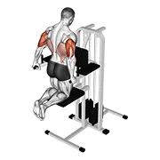 | [0019](../exercises/0019.json) | assisted triceps dip (kneeling) | leverage machine | triceps |
| 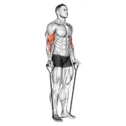 | [0968](../exercises/0968.json) | band alternating biceps curl | band | biceps |
| 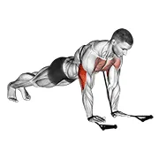 | [0975](../exercises/0975.json) | band close-grip push-up | band | triceps |
| 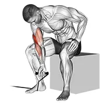 | [0976](../exercises/0976.json) | band concentration curl | band | biceps |
| 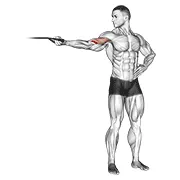 | [0986](../exercises/0986.json) | band one arm overhead biceps curl | band | biceps |
| 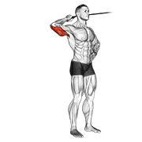 | [0998](../exercises/0998.json) | band side triceps extension | band | triceps |
| 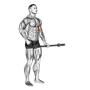 | [0023](../exercises/0023.json) | barbell alternate biceps curl | barbell | biceps |
| 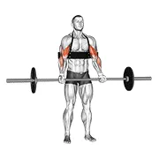 | [2407](../exercises/2407.json) | barbell biceps curl (with arm blaster) | barbell | biceps |
| 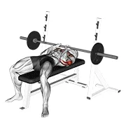 | [0030](../exercises/0030.json) | barbell close-grip bench press | barbell | triceps |
| 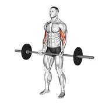 | [0031](../exercises/0031.json) | barbell curl | barbell | biceps |
| 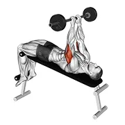 | [0035](../exercises/0035.json) | barbell decline close grip to skull press | barbell | triceps |
| 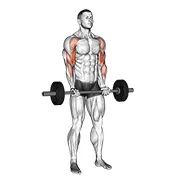 | [0038](../exercises/0038.json) | barbell drag curl | barbell | biceps |
| 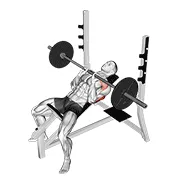 | [1719](../exercises/1719.json) | barbell incline close grip bench press | barbell | triceps |
| 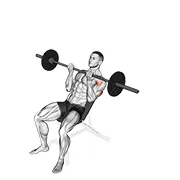 | [0048](../exercises/0048.json) | barbell incline reverse-grip press | barbell | triceps |
| 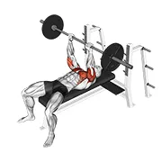 | [0052](../exercises/0052.json) | barbell jm bench press | barbell | triceps |
| 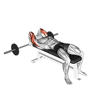 | [1720](../exercises/1720.json) | barbell lying back of the head tricep extension | barbell | triceps |
| 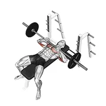 | [0055](../exercises/0055.json) | barbell lying close-grip press | barbell | triceps |
| 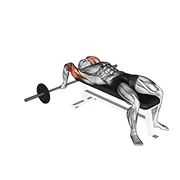 | [0056](../exercises/0056.json) | barbell lying close-grip triceps extension | barbell | triceps |
| 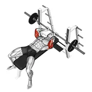 | [0057](../exercises/0057.json) | barbell lying extension | barbell | triceps |
| 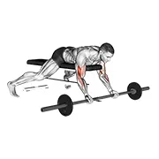 | [0059](../exercises/0059.json) | barbell lying preacher curl | barbell | biceps |
| 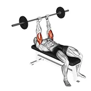 | [0061](../exercises/0061.json) | barbell lying triceps extension | barbell | triceps |
| 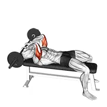 | [0060](../exercises/0060.json) | barbell lying triceps extension skull crusher | barbell | triceps |
| 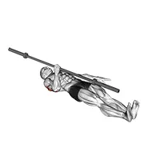 | [0065](../exercises/0065.json) | barbell one arm floor press | barbell | triceps |
| 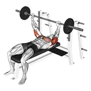 | [1751](../exercises/1751.json) | barbell pin presses | barbell | triceps |
| 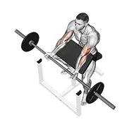 | [0070](../exercises/0070.json) | barbell preacher curl | barbell | biceps |
| 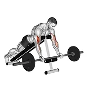 | [0072](../exercises/0072.json) | barbell prone incline curl | barbell | biceps |
| 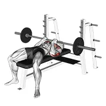 | [2187](../exercises/2187.json) | barbell reverse close-grip bench press | barbell | triceps |
| 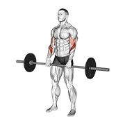 | [0080](../exercises/0080.json) | barbell reverse curl | barbell | biceps |
| 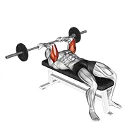 | [1721](../exercises/1721.json) | barbell reverse grip skullcrusher | barbell | triceps |
| 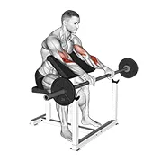 | [0081](../exercises/0081.json) | barbell reverse preacher curl | barbell | biceps |
| 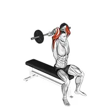 | [1718](../exercises/1718.json) | barbell seated close grip behind neck triceps extension | barbell | triceps |
| 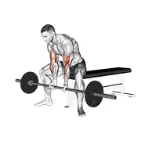 | [0089](../exercises/0089.json) | barbell seated close-grip concentration curl | barbell | biceps |
| 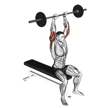 | [0092](../exercises/0092.json) | barbell seated overhead triceps extension | barbell | triceps |
| 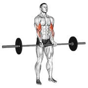 | [0106](../exercises/0106.json) | barbell standing close grip curl | barbell | biceps |
| 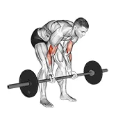 | [2414](../exercises/2414.json) | barbell standing concentration curl | barbell | biceps |
| 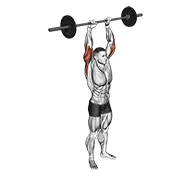 | [0109](../exercises/0109.json) | barbell standing overhead triceps extension | barbell | triceps |
| 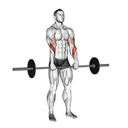 | [0110](../exercises/0110.json) | barbell standing reverse grip curl | barbell | biceps |
| 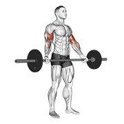 | [1629](../exercises/1629.json) | barbell standing wide grip biceps curl | barbell | biceps |
| 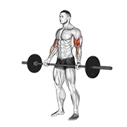 | [0113](../exercises/0113.json) | barbell standing wide-grip curl | barbell | biceps |
| 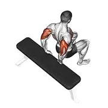 | [0129](../exercises/0129.json) | bench dip (knees bent) | body weight | triceps |
| 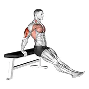 | [1399](../exercises/1399.json) | bench dip on floor | body weight | triceps |
| 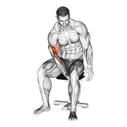 | [1770](../exercises/1770.json) | biceps leg concentration curl | body weight | biceps |
| 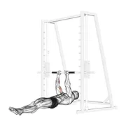 | [0139](../exercises/0139.json) | biceps narrow pull-ups | body weight | biceps |
| 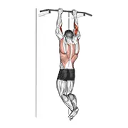 | [0140](../exercises/0140.json) | biceps pull-up | body weight | biceps |
| 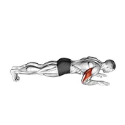 | [0137](../exercises/0137.json) | body-up | body weight | triceps |
| 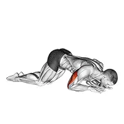 | [1771](../exercises/1771.json) | bodyweight kneeling triceps extension | body weight | triceps |
| 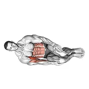 | [1769](../exercises/1769.json) | bodyweight side lying biceps curl | body weight | biceps |
| 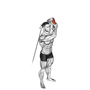 | [0149](../exercises/0149.json) | cable alternate triceps extension | cable | triceps |
| 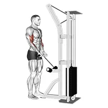 | [1630](../exercises/1630.json) | cable close grip curl | cable | biceps |
|  | [1631](../exercises/1631.json) | cable concentration curl | cable | biceps |
|  | [0152](../exercises/0152.json) | cable concentration extension (on knee) | cable | triceps |
|  | [0868](../exercises/0868.json) | cable curl | cable | biceps |
|  | [1632](../exercises/1632.json) | cable drag curl | cable | biceps |
|  | [0165](../exercises/0165.json) | cable hammer curl (with rope) | cable | biceps |
|  | [1722](../exercises/1722.json) | cable high pulley overhead tricep extension | cable | triceps |
|  | [0173](../exercises/0173.json) | cable incline triceps extension | cable | triceps |
|  | [0860](../exercises/0860.json) | cable kickback | cable | triceps |
|  | [0176](../exercises/0176.json) | cable kneeling triceps extension | cable | triceps |
|  | [1634](../exercises/1634.json) | cable lying bicep curl | cable | biceps |
|  | [0182](../exercises/0182.json) | cable lying close-grip curl | cable | biceps |
|  | [0186](../exercises/0186.json) | cable lying triceps extension v. 2 | cable | triceps |
|  | [0190](../exercises/0190.json) | cable one arm curl | cable | biceps |
|  | [1633](../exercises/1633.json) | cable one arm preacher curl | cable | biceps |
|  | [1635](../exercises/1635.json) | cable one arm reverse preacher curl | cable | biceps |
|  | [1723](../exercises/1723.json) | cable one arm tricep pushdown | cable | triceps |
|  | [1636](../exercises/1636.json) | cable overhead curl | cable | biceps |
|  | [1637](../exercises/1637.json) | cable overhead curl on exercise ball | cable | biceps |
|  | [0194](../exercises/0194.json) | cable overhead triceps extension (rope attachment) | cable | triceps |
|  | [0195](../exercises/0195.json) | cable preacher curl | cable | biceps |
|  | [1638](../exercises/1638.json) | cable pulldown bicep curl | cable | biceps |
|  | [0201](../exercises/0201.json) | cable pushdown | cable | triceps |
|  | [0200](../exercises/0200.json) | cable pushdown (with rope attachment) | cable | triceps |
|  | [0204](../exercises/0204.json) | cable rear drive | cable | triceps |
|  | [0206](../exercises/0206.json) | cable reverse curl | cable | biceps |
|  | [2406](../exercises/2406.json) | cable reverse grip triceps pushdown (sz-bar) (with arm blaster) | cable | triceps |
|  | [1413](../exercises/1413.json) | cable reverse one arm curl | cable | biceps |
|  | [0209](../exercises/0209.json) | cable reverse preacher curl | cable | biceps |
|  | [0207](../exercises/0207.json) | cable reverse-grip pushdown | cable | triceps |
|  | [1639](../exercises/1639.json) | cable rope hammer preacher curl | cable | biceps |
|  | [1724](../exercises/1724.json) | cable rope high pulley overhead tricep extension | cable | triceps |
|  | [1725](../exercises/1725.json) | cable rope incline tricep extension | cable | triceps |
|  | [1726](../exercises/1726.json) | cable rope lying on floor tricep extension | cable | triceps |
|  | [1640](../exercises/1640.json) | cable rope one arm hammer preacher curl | cable | biceps |
|  | [1641](../exercises/1641.json) | cable seated curl | cable | biceps |
|  | [1642](../exercises/1642.json) | cable seated one arm concentration curl | cable | biceps |
|  | [1643](../exercises/1643.json) | cable seated overhead curl | cable | biceps |
|  | [1644](../exercises/1644.json) | cable squatting curl | cable | biceps |
|  | [0229](../exercises/0229.json) | cable standing inner curl | cable | biceps |
|  | [0231](../exercises/0231.json) | cable standing one arm triceps extension | cable | triceps |
|  | [0232](../exercises/0232.json) | cable standing pulldown (with rope) | cable | biceps |
|  | [1727](../exercises/1727.json) | cable standing reverse grip one arm overhead tricep extension | cable | triceps |
|  | [0241](../exercises/0241.json) | cable triceps pushdown (v-bar) | cable | triceps |
|  | [2405](../exercises/2405.json) | cable triceps pushdown (v-bar) (with arm blaster) | cable | triceps |
|  | [1645](../exercises/1645.json) | cable two arm curl on incline bench | cable | biceps |
|  | [1728](../exercises/1728.json) | cable two arm tricep kickback | cable | triceps |
|  | [0259](../exercises/0259.json) | close-grip push-up | body weight | triceps |
|  | [2398](../exercises/2398.json) | close-grip push-up (on knees) | body weight | triceps |
|  | [0283](../exercises/0283.json) | diamond push-up | body weight | triceps |
|  | [0285](../exercises/0285.json) | dumbbell alternate biceps curl | dumbbell | biceps |
|  | [2403](../exercises/2403.json) | dumbbell alternate biceps curl (with arm blaster) | dumbbell | biceps |
|  | [1646](../exercises/1646.json) | dumbbell alternate hammer preacher curl | dumbbell | biceps |
|  | [1647](../exercises/1647.json) | dumbbell alternate preacher curl | dumbbell | biceps |
|  | [1648](../exercises/1648.json) | dumbbell alternate seated hammer curl | dumbbell | biceps |
|  | [1649](../exercises/1649.json) | dumbbell alternating bicep curl with leg raised on exercise ball | dumbbell | biceps |
|  | [1650](../exercises/1650.json) | dumbbell alternating seated bicep curl on exercise ball | dumbbell | biceps |
|  | [1651](../exercises/1651.json) | dumbbell bicep curl lunge with bowling motion | dumbbell | biceps |
|  | [1652](../exercises/1652.json) | dumbbell bicep curl on exercise ball with leg raised | dumbbell | biceps |
|  | [1653](../exercises/1653.json) | dumbbell bicep curl with stork stance | dumbbell | biceps |
|  | [0294](../exercises/0294.json) | dumbbell biceps curl | dumbbell | biceps |
|  | [2401](../exercises/2401.json) | dumbbell biceps curl (with arm blaster) | dumbbell | biceps |
|  | [1654](../exercises/1654.json) | dumbbell biceps curl reverse | dumbbell | biceps |
|  | [1655](../exercises/1655.json) | dumbbell biceps curl squat | dumbbell | biceps |
|  | [1656](../exercises/1656.json) | dumbbell biceps curl v sit on bosu ball | dumbbell | biceps |
|  | [1731](../exercises/1731.json) | dumbbell close grip press | dumbbell | triceps |
|  | [0296](../exercises/0296.json) | dumbbell close-grip press | dumbbell | triceps |
|  | [0297](../exercises/0297.json) | dumbbell concentration curl | dumbbell | biceps |
|  | [0298](../exercises/0298.json) | dumbbell cross body hammer curl | dumbbell | biceps |
|  | [1657](../exercises/1657.json) | dumbbell cross body hammer curl v. 2 | dumbbell | biceps |
|  | [1617](../exercises/1617.json) | dumbbell decline one arm hammer press | dumbbell | triceps |
|  | [0306](../exercises/0306.json) | dumbbell decline triceps extension | dumbbell | triceps |
|  | [1732](../exercises/1732.json) | dumbbell forward lunge triceps extension | dumbbell | triceps |
|  | [0313](../exercises/0313.json) | dumbbell hammer curl | dumbbell | biceps |
|  | [1659](../exercises/1659.json) | dumbbell hammer curl on exercise ball | dumbbell | biceps |
|  | [0312](../exercises/0312.json) | dumbbell hammer curl v. 2 | dumbbell | biceps |
|  | [2402](../exercises/2402.json) | dumbbell hammer curls (with arm blaster) | dumbbell | biceps |
|  | [1664](../exercises/1664.json) | dumbbell high curl | dumbbell | biceps |
|  | [0315](../exercises/0315.json) | dumbbell incline biceps curl | dumbbell | biceps |
|  | [0318](../exercises/0318.json) | dumbbell incline curl | dumbbell | biceps |
|  | [0317](../exercises/0317.json) | dumbbell incline curl v. 2 | dumbbell | biceps |
|  | [0320](../exercises/0320.json) | dumbbell incline hammer curl | dumbbell | biceps |
|  | [1618](../exercises/1618.json) | dumbbell incline hammer press on exercise ball | dumbbell | triceps |
|  | [0322](../exercises/0322.json) | dumbbell incline inner biceps curl | dumbbell | biceps |
|  | [1619](../exercises/1619.json) | dumbbell incline one arm hammer press | dumbbell | triceps |
|  | [1620](../exercises/1620.json) | dumbbell incline one arm hammer press on exercise ball | dumbbell | triceps |
|  | [0330](../exercises/0330.json) | dumbbell incline triceps extension | dumbbell | triceps |
|  | [1733](../exercises/1733.json) | dumbbell incline two arm extension | dumbbell | triceps |
|  | [0333](../exercises/0333.json) | dumbbell kickback | dumbbell | triceps |
|  | [1734](../exercises/1734.json) | dumbbell kickbacks on exercise ball | dumbbell | triceps |
|  | [1660](../exercises/1660.json) | dumbbell kneeling bicep curl exercise ball | dumbbell | biceps |
|  | [1658](../exercises/1658.json) | dumbbell lunge with bicep curl | dumbbell | biceps |
|  | [1729](../exercises/1729.json) | dumbbell lying alternate extension | dumbbell | triceps |
|  | [0338](../exercises/0338.json) | dumbbell lying elbow press | dumbbell | triceps |
|  | [0337](../exercises/0337.json) | dumbbell lying extension (across face) | dumbbell | triceps |
|  | [0344](../exercises/0344.json) | dumbbell lying one arm pronated triceps extension | dumbbell | triceps |
|  | [0346](../exercises/0346.json) | dumbbell lying one arm supinated triceps extension | dumbbell | triceps |
|  | [1735](../exercises/1735.json) | dumbbell lying single extension | dumbbell | triceps |
|  | [1661](../exercises/1661.json) | dumbbell lying supine biceps curl | dumbbell | biceps |
|  | [0350](../exercises/0350.json) | dumbbell lying supine curl | dumbbell | biceps |
|  | [0351](../exercises/0351.json) | dumbbell lying triceps extension | dumbbell | triceps |
|  | [1662](../exercises/1662.json) | dumbbell lying wide curl | dumbbell | biceps |
|  | [0352](../exercises/0352.json) | dumbbell neutral grip bench press | dumbbell | triceps |
|  | [0353](../exercises/0353.json) | dumbbell one arm concentration curl (on stability ball) | dumbbell | biceps |
|  | [1736](../exercises/1736.json) | dumbbell one arm french press on exercise ball | dumbbell | triceps |
|  | [1663](../exercises/1663.json) | dumbbell one arm hammer preacher curl | dumbbell | biceps |
|  | [1621](../exercises/1621.json) | dumbbell one arm hammer press on exercise ball | dumbbell | triceps |
|  | [0354](../exercises/0354.json) | dumbbell one arm kickback | dumbbell | triceps |
|  | [1665](../exercises/1665.json) | dumbbell one arm prone curl | dumbbell | biceps |
|  | [1666](../exercises/1666.json) | dumbbell one arm prone hammer curl | dumbbell | biceps |
|  | [1414](../exercises/1414.json) | dumbbell one arm reverse preacher curl | dumbbell | biceps |
|  | [1667](../exercises/1667.json) | dumbbell one arm reverse spider curl | dumbbell | biceps |
|  | [1668](../exercises/1668.json) | dumbbell one arm seated bicep curl on exercise ball | dumbbell | biceps |
|  | [1669](../exercises/1669.json) | dumbbell one arm seated hammer curl | dumbbell | biceps |
|  | [1670](../exercises/1670.json) | dumbbell one arm standing curl | dumbbell | biceps |
|  | [1671](../exercises/1671.json) | dumbbell one arm standing hammer curl | dumbbell | biceps |
|  | [0362](../exercises/0362.json) | dumbbell one arm triceps extension (on bench) | dumbbell | triceps |
|  | [1672](../exercises/1672.json) | dumbbell one arm zottman preacher curl | dumbbell | biceps |
|  | [0365](../exercises/0365.json) | dumbbell over bench neutral wrist curl | dumbbell | biceps |
|  | [0366](../exercises/0366.json) | dumbbell over bench one arm neutral wrist curl | dumbbell | biceps |
|  | [1623](../exercises/1623.json) | dumbbell palms in incline bench press | dumbbell | triceps |
|  | [0370](../exercises/0370.json) | dumbbell peacher hammer curl | dumbbell | biceps |
|  | [0372](../exercises/0372.json) | dumbbell preacher curl | dumbbell | biceps |
|  | [1673](../exercises/1673.json) | dumbbell preacher curl over exercise ball | dumbbell | biceps |
|  | [0373](../exercises/0373.json) | dumbbell pronate-grip triceps extension | dumbbell | triceps |
|  | [0374](../exercises/0374.json) | dumbbell prone incline curl | dumbbell | biceps |
|  | [1674](../exercises/1674.json) | dumbbell prone incline hammer curl | dumbbell | biceps |
|  | [0382](../exercises/0382.json) | dumbbell revers grip biceps curl | dumbbell | biceps |
|  | [0384](../exercises/0384.json) | dumbbell reverse preacher curl | dumbbell | biceps |
|  | [1675](../exercises/1675.json) | dumbbell reverse spider curl | dumbbell | biceps |
|  | [1676](../exercises/1676.json) | dumbbell seated alternate hammer curl on exercise ball | dumbbell | biceps |
|  | [0389](../exercises/0389.json) | dumbbell seated bench extension | dumbbell | triceps |
|  | [1730](../exercises/1730.json) | dumbbell seated bent over alternate kickback | dumbbell | triceps |
|  | [1737](../exercises/1737.json) | dumbbell seated bent over triceps extension | dumbbell | triceps |
|  | [1677](../exercises/1677.json) | dumbbell seated bicep curl | dumbbell | biceps |
|  | [0390](../exercises/0390.json) | dumbbell seated biceps curl (on stability ball) | dumbbell | biceps |
|  | [3547](../exercises/3547.json) | dumbbell seated biceps curl to shoulder press | dumbbell | biceps |
|  | [0391](../exercises/0391.json) | dumbbell seated curl | dumbbell | biceps |
|  | [1678](../exercises/1678.json) | dumbbell seated hammer curl | dumbbell | biceps |
|  | [0393](../exercises/0393.json) | dumbbell seated inner biceps curl | dumbbell | biceps |
|  | [0394](../exercises/0394.json) | dumbbell seated kickback | dumbbell | triceps |
|  | [0397](../exercises/0397.json) | dumbbell seated neutral wrist curl | dumbbell | biceps |
|  | [1679](../exercises/1679.json) | dumbbell seated one arm bicep curl on exercise ball with leg raised | dumbbell | biceps |
|  | [0398](../exercises/0398.json) | dumbbell seated one arm kickback | dumbbell | triceps |
|  | [0402](../exercises/0402.json) | dumbbell seated preacher curl | dumbbell | biceps |
|  | [0403](../exercises/0403.json) | dumbbell seated revers grip concentration curl | dumbbell | biceps |
|  | [1738](../exercises/1738.json) | dumbbell seated reverse grip one arm overhead tricep extension | dumbbell | triceps |
|  | [2188](../exercises/2188.json) | dumbbell seated triceps extension | dumbbell | triceps |
|  | [3560](../exercises/3560.json) | dumbbell standing alternate hammer curl and press | dumbbell | biceps |
|  | [1739](../exercises/1739.json) | dumbbell standing alternating tricep kickback | dumbbell | triceps |
|  | [1740](../exercises/1740.json) | dumbbell standing bent over one arm triceps extension | dumbbell | triceps |
|  | [1741](../exercises/1741.json) | dumbbell standing bent over two arm triceps extension | dumbbell | triceps |
|  | [0416](../exercises/0416.json) | dumbbell standing biceps curl | dumbbell | biceps |
|  | [0418](../exercises/0418.json) | dumbbell standing concentration curl | dumbbell | biceps |
|  | [2321](../exercises/2321.json) | dumbbell standing inner biceps curl v. 2 | dumbbell | biceps |
|  | [0420](../exercises/0420.json) | dumbbell standing kickback | dumbbell | triceps |
|  | [0421](../exercises/0421.json) | dumbbell standing one arm concentration curl | dumbbell | biceps |
|  | [0422](../exercises/0422.json) | dumbbell standing one arm curl (over incline bench) | dumbbell | biceps |
|  | [1680](../exercises/1680.json) | dumbbell standing one arm curl over incline bench | dumbbell | biceps |
|  | [0423](../exercises/0423.json) | dumbbell standing one arm extension | dumbbell | triceps |
|  | [0425](../exercises/0425.json) | dumbbell standing one arm reverse curl | dumbbell | biceps |
|  | [0428](../exercises/0428.json) | dumbbell standing preacher curl | dumbbell | biceps |
|  | [0429](../exercises/0429.json) | dumbbell standing reverse curl | dumbbell | biceps |
|  | [0430](../exercises/0430.json) | dumbbell standing triceps extension | dumbbell | triceps |
|  | [2293](../exercises/2293.json) | dumbbell standing zottman preacher curl | dumbbell | biceps |
|  | [1684](../exercises/1684.json) | dumbbell step up single leg balance with bicep curl | dumbbell | biceps |
|  | [0436](../exercises/0436.json) | dumbbell tate press | dumbbell | triceps |
|  | [1742](../exercises/1742.json) | dumbbell tricep kickback with stork stance | dumbbell | triceps |
|  | [1743](../exercises/1743.json) | dumbbell twisting bench press | dumbbell | triceps |
|  | [5201](../exercises/5201.json) | dumbbell waiter biceps curl | dumbbell | biceps |
|  | [0439](../exercises/0439.json) | dumbbell zottman curl | dumbbell | biceps |
|  | [2294](../exercises/2294.json) | dumbbell zottman preacher curl | dumbbell | biceps |
|  | [2189](../exercises/2189.json) | dumbbells seated triceps extension | dumbbell | triceps |
|  | [3287](../exercises/3287.json) | elbow dips | body weight | triceps |
|  | [1744](../exercises/1744.json) | exercise ball dip | stability ball | triceps |
|  | [1745](../exercises/1745.json) | exercise ball seated triceps stretch | stability ball | triceps |
|  | [1746](../exercises/1746.json) | exercise ball supine triceps extension | dumbbell | triceps |
|  | [1747](../exercises/1747.json) | ez bar french press on exercise ball | ez barbell | triceps |
|  | [1748](../exercises/1748.json) | ez bar lying close grip triceps extension behind head | ez barbell | triceps |
|  | [1682](../exercises/1682.json) | ez bar seated close grip concentration curl | ez barbell | biceps |
|  | [1749](../exercises/1749.json) | ez bar standing french press | ez barbell | triceps |
|  | [1627](../exercises/1627.json) | ez barbell close grip preacher curl | ez barbell | biceps |
|  | [0446](../exercises/0446.json) | ez barbell close-grip curl | ez barbell | biceps |
|  | [0447](../exercises/0447.json) | ez barbell curl | ez barbell | biceps |
|  | [0448](../exercises/0448.json) | ez barbell decline close grip face press | ez barbell | triceps |
|  | [2186](../exercises/2186.json) | ez barbell decline triceps extension | ez barbell | triceps |
|  | [0449](../exercises/0449.json) | ez barbell incline triceps extension | ez barbell | triceps |
|  | [0450](../exercises/0450.json) | ez barbell jm bench press | ez barbell | triceps |
|  | [0451](../exercises/0451.json) | ez barbell reverse grip curl | ez barbell | biceps |
|  | [0452](../exercises/0452.json) | ez barbell reverse grip preacher curl | ez barbell | biceps |
|  | [1458](../exercises/1458.json) | ez barbell seated curls | ez barbell | biceps |
|  | [0453](../exercises/0453.json) | ez barbell seated triceps extension | ez barbell | triceps |
|  | [0454](../exercises/0454.json) | ez barbell spider curl | ez barbell | biceps |
|  | [1628](../exercises/1628.json) | ez barbell spider curl | ez barbell | biceps |
|  | [2404](../exercises/2404.json) | ez-bar biceps curl (with arm blaster) | ez barbell | biceps |
|  | [2432](../exercises/2432.json) | ez-bar close-grip bench press | ez barbell | triceps |
|  | [2741](../exercises/2741.json) | ez-barbell standing wide grip biceps curl | ez barbell | biceps |
|  | [3302](../exercises/3302.json) | handstand | body weight | triceps |
|  | [0471](../exercises/0471.json) | handstand push-up | body weight | triceps |
|  | [3289](../exercises/3289.json) | impossible dips | body weight | triceps |
|  | [0490](../exercises/0490.json) | incline close-grip push-up | body weight | triceps |
|  | [0525](../exercises/0525.json) | kettlebell bottoms up clean from the hang position | kettlebell | biceps |
|  | [0526](../exercises/0526.json) | kettlebell double alternating hang clean | kettlebell | biceps |
|  | [0575](../exercises/0575.json) | lever bicep curl | leverage machine | biceps |
|  | [1615](../exercises/1615.json) | lever hammer grip preacher curl | leverage machine | biceps |
|  | [0591](../exercises/0591.json) | lever overhand triceps dip | leverage machine | triceps |
|  | [0592](../exercises/0592.json) | lever preacher curl | leverage machine | biceps |
|  | [1614](../exercises/1614.json) | lever preacher curl v. 2 | leverage machine | biceps |
|  | [1616](../exercises/1616.json) | lever reverse grip preacher curl | leverage machine | biceps |
|  | [1451](../exercises/1451.json) | lever seated dip | leverage machine | triceps |
|  | [0607](../exercises/0607.json) | lever triceps extension | leverage machine | triceps |
|  | [1701](../exercises/1701.json) | medicine ball close grip push up | medicine ball | triceps |
|  | [1750](../exercises/1750.json) | medicine ball supine chest throw | medicine ball | triceps |
|  | [2328](../exercises/2328.json) | narrow push-up on exercise ball | stability ball | triceps |
|  | [0636](../exercises/0636.json) | olympic barbell hammer curl | olympic barbell | biceps |
|  | [0637](../exercises/0637.json) | olympic barbell triceps extension | olympic barbell | triceps |
|  | [0639](../exercises/0639.json) | one arm dip | body weight | triceps |
|  | [0643](../exercises/0643.json) | overhead triceps stretch | body weight | triceps |
|  | [0660](../exercises/0660.json) | push-up close-grip off dumbbell | dumbbell | triceps |
|  | [1467](../exercises/1467.json) | push-up on lower arms | body weight | triceps |
|  | [3123](../exercises/3123.json) | resistance band seated biceps curl | resistance band | biceps |
|  | [0672](../exercises/0672.json) | reverse dip | body weight | triceps |
|  | [0677](../exercises/0677.json) | ring dips | body weight | triceps |
|  | [0717](../exercises/0717.json) | side push-up | body weight | triceps |
|  | [2142](../exercises/2142.json) | ski ergometer | skierg machine | triceps |
|  | [0751](../exercises/0751.json) | smith close-grip bench press | smith machine | triceps |
|  | [1683](../exercises/1683.json) | smith machine bicep curl | smith machine | biceps |
|  | [1625](../exercises/1625.json) | smith machine decline close grip bench press | smith machine | triceps |
|  | [1752](../exercises/1752.json) | smith machine incline tricep extension | smith machine | triceps |
|  | [3291](../exercises/3291.json) | stalder press | body weight | triceps |
|  | [1753](../exercises/1753.json) | three bench dip | body weight | triceps |
|  | [0814](../exercises/0814.json) | triceps dip | body weight | triceps |
|  | [0812](../exercises/0812.json) | triceps dip (bench leg) | body weight | triceps |
|  | [0813](../exercises/0813.json) | triceps dip (between benches) | body weight | triceps |
|  | [0815](../exercises/0815.json) | triceps dips floor | body weight | triceps |
|  | [0816](../exercises/0816.json) | triceps press | body weight | triceps |
|  | [0817](../exercises/0817.json) | triceps stretch | body weight | triceps |
|  | [0830](../exercises/0830.json) | weighted bench dip | weighted | triceps |
|  | [0847](../exercises/0847.json) | weighted seated bicep curl (on stability ball) | medicine ball | biceps |
|  | [0853](../exercises/0853.json) | weighted standing curl | weighted | biceps |
|  | [1754](../exercises/1754.json) | weighted three bench dips | weighted | triceps |
|  | [1755](../exercises/1755.json) | weighted tricep dips | weighted | triceps |
|  | [1767](../exercises/1767.json) | weighted triceps dip on high parallel bars | weighted | triceps |
