# upper legs

Generated by `scripts/catalogue/build.mjs`, do not edit. Click an id to edit that exercise. Pictures © Gym visual, licensed for openGym only (see [NOTICE](../media/NOTICE.md)).

| | id | name | equipment | target |
|---|---|---|---|---|
| 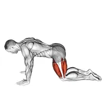 | [1512](../exercises/1512.json) | all fours squad stretch | body weight | quads |
| 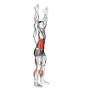 | [3214](../exercises/3214.json) | arms apart circular toe touch (male) | body weight | glutes |
| 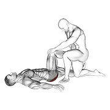 | [1709](../exercises/1709.json) | assisted lying glutes stretch | assisted | glutes |
| 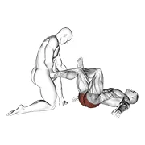 | [1710](../exercises/1710.json) | assisted lying gluteus and piriformis stretch | assisted | glutes |
| 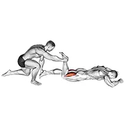 | [0016](../exercises/0016.json) | assisted prone hamstring | assisted | hamstrings |
| 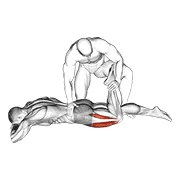 | [1713](../exercises/1713.json) | assisted prone lying quads stretch | assisted | quads |
| 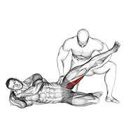 | [1712](../exercises/1712.json) | assisted side lying adductor stretch | assisted | adductors |
| 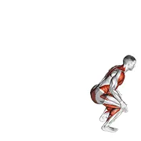 | [1473](../exercises/1473.json) | backward jump | body weight | quads |
| 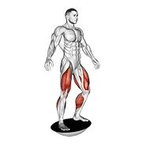 | [0020](../exercises/0020.json) | balance board | body weight | quads |
| 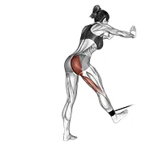 | [0980](../exercises/0980.json) | band bent-over hip extension | band | glutes |
| 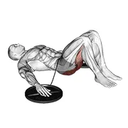 | [1408](../exercises/1408.json) | band hip lift | band | glutes |
| 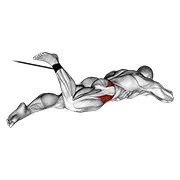 | [0984](../exercises/0984.json) | band lying hip internal rotation | band | glutes |
| 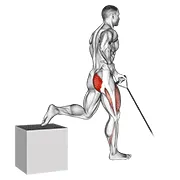 | [0987](../exercises/0987.json) | band one arm single leg split squat | band | quads |
| 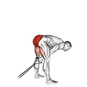 | [0991](../exercises/0991.json) | band pull through | band | glutes |
| 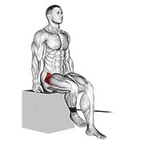 | [0996](../exercises/0996.json) | band seated hip internal rotation | band | glutes |
| 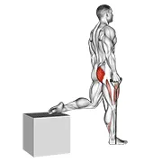 | [1001](../exercises/1001.json) | band single leg split squat | band | quads |
| 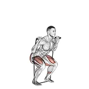 | [1004](../exercises/1004.json) | band squat | band | glutes |
| 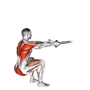 | [1003](../exercises/1003.json) | band squat row | band | glutes |
| 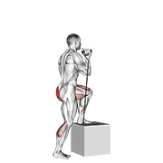 | [1008](../exercises/1008.json) | band step-up | band | glutes |
| 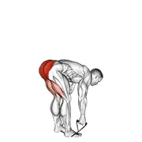 | [1009](../exercises/1009.json) | band stiff leg deadlift | band | glutes |
| 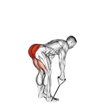 | [1023](../exercises/1023.json) | band straight back stiff leg deadlift | band | glutes |
| 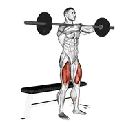 | [0024](../exercises/0024.json) | barbell bench front squat | barbell | quads |
| 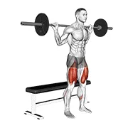 | [0026](../exercises/0026.json) | barbell bench squat | barbell | quads |
| 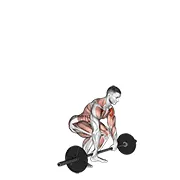 | [0028](../exercises/0028.json) | barbell clean and press | barbell | quads |
| 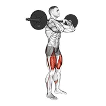 | [0029](../exercises/0029.json) | barbell clean-grip front squat | barbell | glutes |
| 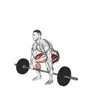 | [0032](../exercises/0032.json) | barbell deadlift | barbell | glutes |
| 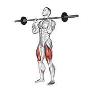 | [0039](../exercises/0039.json) | barbell front chest squat | barbell | glutes |
| 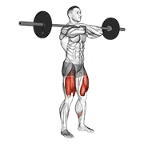 | [0042](../exercises/0042.json) | barbell front squat | barbell | glutes |
| 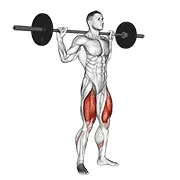 | [0043](../exercises/0043.json) | barbell full squat | barbell | glutes |
| 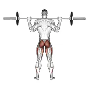 | [1461](../exercises/1461.json) | barbell full squat (back pov) | barbell | glutes |
| 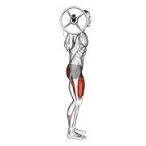 | [1462](../exercises/1462.json) | barbell full squat (side pov) | barbell | glutes |
| 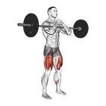 | [1545](../exercises/1545.json) | barbell full zercher squat | barbell | glutes |
| 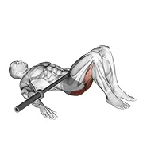 | [1409](../exercises/1409.json) | barbell glute bridge | barbell | glutes |
| 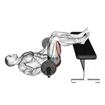 | [3562](../exercises/3562.json) | barbell glute bridge two legs on bench (male) | barbell | glutes |
| 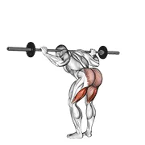 | [0044](../exercises/0044.json) | barbell good morning | barbell | hamstrings |
| 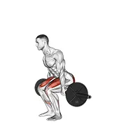 | [0046](../exercises/0046.json) | barbell hack squat | barbell | glutes |
| 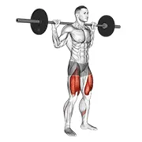 | [1436](../exercises/1436.json) | barbell high bar squat | barbell | glutes |
| 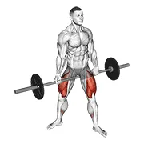 | [0051](../exercises/0051.json) | barbell jefferson squat | barbell | glutes |
| 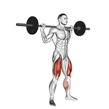 | [0053](../exercises/0053.json) | barbell jump squat | barbell | glutes |
| 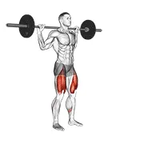 | [1410](../exercises/1410.json) | barbell lateral lunge | barbell | glutes |
| 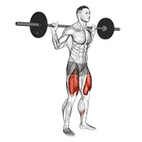 | [1435](../exercises/1435.json) | barbell low bar squat | barbell | glutes |
| 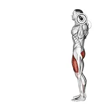 | [0054](../exercises/0054.json) | barbell lunge | barbell | glutes |
| 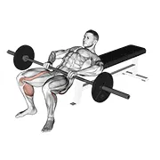 | [0058](../exercises/0058.json) | barbell lying lifting (on hip) | barbell | glutes |
| 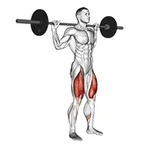 | [0063](../exercises/0063.json) | barbell narrow stance squat | barbell | glutes |
| 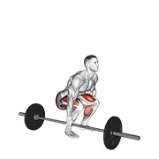 | [0066](../exercises/0066.json) | barbell one arm side deadlift | barbell | glutes |
| 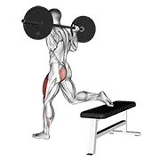 | [0068](../exercises/0068.json) | barbell one leg squat | barbell | quads |
| 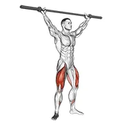 | [0069](../exercises/0069.json) | barbell overhead squat | barbell | quads |
| 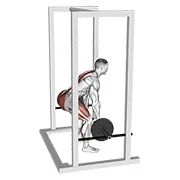 | [0074](../exercises/0074.json) | barbell rack pull | barbell | glutes |
| 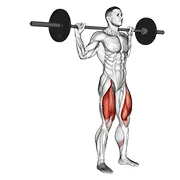 | [0078](../exercises/0078.json) | barbell rear lunge | barbell | glutes |
| 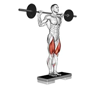 | [0077](../exercises/0077.json) | barbell rear lunge v. 2 | barbell | glutes |
|  | [0085](../exercises/0085.json) | barbell romanian deadlift | barbell | glutes |
|  | [0090](../exercises/0090.json) | barbell seated good morning | barbell | glutes |
|  | [0098](../exercises/0098.json) | barbell side split squat | barbell | quads |
|  | [0097](../exercises/0097.json) | barbell side split squat v. 2 | barbell | quads |
|  | [1756](../exercises/1756.json) | barbell single leg deadlift | barbell | glutes |
|  | [0099](../exercises/0099.json) | barbell single leg split squat | barbell | quads |
|  | [0101](../exercises/0101.json) | barbell speed squat | barbell | glutes |
|  | [2810](../exercises/2810.json) | barbell split squat v. 2 | barbell | quads |
|  | [0102](../exercises/0102.json) | barbell squat (on knees) | barbell | quads |
|  | [2798](../exercises/2798.json) | barbell squat jump step rear lunge | barbell | quads |
|  | [0114](../exercises/0114.json) | barbell step-up | barbell | glutes |
|  | [0115](../exercises/0115.json) | barbell stiff leg good morning | barbell | glutes |
|  | [0116](../exercises/0116.json) | barbell straight leg deadlift | barbell | hamstrings |
|  | [0117](../exercises/0117.json) | barbell sumo deadlift | barbell | glutes |
|  | [0124](../exercises/0124.json) | barbell wide squat | barbell | quads |
|  | [0127](../exercises/0127.json) | barbell zercher squat | barbell | glutes |
|  | [3212](../exercises/3212.json) | basic toe touch (male) | body weight | glutes |
|  | [0130](../exercises/0130.json) | bench hip extension | body weight | glutes |
|  | [3639](../exercises/3639.json) | bent knee lying twist (male) | body weight | glutes |
|  | [3543](../exercises/3543.json) | bodyweight drop jump squat | body weight | glutes |
|  | [1494](../exercises/1494.json) | butterfly yoga pose | body weight | adductors |
|  | [3235](../exercises/3235.json) | cable assisted inverse leg curl | cable | hamstrings |
|  | [0157](../exercises/0157.json) | cable deadlift | cable | glutes |
|  | [0168](../exercises/0168.json) | cable hip adduction | cable | adductors |
|  | [0196](../exercises/0196.json) | cable pull through (with rope) | cable | glutes |
|  | [0228](../exercises/0228.json) | cable standing hip extension | cable | glutes |
|  | [1548](../exercises/1548.json) | chair leg extended stretch | body weight | quads |
|  | [3769](../exercises/3769.json) | curtsey squat | body weight | glutes |
|  | [0291](../exercises/0291.json) | dumbbell bench squat | dumbbell | glutes |
|  | [0295](../exercises/0295.json) | dumbbell clean | dumbbell | glutes |
|  | [3635](../exercises/3635.json) | dumbbell contralateral forward lunge | dumbbell | glutes |
|  | [0300](../exercises/0300.json) | dumbbell deadlift | dumbbell | glutes |
|  | [1760](../exercises/1760.json) | dumbbell goblet squat | dumbbell | quads |
|  | [0336](../exercises/0336.json) | dumbbell lunge | dumbbell | glutes |
|  | [0339](../exercises/0339.json) | dumbbell lying femoral | dumbbell | hamstrings |
|  | [3888](../exercises/3888.json) | dumbbell one arm snatch | dumbbell | glutes |
|  | [0371](../exercises/0371.json) | dumbbell plyo squat | dumbbell | glutes |
|  | [0381](../exercises/0381.json) | dumbbell rear lunge | dumbbell | glutes |
|  | [1459](../exercises/1459.json) | dumbbell romanian deadlift | dumbbell | glutes |
|  | [1757](../exercises/1757.json) | dumbbell single leg deadlift | dumbbell | glutes |
|  | [2805](../exercises/2805.json) | dumbbell single leg deadlift with stepbox support | dumbbell | glutes |
|  | [0410](../exercises/0410.json) | dumbbell single leg split squat | dumbbell | quads |
|  | [0411](../exercises/0411.json) | dumbbell single leg squat | dumbbell | glutes |
|  | [0413](../exercises/0413.json) | dumbbell squat | dumbbell | glutes |
|  | [0431](../exercises/0431.json) | dumbbell step-up | dumbbell | glutes |
|  | [2796](../exercises/2796.json) | dumbbell step-up lunge | dumbbell | quads |
|  | [2812](../exercises/2812.json) | dumbbell step-up split squat | dumbbell | quads |
|  | [0432](../exercises/0432.json) | dumbbell stiff leg deadlift | dumbbell | glutes |
|  | [0434](../exercises/0434.json) | dumbbell straight leg deadlift | dumbbell | glutes |
|  | [2808](../exercises/2808.json) | dumbbell sumo pull through | dumbbell | glutes |
|  | [2803](../exercises/2803.json) | dumbbell supported squat | dumbbell | quads |
|  | [1559](../exercises/1559.json) | exercise ball hip flexor stretch | stability ball | glutes |
|  | [1416](../exercises/1416.json) | exercise ball one leg prone lower body rotation | stability ball | glutes |
|  | [1417](../exercises/1417.json) | exercise ball one legged diagonal kick hamstring curl | stability ball | glutes |
|  | [1560](../exercises/1560.json) | exercise ball seated hamstring stretch | stability ball | hamstrings |
|  | [2133](../exercises/2133.json) | farmers walk | dumbbell | quads |
|  | [0459](../exercises/0459.json) | flutter kicks | body weight | glutes |
|  | [1472](../exercises/1472.json) | forward jump | body weight | quads |
|  | [3470](../exercises/3470.json) | forward lunge (male) | body weight | glutes |
|  | [3194](../exercises/3194.json) | frankenstein squat | barbell | glutes |
|  | [3561](../exercises/3561.json) | glute bridge march | body weight | glutes |
|  | [3523](../exercises/3523.json) | glute bridge two legs on bench (male) | body weight | glutes |
|  | [3193](../exercises/3193.json) | glute-ham raise | body weight | hamstrings |
|  | [1511](../exercises/1511.json) | hamstring stretch | body weight | hamstrings |
|  | [3218](../exercises/3218.json) | hands clasped circular toe touch (male) | body weight | glutes |
|  | [3215](../exercises/3215.json) | hands reversed clasped circular toe touch (male) | body weight | glutes |
|  | [1418](../exercises/1418.json) | hug keens to chest | body weight | glutes |
|  | [1564](../exercises/1564.json) | intermediate hip flexor and quad stretch | rope | quads |
|  | [0496](../exercises/0496.json) | inverse leg curl (bench support) | body weight | hamstrings |
|  | [2400](../exercises/2400.json) | inverse leg curl (on pull-up cable machine) | body weight | hamstrings |
|  | [1419](../exercises/1419.json) | iron cross stretch | body weight | glutes |
|  | [0514](../exercises/0514.json) | jump squat | body weight | glutes |
|  | [0513](../exercises/0513.json) | jump squat v. 2 | body weight | glutes |
|  | [0533](../exercises/0533.json) | kettlebell front squat | kettlebell | glutes |
|  | [0534](../exercises/0534.json) | kettlebell goblet squat | kettlebell | glutes |
|  | [0535](../exercises/0535.json) | kettlebell hang clean | kettlebell | hamstrings |
|  | [0536](../exercises/0536.json) | kettlebell lunge pass through | kettlebell | glutes |
|  | [0544](../exercises/0544.json) | kettlebell pistol squat | kettlebell | glutes |
|  | [0549](../exercises/0549.json) | kettlebell swing | kettlebell | glutes |
|  | [0551](../exercises/0551.json) | kettlebell turkish get up (squat style) | kettlebell | glutes |
|  | [0555](../exercises/0555.json) | kick out sit | body weight | hamstrings |
|  | [1420](../exercises/1420.json) | kneeling jump squat | barbell | glutes |
|  | [1576](../exercises/1576.json) | leg up hamstring stretch | body weight | hamstrings |
|  | [2287](../exercises/2287.json) | lever alternate leg press | leverage machine | quads |
|  | [0578](../exercises/0578.json) | lever deadlift | leverage machine | glutes |
|  | [2286](../exercises/2286.json) | lever hip extension v. 2 | leverage machine | glutes |
|  | [2611](../exercises/2611.json) | lever horizontal one leg press | leverage machine | glutes |
|  | [0582](../exercises/0582.json) | lever kneeling leg curl | leverage machine | hamstrings |
|  | [0585](../exercises/0585.json) | lever leg extension | leverage machine | quads |
|  | [0586](../exercises/0586.json) | lever lying leg curl | leverage machine | hamstrings |
|  | [3195](../exercises/3195.json) | lever lying two-one leg curl | leverage machine | hamstrings |
|  | [0593](../exercises/0593.json) | lever reverse hyperextension | leverage machine | glutes |
|  | [3759](../exercises/3759.json) | lever seated good morning | leverage machine | glutes |
|  | [0597](../exercises/0597.json) | lever seated hip abduction | leverage machine | abductors |
|  | [0598](../exercises/0598.json) | lever seated hip adduction | leverage machine | adductors |
|  | [0599](../exercises/0599.json) | lever seated leg curl | leverage machine | hamstrings |
|  | [3013](../exercises/3013.json) | low glute bridge on floor | body weight | glutes |
|  | [3582](../exercises/3582.json) | lunge with jump | body weight | glutes |
|  | [0613](../exercises/0613.json) | lying (side) quads stretch | body weight | quads |
|  | [0624](../exercises/0624.json) | march sit (wall) | body weight | glutes |
|  | [0628](../exercises/0628.json) | monster walk | body weight | glutes |
|  | [1476](../exercises/1476.json) | one leg squat | body weight | glutes |
|  | [0642](../exercises/0642.json) | outside leg kick push-up | body weight | glutes |
|  | [1422](../exercises/1422.json) | pelvic tilt into bridge | body weight | glutes |
|  | [3662](../exercises/3662.json) | pike-to-cobra push-up | body weight | glutes |
|  | [3132](../exercises/3132.json) | potty squat with support | body weight | glutes |
|  | [0648](../exercises/0648.json) | power clean | barbell | hamstrings |
|  | [0661](../exercises/0661.json) | push-up inside leg kick | body weight | glutes |
|  | [3533](../exercises/3533.json) | quads | body weight | quads |
|  | [3552](../exercises/3552.json) | quick feet v. 2 | body weight | quads |
|  | [0668](../exercises/0668.json) | rear decline bridge | body weight | glutes |
|  | [1582](../exercises/1582.json) | reclining big toe pose with rope | rope | hamstrings |
|  | [3236](../exercises/3236.json) | resistance band hip thrusts on knees (female) | resistance band | glutes |
|  | [3007](../exercises/3007.json) | resistance band leg extension | resistance band | quads |
|  | [3006](../exercises/3006.json) | resistance band seated hip abduction | resistance band | abductors |
|  | [0675](../exercises/0675.json) | reverse hyper extension (on stability ball) | stability ball | glutes |
|  | [1423](../exercises/1423.json) | reverse hyper on flat bench | body weight | glutes |
|  | [2571](../exercises/2571.json) | rocking frog stretch | body weight | glutes |
|  | [2205](../exercises/2205.json) | roller hip lat stretch | roller | glutes |
|  | [2202](../exercises/2202.json) | roller hip stretch | roller | glutes |
|  | [1585](../exercises/1585.json) | runners stretch | body weight | hamstrings |
|  | [1424](../exercises/1424.json) | seated glute stretch | body weight | glutes |
|  | [2567](../exercises/2567.json) | seated piriformis stretch | body weight | glutes |
|  | [1587](../exercises/1587.json) | seated wide angle pose sequence | body weight | hamstrings |
|  | [0697](../exercises/0697.json) | self assisted inverse leg curl | body weight | hamstrings |
|  | [1766](../exercises/1766.json) | self assisted inverse leg curl | body weight | hamstrings |
|  | [0696](../exercises/0696.json) | self assisted inverse leg curl (on floor) | body weight | hamstrings |
|  | [1774](../exercises/1774.json) | side bridge hip abduction | body weight | abductors |
|  | [0710](../exercises/0710.json) | side hip abduction | body weight | abductors |
|  | [3667](../exercises/3667.json) | side lying hip adduction (male) | body weight | adductors |
|  | [1775](../exercises/1775.json) | side plank hip adduction | body weight | adductors |
|  | [3645](../exercises/3645.json) | single leg bridge with outstretched leg | body weight | glutes |
|  | [0730](../exercises/0730.json) | single leg platform slide | body weight | hamstrings |
|  | [1759](../exercises/1759.json) | single leg squat (pistol) male | body weight | glutes |
|  | [1489](../exercises/1489.json) | sissy squat | body weight | quads |
|  | [1425](../exercises/1425.json) | sled 45 degrees one leg press | sled machine | glutes |
|  | [0739](../exercises/0739.json) | sled 45° leg press | sled machine | glutes |
|  | [1464](../exercises/1464.json) | sled 45° leg press (back pov) | sled machine | glutes |
|  | [1463](../exercises/1463.json) | sled 45° leg press (side pov) | sled machine | glutes |
|  | [0740](../exercises/0740.json) | sled 45° leg wide press | sled machine | glutes |
|  | [0741](../exercises/0741.json) | sled closer hack squat | sled machine | glutes |
|  | [0743](../exercises/0743.json) | sled hack squat | sled machine | glutes |
|  | [0744](../exercises/0744.json) | sled lying squat | sled machine | glutes |
|  | [0749](../exercises/0749.json) | smith bent knee good morning | smith machine | glutes |
|  | [0750](../exercises/0750.json) | smith chair squat | smith machine | quads |
|  | [0752](../exercises/0752.json) | smith deadlift | smith machine | glutes |
|  | [1433](../exercises/1433.json) | smith front squat (clean grip) | smith machine | glutes |
|  | [3281](../exercises/3281.json) | smith full squat | smith machine | glutes |
|  | [0755](../exercises/0755.json) | smith hack squat | smith machine | glutes |
|  | [0760](../exercises/0760.json) | smith leg press | smith machine | glutes |
|  | [1434](../exercises/1434.json) | smith low bar squat | smith machine | glutes |
|  | [0768](../exercises/0768.json) | smith single leg split squat | smith machine | quads |
|  | [0769](../exercises/0769.json) | smith sprint lunge | smith machine | glutes |
|  | [0770](../exercises/0770.json) | smith squat | smith machine | glutes |
|  | [3142](../exercises/3142.json) | smith sumo squat | smith machine | glutes |
|  | [0776](../exercises/0776.json) | snatch pull | barbell | quads |
|  | [0778](../exercises/0778.json) | spider crawl push up | body weight | glutes |
|  | [2368](../exercises/2368.json) | split squats | body weight | quads |
|  | [0786](../exercises/0786.json) | squat jerk | barbell | quads |
|  | [1705](../exercises/1705.json) | squat on bosu ball | bosu ball | quads |
|  | [1685](../exercises/1685.json) | squat to overhead reach | body weight | quads |
|  | [1686](../exercises/1686.json) | squat to overhead reach with twist | body weight | quads |
|  | [1599](../exercises/1599.json) | standing hamstring and calf stretch with strap | rope | hamstrings |
|  | [0795](../exercises/0795.json) | standing single leg curl | body weight | hamstrings |
|  | [1427](../exercises/1427.json) | straight leg outer hip abductor | body weight | abductors |
|  | [0809](../exercises/0809.json) | suspended split squat | body weight | quads |
|  | [3433](../exercises/3433.json) | swimmer kicks v. 2 (male) | body weight | glutes |
|  | [2459](../exercises/2459.json) | tire flip | tire | glutes |
|  | [0811](../exercises/0811.json) | trap bar deadlift | trap bar | glutes |
|  | [1466](../exercises/1466.json) | twist hip lift | body weight | glutes |
|  | [1460](../exercises/1460.json) | walking lunge | body weight | glutes |
|  | [3643](../exercises/3643.json) | weighted cossack squats (male) | weighted | glutes |
|  | [3644](../exercises/3644.json) | weighted lunge with swing | weighted | glutes |
|  | [0851](../exercises/0851.json) | weighted sissy squat | weighted | quads |
|  | [0852](../exercises/0852.json) | weighted squat | weighted | glutes |
|  | [3642](../exercises/3642.json) | weighted stretch lunge | weighted | glutes |
|  | [1604](../exercises/1604.json) | world greatest stretch | body weight | hamstrings |
