# waist

Generated by `scripts/catalogue/build.mjs`, do not edit. Click an id to edit that exercise. Pictures © Gym visual, licensed for openGym only (see [NOTICE](../media/NOTICE.md)).

| | id | name | equipment | target |
|---|---|---|---|---|
| 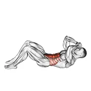 | [0001](../exercises/0001.json) | 3/4 sit-up | body weight | abs |
| 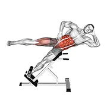 | [5265](../exercises/5265.json) | 45 degree bicycle twisting crunch | body weight | abs |
| 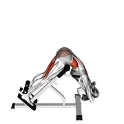 | [1171](../exercises/1171.json) | 45 degree twisting hyperextension | body weight | spine |
| 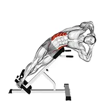 | [5699](../exercises/5699.json) | 45 degrees side bend | body weight | abs |
| 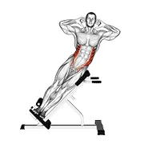 | [0002](../exercises/0002.json) | 45° side bend | body weight | abs |
| 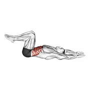 | [4007](../exercises/4007.json) | 90 degree heel touch | body weight | abs |
| 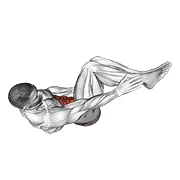 | [6428](../exercises/6428.json) | 90 degree heel touch v. 2 | body weight | abs |
| 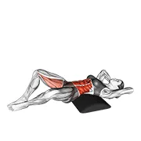 | [6555](../exercises/6555.json) | ab mat sit up | body weight | abs |
| 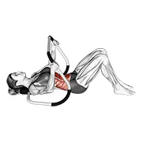 | [2269](../exercises/2269.json) | ab roller crunch | wheel roller | abs |
| 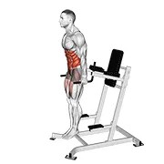 | [6033](../exercises/6033.json) | ab tuck | body weight | abs |
| 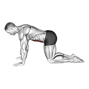 | [4348](../exercises/4348.json) | abdominal 4 points | body weight | abs |
| 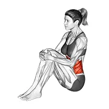 | [3244](../exercises/3244.json) | abdominal stretch | body weight | abs |
| 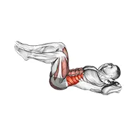 | [0003](../exercises/0003.json) | air bike | body weight | abs |
| 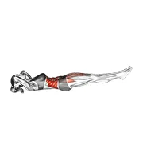 | [2395](../exercises/2395.json) | air bike v. 2 | body weight | abs |
| 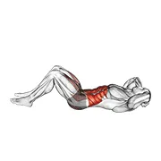 | [5266](../exercises/5266.json) | air twisting crunch | body weight | abs |
| 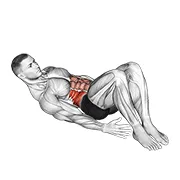 | [0006](../exercises/0006.json) | alternate heel touchers | body weight | abs |
| 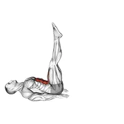 | [4826](../exercises/4826.json) | alternate leg raise | body weight | abs |
| 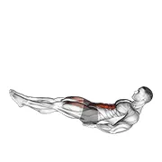 | [4001](../exercises/4001.json) | alternate leg raise with head up | body weight | abs |
| 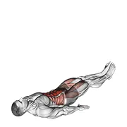 | [3590](../exercises/3590.json) | alternate lying floor leg raise | body weight | abs |
| 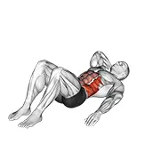 | [4354](../exercises/4354.json) | alternate oblique crunch | body weight | abs |
| 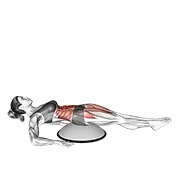 | [1186](../exercises/1186.json) | alternate straight leg raise (on bosu ball) | bosu ball | abs |
| 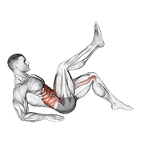 | [5106](../exercises/5106.json) | alternate toe tap leg lift | body weight | abs |
| 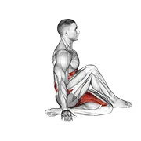 | [6121](../exercises/6121.json) | ardha matsyendrasana yoga pose | body weight | spine |
| 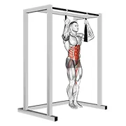 | [2355](../exercises/2355.json) | arm slingers hanging bent knee legs | body weight | abs |
| 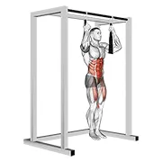 | [2333](../exercises/2333.json) | arm slingers hanging straight legs | body weight | abs |
| 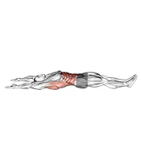 | [3204](../exercises/3204.json) | arms overhead full sit-up (male) | body weight | abs |
| 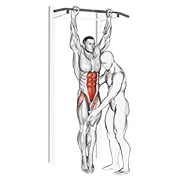 | [0011](../exercises/0011.json) | assisted hanging knee raise | assisted | abs |
| 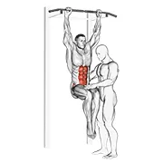 | [0010](../exercises/0010.json) | assisted hanging knee raise with throw down | assisted | abs |
| 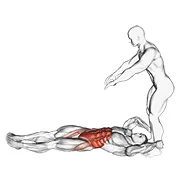 | [0012](../exercises/0012.json) | assisted lying leg raise with lateral throw down | assisted | abs |
| 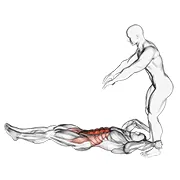 | [0013](../exercises/0013.json) | assisted lying leg raise with throw down | assisted | abs |
| 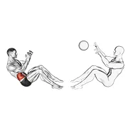 | [0014](../exercises/0014.json) | assisted motion russian twist | medicine ball | abs |
| 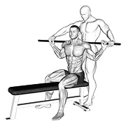 | [2123](../exercises/2123.json) | assisted obliques stretch | assisted | abs |
| 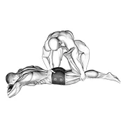 | [1714](../exercises/1714.json) | assisted prone rectus femoris stretch | assisted | abs |
| 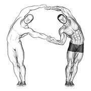 | [2122](../exercises/2122.json) | assisted side bent | assisted | abs |
| 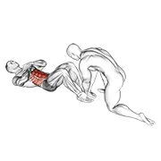 | [1758](../exercises/1758.json) | assisted sit-up | assisted | abs |
| 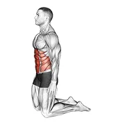 | [4006](../exercises/4006.json) | backward abdominal stretch | body weight | abs |
| 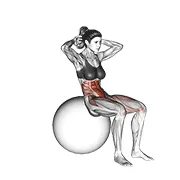 | [0021](../exercises/0021.json) | ball sit up (on stability ball) | stability ball | abs |
| 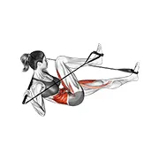 | [4699](../exercises/4699.json) | band air bike | band | abs |
| 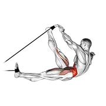 | [0969](../exercises/0969.json) | band alternating v-up | band | abs |
| 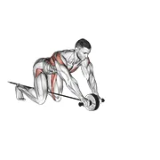 | [0971](../exercises/0971.json) | band assisted wheel rollerout | band | abs |
| 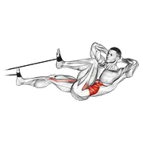 | [0972](../exercises/0972.json) | band bicycle crunch | band | abs |
| 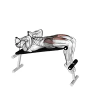 | [1498](../exercises/1498.json) | band decline sit up | band | abs |
| 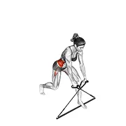 | [4696](../exercises/4696.json) | band down to up twist | band | abs |
| 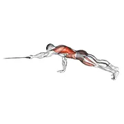 | [3777](../exercises/3777.json) | band front plank with single arm pulldown | band | abs |
| 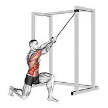 | [4573](../exercises/4573.json) | band half kneeling chop | band | abs |
| 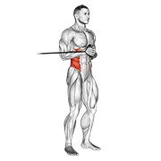 | [0979](../exercises/0979.json) | band horizontal pallof press | band | abs |
| 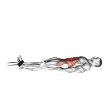 | [0981](../exercises/0981.json) | band jack knife sit-up | band | abs |
| 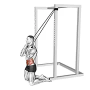 | [4080](../exercises/4080.json) | band kneeling crunch | band | abs |
| 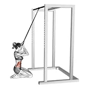 | [4720](../exercises/4720.json) | band kneeling crunch v. 2 | band | abs |
| 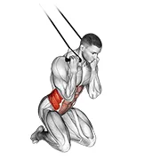 | [0985](../exercises/0985.json) | band kneeling twisting crunch | band | abs |
|  | [6810](../exercises/6810.json) | band lying bent knee raise | band | abs |
|  | [0910](../exercises/0910.json) | band lying leg and hip raise | band | abs |
|  | [1002](../exercises/1002.json) | band lying straight leg raise | band | abs |
|  | [4082](../exercises/4082.json) | band overhead side bend | band | abs |
|  | [0992](../exercises/0992.json) | band push sit-up | band | abs |
|  | [4081](../exercises/4081.json) | band reverse crunch | band | abs |
|  | [1011](../exercises/1011.json) | band seated twist | band | abs |
|  | [3841](../exercises/3841.json) | band side bend | band | abs |
|  | [1020](../exercises/1020.json) | band side crunch | band | abs |
|  | [4137](../exercises/4137.json) | band squat twist | band | abs |
|  | [1005](../exercises/1005.json) | band standing crunch | band | abs |
|  | [4685](../exercises/4685.json) | band standing side bend | band | abs |
|  | [1007](../exercises/1007.json) | band standing twisting crunch | band | abs |
|  | [3591](../exercises/3591.json) | band twist | band | abs |
|  | [0931](../exercises/0931.json) | band twist (down up) | band | abs |
|  | [3847](../exercises/3847.json) | band twist (up down) | band | abs |
|  | [3778](../exercises/3778.json) | band upper body lying air bike | band | abs |
|  | [2938](../exercises/2938.json) | band upper body resistance dead bug | band | abs |
|  | [4083](../exercises/4083.json) | band upper crunch | band | abs |
|  | [1014](../exercises/1014.json) | band v-up | band | abs |
|  | [1015](../exercises/1015.json) | band vertical pallof press | band | abs |
|  | [4839](../exercises/4839.json) | banded lower body dead bug | band | abs |
|  | [10195](../exercises/10195.json) | barbell half kneeling thor lift | barbell | abs |
|  | [0071](../exercises/0071.json) | barbell press sit-up | barbell | abs |
|  | [0084](../exercises/0084.json) | barbell rollerout | barbell | abs |
|  | [0083](../exercises/0083.json) | barbell rollerout from bench | barbell | abs |
|  | [0094](../exercises/0094.json) | barbell seated twist | barbell | abs |
|  | [0093](../exercises/0093.json) | barbell seated twist (on stability ball) | barbell | abs |
|  | [0096](../exercises/0096.json) | barbell side bent v. 2 | barbell | abs |
|  | [2799](../exercises/2799.json) | barbell sitted alternate leg raise | barbell | abs |
|  | [2800](../exercises/2800.json) | barbell sitted alternate leg raise (female) | barbell | abs |
|  | [4854](../exercises/4854.json) | barbell sitting on floor oblique twist | barbell | abs |
|  | [0103](../exercises/0103.json) | barbell standing ab rollerout | barbell | abs |
|  | [0112](../exercises/0112.json) | barbell standing twist | barbell | abs |
|  | [2918](../exercises/2918.json) | barbell suitcase carry | barbell | abs |
|  | [3377](../exercises/3377.json) | battling ropes russian twist | rope | abs |
|  | [4170](../exercises/4170.json) | bear plank | body weight | abs |
|  | [4333](../exercises/4333.json) | bench reverse crunch circle | body weight | abs |
|  | [0131](../exercises/0131.json) | bent knee lying twist (on stability ball) | stability ball | abs |
|  | [0133](../exercises/0133.json) | bent knee side plank | body weight | abs |
|  | [3391](../exercises/3391.json) | bent over twist | body weight | abs |
|  | [2838](../exercises/2838.json) | bicycle | body weight | abs |
|  | [6211](../exercises/6211.json) | bicycle crunch | body weight | abs |
|  | [0147](../exercises/0147.json) | bicycle twisting crunch | body weight | abs |
|  | [1241](../exercises/1241.json) | bird dog | body weight | spine |
|  | [9002](../exercises/9002.json) | bird dog plank | body weight | abs |
|  | [3141](../exercises/3141.json) | bird dog v. 2 | body weight | spine |
|  | [4279](../exercises/4279.json) | boat stretch | body weight | abs |
|  | [0136](../exercises/0136.json) | boat yoga pose | body weight | abs |
|  | [4384](../exercises/4384.json) | body saw plank | body weight | abs |
|  | [3544](../exercises/3544.json) | bodyweight incline side plank | body weight | abs |
|  | [4855](../exercises/4855.json) | bodyweight standing oblique twist | body weight | abs |
|  | [3908](../exercises/3908.json) | bodyweight windmill | body weight | abs |
|  | [5882](../exercises/5882.json) | bodyweight wood chop squat | body weight | abs |
|  | [2876](../exercises/2876.json) | boomerang | body weight | abs |
|  | [6053](../exercises/6053.json) | bottle weighted frog crunch | weighted | abs |
|  | [6052](../exercises/6052.json) | bottle weighted overhead crunch | weighted | abs |
|  | [6055](../exercises/6055.json) | bottle weighted russian twist | weighted | abs |
|  | [6054](../exercises/6054.json) | bottle weighted side bend | weighted | abs |
|  | [0138](../exercises/0138.json) | bottoms-up | body weight | abs |
|  | [0142](../exercises/0142.json) | bridge (on knees) | body weight | abs |
|  | [0143](../exercises/0143.json) | bridge (straight arm) | body weight | abs |
|  | [2466](../exercises/2466.json) | bridge - mountain climber (cross body) | body weight | abs |
|  | [0870](../exercises/0870.json) | butt-ups | body weight | abs |
|  | [4196](../exercises/4196.json) | cable half kneeling adductor pallof press | cable | abs |
|  | [4193](../exercises/4193.json) | cable half kneeling pallof press | cable | abs |
|  | [4228](../exercises/4228.json) | cable half kneeling push pull | cable | abs |
|  | [2887](../exercises/2887.json) | cable hanging leg raise | cable | abs |
|  | [1202](../exercises/1202.json) | cable horizontal pallof press | cable | abs |
|  | [4356](../exercises/4356.json) | cable horizontal pallof press v. 2 | cable | abs |
|  | [0174](../exercises/0174.json) | cable judo flip | cable | abs |
|  | [0175](../exercises/0175.json) | cable kneeling crunch | cable | abs |
|  | [5741](../exercises/5741.json) | cable kneeling crunch v. 2 | cable | abs |
|  | [11270](../exercises/11270.json) | cable kneeling crunch v. 3 | cable | abs |
|  | [7584](../exercises/7584.json) | cable kneeling high low anti rotation chop | cable | abs |
|  | [6693](../exercises/6693.json) | cable kneeling side crunch | cable | abs |
|  | [6760](../exercises/6760.json) | cable kneeling twist | cable | abs |
|  | [11251](../exercises/11251.json) | cable kneeling woodchop v. 3 | cable | abs |
|  | [11262](../exercises/11262.json) | cable lying alternating bent leg jackknife v. 3 | cable | abs |
|  | [4224](../exercises/4224.json) | cable lying pallof press | cable | abs |
|  | [4197](../exercises/4197.json) | cable pallof press with glute bridge | cable | abs |
|  | [0873](../exercises/0873.json) | cable reverse crunch | cable | abs |
|  | [8193](../exercises/8193.json) | cable reverse woodchop | cable | abs |
|  | [0211](../exercises/0211.json) | cable russian twists (on stability ball) | cable | abs |
|  | [4042](../exercises/4042.json) | cable seated cross arm twist | cable | abs |
|  | [0212](../exercises/0212.json) | cable seated crunch | cable | abs |
|  | [2399](../exercises/2399.json) | cable seated twist | cable | abs |
|  | [2434](../exercises/2434.json) | cable seated twist on floor | cable | abs |
|  | [0222](../exercises/0222.json) | cable side bend | cable | abs |
|  | [0221](../exercises/0221.json) | cable side bend crunch (bosu ball) | cable | abs |
|  | [5657](../exercises/5657.json) | cable side bend v. 2 | cable | abs |
|  | [0223](../exercises/0223.json) | cable side crunch | cable | abs |
|  | [11275](../exercises/11275.json) | cable side plank row v. 3 | cable | abs |
|  | [4106](../exercises/4106.json) | cable split stance horizontal pallof press | cable | abs |
|  | [0226](../exercises/0226.json) | cable standing crunch | cable | abs |
|  | [0874](../exercises/0874.json) | cable standing crunch (with rope attachment) | cable | abs |
|  | [0230](../exercises/0230.json) | cable standing lift | cable | abs |
|  | [11278](../exercises/11278.json) | cable standing side bend v. 3 | cable | abs |
|  | [11271](../exercises/11271.json) | cable standing torso twist v. 3 | cable | abs |
|  | [0242](../exercises/0242.json) | cable tuck reverse crunch | cable | abs |
|  | [0243](../exercises/0243.json) | cable twist | cable | abs |
|  | [1207](../exercises/1207.json) | cable twist (down up) | cable | abs |
|  | [1208](../exercises/1208.json) | cable twist (up down) v. 2 | cable | abs |
|  | [0862](../exercises/0862.json) | cable twist (up-down) | cable | abs |
|  | [5118](../exercises/5118.json) | cable twist v. 2 | cable | abs |
|  | [1069](../exercises/1069.json) | cable twist v. 3 | cable | abs |
|  | [1213](../exercises/1213.json) | cable vertical pallof press | cable | abs |
|  | [3505](../exercises/3505.json) | camel pose | body weight | abs |
|  | [5107](../exercises/5107.json) | captains chair leg raise | body weight | abs |
|  | [2963](../exercises/2963.json) | captains chair straight leg raise | body weight | abs |
|  | [2106](../exercises/2106.json) | cat stretch v. 2 | body weight | spine |
|  | [2839](../exercises/2839.json) | chest lift with rotation | body weight | abs |
|  | [8610](../exercises/8610.json) | chinese plank | body weight | abs |
|  | [1482](../exercises/1482.json) | cobra yoga pose | body weight | abs |
|  | [0260](../exercises/0260.json) | cocoons | body weight | abs |
|  | [2840](../exercises/2840.json) | control balance | body weight | abs |
|  | [2841](../exercises/2841.json) | corkscrew | body weight | abs |
|  | [2107](../exercises/2107.json) | cow stretch | body weight | spine |
|  | [2842](../exercises/2842.json) | crab | body weight | abs |
|  | [1468](../exercises/1468.json) | crab twist toe touch | body weight | abs |
|  | [0947](../exercises/0947.json) | crescent moon pose | body weight | abs |
|  | [4020](../exercises/4020.json) | criss cross leg raises | body weight | abs |
|  | [4372](../exercises/4372.json) | crocodile yoga pose | body weight | abs |
|  | [0262](../exercises/0262.json) | cross body crunch | body weight | abs |
|  | [0263](../exercises/0263.json) | cross body twisting crunch | body weight | abs |
|  | [5846](../exercises/5846.json) | cross standing crunch | body weight | abs |
|  | [3951](../exercises/3951.json) | cross twisting sit up | body weight | abs |
|  | [5334](../exercises/5334.json) | cross twisting sit up v. 2 | body weight | abs |
|  | [4727](../exercises/4727.json) | crunch (arms on chest) | body weight | abs |
|  | [3821](../exercises/3821.json) | crunch (arms straight) | body weight | abs |
|  | [0267](../exercises/0267.json) | crunch (hands overhead) | body weight | abs |
|  | [0268](../exercises/0268.json) | crunch (leg raise) | body weight | abs |
|  | [0269](../exercises/0269.json) | crunch (legs on stability ball) | stability ball | abs |
|  | [3838](../exercises/3838.json) | crunch (on bench) | body weight | abs |
|  | [1242](../exercises/1242.json) | crunch (on bosu ball) | bosu ball | abs |
|  | [0271](../exercises/0271.json) | crunch (on stability ball) | stability ball | abs |
|  | [0272](../exercises/0272.json) | crunch (on stability ball, arms straight) | stability ball | abs |
|  | [0273](../exercises/0273.json) | crunch (straight leg up) | body weight | abs |
|  | [7414](../exercises/7414.json) | crunch against wall | body weight | abs |
|  | [2344](../exercises/2344.json) | crunch back (form check) | body weight | abs |
|  | [0274](../exercises/0274.json) | crunch floor | body weight | abs |
|  | [0275](../exercises/0275.json) | crunch floor v. 2 | body weight | abs |
|  | [4332](../exercises/4332.json) | crunch hold | body weight | abs |
|  | [4331](../exercises/4331.json) | crunch single leg lift | body weight | abs |
|  | [4095](../exercises/4095.json) | crunch with leg lift | body weight | abs |
|  | [3510](../exercises/3510.json) | crunchy frog on floor | body weight | abs |
|  | [3016](../exercises/3016.json) | curl-up | body weight | abs |
|  | [0276](../exercises/0276.json) | dead bug | body weight | abs |
|  | [1243](../exercises/1243.json) | dead bug v. 2 | body weight | abs |
|  | [7839](../exercises/7839.json) | dead bug v. 3 | body weight | abs |
|  | [4124](../exercises/4124.json) | dead bug with medicine ball | medicine ball | abs |
|  | [4056](../exercises/4056.json) | dead bug with stability ball | stability ball | abs |
|  | [1845](../exercises/1845.json) | decline bent leg reverse crunch | body weight | abs |
|  | [0277](../exercises/0277.json) | decline crunch | body weight | abs |
|  | [6548](../exercises/6548.json) | decline knee raise | body weight | abs |
|  | [3438](../exercises/3438.json) | decline leg hip raise | body weight | abs |
|  | [0281](../exercises/0281.json) | decline sit up (arms straight) | body weight | abs |
|  | [4972](../exercises/4972.json) | decline sit up and russian twist | body weight | abs |
|  | [5515](../exercises/5515.json) | decline sit up v. 3 | body weight | abs |
|  | [0282](../exercises/0282.json) | decline sit-up | body weight | abs |
|  | [2523](../exercises/2523.json) | decline twisting sit up | body weight | abs |
|  | [6632](../exercises/6632.json) | diagonal reach on chair | body weight | abs |
|  | [9486](../exercises/9486.json) | dish hold | body weight | abs |
|  | [2843](../exercises/2843.json) | double leg stretch | body weight | abs |
|  | [6805](../exercises/6805.json) | dumbbell alternate v up | dumbbell | abs |
|  | [10185](../exercises/10185.json) | dumbbell bear plank alternating row | dumbbell | abs |
|  | [4621](../exercises/4621.json) | dumbbell close grip shoulder press sit up | dumbbell | abs |
|  | [4624](../exercises/4624.json) | dumbbell crunch up | dumbbell | abs |
|  | [4734](../exercises/4734.json) | dumbbell decline overhead sit up | dumbbell | abs |
|  | [4735](../exercises/4735.json) | dumbbell decline sit up | dumbbell | abs |
|  | [4737](../exercises/4737.json) | dumbbell floor wiper | dumbbell | abs |
|  | [4627](../exercises/4627.json) | dumbbell front plank arm leg raise | dumbbell | abs |
|  | [4622](../exercises/4622.json) | dumbbell front plank arm raise | dumbbell | abs |
|  | [4572](../exercises/4572.json) | dumbbell half kneeling lift and chop | dumbbell | abs |
|  | [10093](../exercises/10093.json) | dumbbell half kneeling thor lift | dumbbell | abs |
|  | [8505](../exercises/8505.json) | dumbbell kneeling twist down up raise | dumbbell | abs |
|  | [8221](../exercises/8221.json) | dumbbell lateral raise plank | dumbbell | abs |
|  | [4746](../exercises/4746.json) | dumbbell low windmill | dumbbell | abs |
|  | [6799](../exercises/6799.json) | dumbbell lying oblique v up | dumbbell | abs |
|  | [4747](../exercises/4747.json) | dumbbell lying woodchop | dumbbell | abs |
|  | [6800](../exercises/6800.json) | dumbbell military press russian twist with legs floor off | dumbbell | abs |
|  | [6806](../exercises/6806.json) | dumbbell military press russian twist with legs floor off v. 2 | dumbbell | abs |
|  | [4748](../exercises/4748.json) | dumbbell overhead sit up | dumbbell | abs |
|  | [6809](../exercises/6809.json) | dumbbell overhead sit up with legs on bench | dumbbell | abs |
|  | [5497](../exercises/5497.json) | dumbbell plank pass through | dumbbell | abs |
|  | [8223](../exercises/8223.json) | dumbbell renegade row on stability ball | dumbbell | abs |
|  | [8225](../exercises/8225.json) | dumbbell renegade row walk | dumbbell | abs |
|  | [6215](../exercises/6215.json) | dumbbell rollout | dumbbell | abs |
|  | [3449](../exercises/3449.json) | dumbbell russian twist | dumbbell | abs |
|  | [4041](../exercises/4041.json) | dumbbell russian twist (on stability ball) | dumbbell | abs |
|  | [4625](../exercises/4625.json) | dumbbell russian twist close grip shoulder press sit up | dumbbell | abs |
|  | [4750](../exercises/4750.json) | dumbbell russian twist with legs floor off | dumbbell | abs |
|  | [6802](../exercises/6802.json) | dumbbell seated military hold alternate leg raise on floor | dumbbell | abs |
|  | [6801](../exercises/6801.json) | dumbbell seated military press in out leg raise on floor | dumbbell | abs |
|  | [4626](../exercises/4626.json) | dumbbell seated tuck crunch on floor | dumbbell | abs |
|  | [4628](../exercises/4628.json) | dumbbell seated tuck twisting crunch on floor | dumbbell | abs |
|  | [0407](../exercises/0407.json) | dumbbell side bend | dumbbell | abs |
|  | [4335](../exercises/4335.json) | dumbbell side bend v. 2 | dumbbell | abs |
|  | [3337](../exercises/3337.json) | dumbbell side bridge | dumbbell | abs |
|  | [4457](../exercises/4457.json) | dumbbell side bridge with bent leg | dumbbell | abs |
|  | [10041](../exercises/10041.json) | dumbbell side plank v. 2 | dumbbell | abs |
|  | [4756](../exercises/4756.json) | dumbbell sit up | dumbbell | abs |
|  | [10183](../exercises/10183.json) | dumbbell standing front raise twist | dumbbell | abs |
|  | [4888](../exercises/4888.json) | dumbbell standing high windmill | dumbbell | abs |
|  | [4901](../exercises/4901.json) | dumbbell standing windmill | dumbbell | abs |
|  | [4248](../exercises/4248.json) | dumbbell straight arm crunch | dumbbell | abs |
|  | [6144](../exercises/6144.json) | dumbbell straight arm crunch v. 2 | dumbbell | abs |
|  | [4251](../exercises/4251.json) | dumbbell straight arm twisting sit up | dumbbell | abs |
|  | [4249](../exercises/4249.json) | dumbbell straight leg russian twist | dumbbell | abs |
|  | [8222](../exercises/8222.json) | dumbbell underhand renegade row | dumbbell | abs |
|  | [3336](../exercises/3336.json) | dumbbell v up | dumbbell | abs |
|  | [4250](../exercises/4250.json) | dumbbell v up v. 2 | dumbbell | abs |
|  | [10873](../exercises/10873.json) | dumbbell weighted crunch (hands overhead) | dumbbell | abs |
|  | [5108](../exercises/5108.json) | dumbbell wood chop squat | dumbbell | abs |
|  | [3266](../exercises/3266.json) | elbow push up | body weight | abs |
|  | [3503](../exercises/3503.json) | elbow to knee side plank crunch | body weight | abs |
|  | [6210](../exercises/6210.json) | elbow to knee side plank crunch (left) | body weight | abs |
|  | [3484](../exercises/3484.json) | elbow to knee sit up | body weight | abs |
|  | [2978](../exercises/2978.json) | elbow up and down dynamic plank | body weight | abs |
|  | [0443](../exercises/0443.json) | elbow-to-knee | body weight | abs |
|  | [2469](../exercises/2469.json) | exercise ball frog crunch | stability ball | abs |
|  | [7859](../exercises/7859.json) | explosive dynamic plank | body weight | abs |
|  | [1864](../exercises/1864.json) | extra decline sit up | body weight | abs |
|  | [4189](../exercises/4189.json) | ez bar kneeling rollout | ez barbell | abs |
|  | [4187](../exercises/4187.json) | ez bar legs side pull in sit up | ez barbell | abs |
|  | [4188](../exercises/4188.json) | ez bar reverse crunch | ez barbell | abs |
|  | [5308](../exercises/5308.json) | ez bar russian twist sit up | ez barbell | abs |
|  | [5309](../exercises/5309.json) | ez bar shoulder press sit up | ez barbell | abs |
|  | [4190](../exercises/4190.json) | ez bar up down twist | ez barbell | abs |
|  | [3303](../exercises/3303.json) | flag | body weight | abs |
|  | [0456](../exercises/0456.json) | flexion leg sit up (bent knee) | body weight | abs |
|  | [0457](../exercises/0457.json) | flexion leg sit up (straight arm) | body weight | abs |
|  | [3279](../exercises/3279.json) | floor crunch feet on bench | body weight | abs |
|  | [3280](../exercises/3280.json) | floor twisting crunch feet on bench | body weight | abs |
|  | [2891](../exercises/2891.json) | flutter kicks (hands under hips head up) | body weight | abs |
|  | [1179](../exercises/1179.json) | flutter kicks v. 2 | body weight | abs |
|  | [1244](../exercises/1244.json) | flutter kicks v. 3 | body weight | abs |
|  | [3959](../exercises/3959.json) | forward step front plank | body weight | abs |
|  | [2429](../exercises/2429.json) | frog crunch | body weight | abs |
|  | [3301](../exercises/3301.json) | frog planche | body weight | abs |
|  | [3889](../exercises/3889.json) | frog sit up | body weight | abs |
|  | [6094](../exercises/6094.json) | front leg lift under knee tap | body weight | abs |
|  | [3296](../exercises/3296.json) | front lever | body weight | abs |
|  | [0463](../exercises/0463.json) | front plank | body weight | abs |
|  | [2347](../exercises/2347.json) | front plank butt (form check) | body weight | abs |
|  | [3750](../exercises/3750.json) | front plank side hop | body weight | abs |
|  | [4023](../exercises/4023.json) | front plank to toe tap | body weight | abs |
|  | [3814](../exercises/3814.json) | front plank toe tap | body weight | abs |
|  | [3854](../exercises/3854.json) | front plank walkout | body weight | abs |
|  | [5466](../exercises/5466.json) | front plank with arm and leg lift (form check) | body weight | abs |
|  | [2897](../exercises/2897.json) | front plank with arm and leg lift (push up position) | body weight | abs |
|  | [2894](../exercises/2894.json) | front plank with arm lift | body weight | abs |
|  | [2895](../exercises/2895.json) | front plank with arm lift (push up position) | body weight | abs |
|  | [3501](../exercises/3501.json) | front plank with leg lift | body weight | abs |
|  | [0464](../exercises/0464.json) | front plank with twist | body weight | abs |
|  | [3954](../exercises/3954.json) | front to side plank | body weight | abs |
|  | [3248](../exercises/3248.json) | front toe touching | body weight | abs |
|  | [3315](../exercises/3315.json) | full maltese | body weight | abs |
|  | [3299](../exercises/3299.json) | full planche | body weight | abs |
|  | [10639](../exercises/10639.json) | glute ham developer full sit up | leverage machine | abs |
|  | [4763](../exercises/4763.json) | glute ham developer sit up and russian twist | leverage machine | abs |
|  | [11282](../exercises/11282.json) | glute ham developer straight arms sit up | body weight | abs |
|  | [4764](../exercises/4764.json) | glute ham hyperextension twist | leverage machine | spine |
|  | [6554](../exercises/6554.json) | glute ham sit up | leverage machine | abs |
|  | [5051](../exercises/5051.json) | glute ham twist | body weight | abs |
|  | [0467](../exercises/0467.json) | gorilla chin | body weight | abs |
|  | [0469](../exercises/0469.json) | groin crunch | body weight | abs |
|  | [6300](../exercises/6300.json) | half boat pose ardha navasana | body weight | abs |
|  | [10566](../exercises/10566.json) | half kneeling torso twist | body weight | abs |
|  | [3202](../exercises/3202.json) | half sit-up (male) | body weight | abs |
|  | [6006](../exercises/6006.json) | half squat side reach | body weight | abs |
|  | [1248](../exercises/1248.json) | half wipers (bent leg) | body weight | abs |
|  | [0470](../exercises/0470.json) | hand opposite knee crunch | body weight | abs |
|  | [9044](../exercises/9044.json) | hanging advanced tucked front lever hold | body weight | abs |
|  | [10735](../exercises/10735.json) | hanging alternating knee raise | body weight | abs |
|  | [4373](../exercises/4373.json) | hanging deadbug | body weight | abs |
|  | [4766](../exercises/4766.json) | hanging flutter kick | body weight | abs |
|  | [9045](../exercises/9045.json) | hanging front lever hold | body weight | abs |
|  | [7251](../exercises/7251.json) | hanging front lever raise | body weight | abs |
|  | [4891](../exercises/4891.json) | hanging half windmill | body weight | abs |
|  | [6547](../exercises/6547.json) | hanging hollow hold | body weight | abs |
|  | [4767](../exercises/4767.json) | hanging knee circle raise | body weight | abs |
|  | [9819](../exercises/9819.json) | hanging knee raise | body weight | abs |
|  | [3890](../exercises/3890.json) | hanging knees to elbows | body weight | abs |
|  | [11877](../exercises/11877.json) | hanging l sit | body weight | abs |
|  | [1764](../exercises/1764.json) | hanging leg hip raise | body weight | abs |
|  | [0472](../exercises/0472.json) | hanging leg raise | body weight | abs |
|  | [1761](../exercises/1761.json) | hanging oblique knee raise | body weight | abs |
|  | [0473](../exercises/0473.json) | hanging pike | body weight | abs |
|  | [9489](../exercises/9489.json) | hanging side lean | body weight | abs |
|  | [0474](../exercises/0474.json) | hanging straight leg hip raise | body weight | abs |
|  | [0475](../exercises/0475.json) | hanging straight leg raise | body weight | abs |
|  | [0476](../exercises/0476.json) | hanging straight twisting leg hip raise | body weight | abs |
|  | [3891](../exercises/3891.json) | hanging toes to bar | body weight | abs |
|  | [9043](../exercises/9043.json) | hanging tucked front lever hold | body weight | abs |
|  | [5526](../exercises/5526.json) | hip circle with hula hoop | body weight | abs |
|  | [0482](../exercises/0482.json) | hip crunch (knees bent) | body weight | abs |
|  | [11010](../exercises/11010.json) | hip lift low back off floor | body weight | abs |
|  | [0484](../exercises/0484.json) | hip raise (bent knee) | body weight | abs |
|  | [0487](../exercises/0487.json) | hip raise crunch | body weight | abs |
|  | [4385](../exercises/4385.json) | hip roll plank | body weight | abs |
|  | [2845](../exercises/2845.json) | hip twist supported arms | body weight | abs |
|  | [1246](../exercises/1246.json) | hollow hold | body weight | abs |
|  | [5649](../exercises/5649.json) | hollow rock | body weight | abs |
|  | [2846](../exercises/2846.json) | hundred | body weight | abs |
|  | [1471](../exercises/1471.json) | inchworm | body weight | abs |
|  | [3698](../exercises/3698.json) | inchworm v. 2 | body weight | abs |
|  | [4768](../exercises/4768.json) | incline alternate flutter kicks | body weight | abs |
|  | [9049](../exercises/9049.json) | incline hip raise | body weight | abs |
|  | [10593](../exercises/10593.json) | incline jack plank | body weight | abs |
|  | [0491](../exercises/0491.json) | incline leg hip raise (leg straight) | body weight | abs |
|  | [1190](../exercises/1190.json) | incline twisting sit up v. 2 | body weight | abs |
|  | [0495](../exercises/0495.json) | incline twisting sit-up | body weight | abs |
|  | [1193](../exercises/1193.json) | iron cross plank | body weight | abs |
|  | [0502](../exercises/0502.json) | jack knife floor | body weight | abs |
|  | [0503](../exercises/0503.json) | jack knife on ball | stability ball | abs |
|  | [1478](../exercises/1478.json) | jack plank | body weight | abs |
|  | [2564](../exercises/2564.json) | jack plank on medicine ball | medicine ball | abs |
|  | [0505](../exercises/0505.json) | jack split crunches | body weight | abs |
|  | [6103](../exercises/6103.json) | jackknife | body weight | abs |
|  | [0507](../exercises/0507.json) | jackknife sit-up | body weight | abs |
|  | [0508](../exercises/0508.json) | janda sit-up | body weight | abs |
|  | [0517](../exercises/0517.json) | kettlebell advanced windmill | kettlebell | abs |
|  | [0524](../exercises/0524.json) | kettlebell bent press | kettlebell | abs |
|  | [4047](../exercises/4047.json) | kettlebell dead bug | kettlebell | abs |
|  | [0530](../exercises/0530.json) | kettlebell double windmill | kettlebell | abs |
|  | [0532](../exercises/0532.json) | kettlebell figure 8 | kettlebell | abs |
|  | [5069](../exercises/5069.json) | kettlebell lunge with twist | kettlebell | abs |
|  | [7229](../exercises/7229.json) | kettlebell plank pass through | kettlebell | abs |
|  | [9518](../exercises/9518.json) | kettlebell pullover dead bug | kettlebell | abs |
|  | [4393](../exercises/4393.json) | kettlebell russian twist | kettlebell | abs |
|  | [4396](../exercises/4396.json) | kettlebell side bend v. 2 | kettlebell | abs |
|  | [5879](../exercises/5879.json) | kettlebell side plank | kettlebell | abs |
|  | [10192](../exercises/10192.json) | kettlebell side swing | kettlebell | abs |
|  | [8366](../exercises/8366.json) | kettlebell side swing v. 2 | kettlebell | abs |
|  | [4535](../exercises/4535.json) | kettlebell single arm sit up | kettlebell | abs |
|  | [1187](../exercises/1187.json) | kettlebell sit up | kettlebell | abs |
|  | [5072](../exercises/5072.json) | kettlebell sit up press | kettlebell | abs |
|  | [12018](../exercises/12018.json) | kettlebell standing slingshots (advanced) | kettlebell | abs |
|  | [10327](../exercises/10327.json) | kettlebell strong russian twist | kettlebell | abs |
|  | [8371](../exercises/8371.json) | kettlebell weighted russian twist | kettlebell | abs |
|  | [0554](../exercises/0554.json) | kettlebell windmill | kettlebell | abs |
|  | [8025](../exercises/8025.json) | kettlebell wood chop | kettlebell | abs |
|  | [3640](../exercises/3640.json) | knee touch crunch | body weight | abs |
|  | [4990](../exercises/4990.json) | knee tuck oblique crunch | body weight | abs |
|  | [5242](../exercises/5242.json) | kneeling abdominal draw in | body weight | abs |
|  | [2109](../exercises/2109.json) | kneeling abdominal stretch | body weight | abs |
|  | [3238](../exercises/3238.json) | kneeling plank | body weight | abs |
|  | [3239](../exercises/3239.json) | kneeling plank tap shoulder (male) | body weight | abs |
|  | [4506](../exercises/4506.json) | kneeling shoulder tap | body weight | abs |
|  | [1402](../exercises/1402.json) | l sit | body weight | abs |
|  | [10951](../exercises/10951.json) | l sit leg raise | body weight | abs |
|  | [3419](../exercises/3419.json) | l-sit on floor | body weight | abs |
|  | [0562](../exercises/0562.json) | landmine 180 | barbell | abs |
|  | [11092](../exercises/11092.json) | landmine kneeling 180s | landmine | abs |
|  | [2121](../exercises/2121.json) | lateral bend lying down | body weight | abs |
|  | [2124](../exercises/2124.json) | lateral bend on floor by kneeling | body weight | abs |
|  | [1470](../exercises/1470.json) | lateral side plank | body weight | abs |
|  | [1469](../exercises/1469.json) | lateral side plank (bent leg) | body weight | abs |
|  | [2125](../exercises/2125.json) | lateral stretch on floor lying down | body weight | abs |
|  | [3300](../exercises/3300.json) | lean planche | body weight | abs |
|  | [0568](../exercises/0568.json) | leg bench side bridge | body weight | abs |
|  | [3606](../exercises/3606.json) | leg extension crunch (with stability ball) | stability ball | abs |
|  | [4386](../exercises/4386.json) | leg extension plank | body weight | abs |
|  | [4616](../exercises/4616.json) | leg front kick | body weight | abs |
|  | [3982](../exercises/3982.json) | leg lift to chest front plank | body weight | abs |
|  | [2849](../exercises/2849.json) | leg pull | body weight | abs |
|  | [2874](../exercises/2874.json) | leg pull front supported | body weight | abs |
|  | [0570](../exercises/0570.json) | leg pull in flat bench | body weight | abs |
|  | [2848](../exercises/2848.json) | leg pull side | body weight | abs |
|  | [2850](../exercises/2850.json) | leg raise (bent knee) | body weight | abs |
|  | [4058](../exercises/4058.json) | leg raise dragon flag | body weight | abs |
|  | [1852](../exercises/1852.json) | leg raise hip lift | body weight | abs |
|  | [1855](../exercises/1855.json) | leg raise hip lift with head up | body weight | abs |
|  | [5032](../exercises/5032.json) | leg raise oblique crunch | body weight | abs |
|  | [1854](../exercises/1854.json) | leg raise slightly bent knee | body weight | abs |
|  | [5583](../exercises/5583.json) | lever ab coaster crunch | leverage machine | abs |
|  | [6561](../exercises/6561.json) | lever ab swing | leverage machine | abs |
|  | [1858](../exercises/1858.json) | lever decline sit up | leverage machine | abs |
|  | [0583](../exercises/0583.json) | lever kneeling twist | leverage machine | abs |
|  | [2276](../exercises/2276.json) | lever lying crunch | leverage machine | abs |
|  | [2314](../exercises/2314.json) | lever lying crunch v. 2 | leverage machine | abs |
|  | [1856](../exercises/1856.json) | lever lying leg raise (bent knee) | leverage machine | abs |
|  | [1452](../exercises/1452.json) | lever seated crunch | leverage machine | abs |
|  | [0595](../exercises/0595.json) | lever seated crunch (chest pad) | leverage machine | abs |
|  | [2268](../exercises/2268.json) | lever seated crunch (hands pad) | leverage machine | abs |
|  | [3760](../exercises/3760.json) | lever seated crunch v. 2 | leverage machine | abs |
|  | [3881](../exercises/3881.json) | lever seated full crunch | leverage machine | abs |
|  | [3882](../exercises/3882.json) | lever seated left side crunch | leverage machine | abs |
|  | [0600](../exercises/0600.json) | lever seated leg raise crunch | leverage machine | abs |
|  | [3883](../exercises/3883.json) | lever seated right side crunch | leverage machine | abs |
|  | [1453](../exercises/1453.json) | lever seated twist | leverage machine | abs |
|  | [10065](../exercises/10065.json) | lever torso rotation | leverage machine | abs |
|  | [1857](../exercises/1857.json) | lever total abdominal crunch | leverage machine | abs |
|  | [5333](../exercises/5333.json) | lever trunk rotation | leverage machine | abs |
|  | [0608](../exercises/0608.json) | lever twist | leverage machine | abs |
|  | [4009](../exercises/4009.json) | long arm crunch | body weight | abs |
|  | [4906](../exercises/4906.json) | long lever decline sit up | body weight | abs |
|  | [2105](../exercises/2105.json) | lower trunk flexor stretch | body weight | abs |
|  | [1688](../exercises/1688.json) | lunge with twist | body weight | abs |
|  | [1168](../exercises/1168.json) | lying (prone) abdominal stretch | body weight | abs |
|  | [4459](../exercises/4459.json) | lying ab press | body weight | abs |
|  | [9024](../exercises/9024.json) | lying abdominal scissors crunch | body weight | abs |
|  | [4883](../exercises/4883.json) | lying air cycles | body weight | abs |
|  | [5050](../exercises/5050.json) | lying alternate toe touch floor | body weight | abs |
|  | [5472](../exercises/5472.json) | lying bent legs raise | body weight | abs |
|  | [5250](../exercises/5250.json) | lying bicycle crunch | body weight | abs |
|  | [4880](../exercises/4880.json) | lying criss cross legs | body weight | abs |
|  | [6005](../exercises/6005.json) | lying crunch (straight legs) | body weight | abs |
|  | [2312](../exercises/2312.json) | lying elbow to knee | body weight | abs |
|  | [4886](../exercises/4886.json) | lying flat hip raise | body weight | abs |
|  | [9451](../exercises/9451.json) | lying floor 6 inch hold | body weight | abs |
|  | [9321](../exercises/9321.json) | lying floor horizontal flutter kick | body weight | abs |
|  | [9318](../exercises/9318.json) | lying floor negative dragon flag | body weight | abs |
|  | [9319](../exercises/9319.json) | lying floor negative half dragon flag | body weight | abs |
|  | [9322](../exercises/9322.json) | lying floor single leg negative dragon flag | body weight | abs |
|  | [3263](../exercises/3263.json) | lying full leg raise | body weight | abs |
|  | [4885](../exercises/4885.json) | lying incline hip raise | body weight | abs |
|  | [8194](../exercises/8194.json) | lying knee raise | body weight | abs |
|  | [2116](../exercises/2116.json) | lying knee roll over stretch | body weight | spine |
|  | [4994](../exercises/4994.json) | lying leg cross | body weight | abs |
|  | [4987](../exercises/4987.json) | lying leg figure eight | body weight | abs |
|  | [3393](../exercises/3393.json) | lying leg hip raise on floor | body weight | abs |
|  | [4018](../exercises/4018.json) | lying leg hip raise on floor v. 2 | body weight | abs |
|  | [4156](../exercises/4156.json) | lying leg hip side raise on floor | body weight | abs |
|  | [1163](../exercises/1163.json) | lying leg raise | body weight | abs |
|  | [4419](../exercises/4419.json) | lying leg raise (modified) | body weight | abs |
|  | [1245](../exercises/1245.json) | lying leg raise and hold | body weight | abs |
|  | [0620](../exercises/0620.json) | lying leg raise flat bench | body weight | abs |
|  | [3268](../exercises/3268.json) | lying leg raise to side | body weight | abs |
|  | [4808](../exercises/4808.json) | lying leg raise v. 2 | body weight | abs |
|  | [4975](../exercises/4975.json) | lying leg raise v. 3 | body weight | abs |
|  | [0865](../exercises/0865.json) | lying leg-hip raise | body weight | abs |
|  | [2853](../exercises/2853.json) | lying neck pull | body weight | abs |
|  | [8146](../exercises/8146.json) | lying pelvic floor relaxation and deep breathing | body weight | abs |
|  | [7294](../exercises/7294.json) | lying pelvic tilt | body weight | abs |
|  | [6752](../exercises/6752.json) | lying rectus abdominis activation crunch | body weight | abs |
|  | [0621](../exercises/0621.json) | lying scissor crunch | body weight | abs |
|  | [0622](../exercises/0622.json) | lying scissor kick | body weight | abs |
|  | [0623](../exercises/0623.json) | lying simultaneous alternating leg raise | body weight | abs |
|  | [1180](../exercises/1180.json) | lying simultaneous alternating straight leg raise | body weight | abs |
|  | [3496](../exercises/3496.json) | lying straight leg marches | body weight | abs |
|  | [1181](../exercises/1181.json) | lying straight leg raise v. 2 | body weight | abs |
|  | [9977](../exercises/9977.json) | lying supine abdominal breathing | body weight | abs |
|  | [6002](../exercises/6002.json) | lying toe tap | body weight | abs |
|  | [5275](../exercises/5275.json) | lying toe touch | body weight | abs |
|  | [5274](../exercises/5274.json) | lying tuck crunch | body weight | abs |
|  | [3414](../exercises/3414.json) | lying upper body rotation | body weight | spine |
|  | [3422](../exercises/3422.json) | medicine ball crunch | medicine ball | abs |
|  | [9010](../exercises/9010.json) | medicine ball crunch on stability ball | medicine ball | abs |
|  | [4253](../exercises/4253.json) | medicine ball crunch v. 2 | medicine ball | abs |
|  | [5031](../exercises/5031.json) | medicine ball lying leg raise | medicine ball | abs |
|  | [1697](../exercises/1697.json) | medicine ball reverse wood chop squat | medicine ball | abs |
|  | [1699](../exercises/1699.json) | medicine ball rotational throw | medicine ball | abs |
|  | [1704](../exercises/1704.json) | medicine ball single leg wood chop | medicine ball | abs |
|  | [0625](../exercises/0625.json) | medicine ball sit up (wall) | medicine ball | abs |
|  | [10558](../exercises/10558.json) | medicine ball sit up slam | medicine ball | abs |
|  | [10552](../exercises/10552.json) | medicine ball split stance torso twist | medicine ball | abs |
|  | [2879](../exercises/2879.json) | mermaid | body weight | abs |
|  | [5156](../exercises/5156.json) | mountain climber slide with towel | body weight | abs |
|  | [5213](../exercises/5213.json) | mountain climber v. 2 | body weight | abs |
|  | [5228](../exercises/5228.json) | myotatic crunch on bosu ball | bosu ball | abs |
|  | [0634](../exercises/0634.json) | negative crunch | body weight | abs |
|  | [4982](../exercises/4982.json) | negative dragon flag | body weight | abs |
|  | [11090](../exercises/11090.json) | negative front lever raise | body weight | abs |
|  | [1495](../exercises/1495.json) | oblique crunch v. 2 | body weight | abs |
|  | [0635](../exercises/0635.json) | oblique crunches floor | body weight | abs |
|  | [3330](../exercises/3330.json) | oblique crunches with bent knee leg lift | body weight | abs |
|  | [3331](../exercises/3331.json) | oblique crunches with straight leg lift | body weight | abs |
|  | [3515](../exercises/3515.json) | oblique v up on floor | body weight | abs |
|  | [3983](../exercises/3983.json) | one arm front plank | body weight | abs |
|  | [0640](../exercises/0640.json) | one arm slam (with medicine ball) | medicine ball | abs |
|  | [4992](../exercises/4992.json) | opposite crunch | body weight | abs |
|  | [0641](../exercises/0641.json) | otis up | weighted | abs |
|  | [7417](../exercises/7417.json) | overhead sit up with legs on bench | body weight | abs |
|  | [6120](../exercises/6120.json) | pavanamuktasana yoga pose | body weight | glutes |
|  | [6293](../exercises/6293.json) | peacock pose mayurasana | body weight | abs |
|  | [3147](../exercises/3147.json) | pelvic tilt | body weight | abs |
|  | [10658](../exercises/10658.json) | pilates machine hundred | leverage machine | abs |
|  | [10856](../exercises/10856.json) | pilates machine overhead | leverage machine | abs |
|  | [6804](../exercises/6804.json) | plank alternate anti gravity pull up | body weight | abs |
|  | [10554](../exercises/10554.json) | plank alternating hit the ball | medicine ball | abs |
|  | [1440](../exercises/1440.json) | plank arm lifts | body weight | abs |
|  | [2358](../exercises/2358.json) | plank butt (form check) | body weight | abs |
|  | [3930](../exercises/3930.json) | plank jack | body weight | abs |
|  | [5157](../exercises/5157.json) | plank jack on elbows | body weight | abs |
|  | [5158](../exercises/5158.json) | plank jack slide with towel | body weight | abs |
|  | [9999](../exercises/9999.json) | plank knee tap | body weight | abs |
|  | [3852](../exercises/3852.json) | plank lateral raise | body weight | abs |
|  | [9821](../exercises/9821.json) | plank leg lift mountain climber | body weight | abs |
|  | [5159](../exercises/5159.json) | plank on hands | body weight | abs |
|  | [5165](../exercises/5165.json) | plank pike slide with towel | body weight | abs |
|  | [9677](../exercises/9677.json) | plank side jump | body weight | abs |
|  | [1687](../exercises/1687.json) | posterior step to overhead reach | body weight | abs |
|  | [3119](../exercises/3119.json) | potty squat | body weight | abs |
|  | [3665](../exercises/3665.json) | power point plank | body weight | abs |
|  | [0649](../exercises/0649.json) | pretzel stretch | body weight | abs |
|  | [3203](../exercises/3203.json) | prisoner half sit-up (male) | body weight | abs |
|  | [1707](../exercises/1707.json) | prone twist on stability ball | stability ball | abs |
|  | [0650](../exercises/0650.json) | pull-in (on stability ball) | stability ball | abs |
|  | [3459](../exercises/3459.json) | pulse up | body weight | abs |
|  | [4860](../exercises/4860.json) | push up with knee drive | body weight | abs |
|  | [0664](../exercises/0664.json) | push-up to side plank | body weight | abs |
|  | [3201](../exercises/3201.json) | quarter sit-up | body weight | abs |
|  | [2420](../exercises/2420.json) | resistance band air bike | band | abs |
|  | [7212](../exercises/7212.json) | resistance band air bike v. 2 | resistance band | abs |
|  | [10184](../exercises/10184.json) | resistance band alternating split stance pallof press | resistance band | abs |
|  | [3866](../exercises/3866.json) | resistance band anti rotation dead bug | resistance band | abs |
|  | [3511](../exercises/3511.json) | resistance band bird dog | resistance band | spine |
|  | [2152](../exercises/2152.json) | resistance band front plank with kicked leg | resistance band | glutes |
|  | [3791](../exercises/3791.json) | resistance band front plank with single arm pulldown | resistance band | abs |
|  | [4240](../exercises/4240.json) | resistance band horizontal pallof press | resistance band | abs |
|  | [5202](../exercises/5202.json) | resistance band kneeling ab crunch | resistance band | abs |
|  | [5206](../exercises/5206.json) | resistance band kneeling ab crunch v. 2 | resistance band | abs |
|  | [2155](../exercises/2155.json) | resistance band kneeling side plank | resistance band | abs |
|  | [4776](../exercises/4776.json) | resistance band kneeling woodchop | resistance band | abs |
|  | [7201](../exercises/7201.json) | resistance band lying leg raise v. 2 | resistance band | abs |
|  | [7210](../exercises/7210.json) | resistance band plank jack | resistance band | abs |
|  | [8224](../exercises/8224.json) | resistance band renegade row | resistance band | abs |
|  | [6418](../exercises/6418.json) | resistance band reverse crunch | resistance band | abs |
|  | [6419](../exercises/6419.json) | resistance band reverse crunch v. 2 | resistance band | abs |
|  | [2164](../exercises/2164.json) | resistance band side plank | resistance band | abs |
|  | [6737](../exercises/6737.json) | resistance band side plank glute raise | band | abductors |
|  | [5203](../exercises/5203.json) | resistance band standing ab crunch | resistance band | abs |
|  | [2463](../exercises/2463.json) | resistance band toe touch | band | abs |
|  | [3512](../exercises/3512.json) | resistance band upper body dead bug | resistance band | abs |
|  | [3792](../exercises/3792.json) | resistance band upper body lying air bike | resistance band | abs |
|  | [8002](../exercises/8002.json) | resistance band wide stance anti rotation chop | resistance band | abs |
|  | [7850](../exercises/7850.json) | reverse air cycling | body weight | abs |
|  | [0872](../exercises/0872.json) | reverse crunch | body weight | abs |
|  | [4330](../exercises/4330.json) | reverse crunch kick | body weight | abs |
|  | [4097](../exercises/4097.json) | reverse crunch to dead bug | body weight | abs |
|  | [4019](../exercises/4019.json) | reverse crunch v. 2 | body weight | abs |
|  | [4778](../exercises/4778.json) | reverse crunch v. 3 | body weight | abs |
|  | [4779](../exercises/4779.json) | reverse flutter kick on floor (hand under head) | body weight | abs |
|  | [4980](../exercises/4980.json) | reverse flutter kick on floor (hand under head) v. 2 | body weight | abs |
|  | [5045](../exercises/5045.json) | reverse plank on elbows | body weight | spine |
|  | [4934](../exercises/4934.json) | reverse plank v. 2 | body weight | abs |
|  | [3663](../exercises/3663.json) | reverse plank with leg lift | body weight | abs |
|  | [5908](../exercises/5908.json) | revolved head to knee pose | body weight | spine |
|  | [4977](../exercises/4977.json) | ring alternate superman | suspension trainer | spine |
|  | [9313](../exercises/9313.json) | ring isometric hold reverse ab rollout | suspension trainer | abs |
|  | [4978](../exercises/4978.json) | ring kneeling ab rollout | suspension trainer | abs |
|  | [4820](../exercises/4820.json) | ring reverse ab rollout | suspension trainer | abs |
|  | [4979](../exercises/4979.json) | ring rollout | suspension trainer | abs |
|  | [2856](../exercises/2856.json) | rocker with open legs | body weight | abs |
|  | [4482](../exercises/4482.json) | roll ball diaphragm | roller | abs |
|  | [4478](../exercises/4478.json) | roll ball external oblique | roller | abs |
|  | [4477](../exercises/4477.json) | roll ball iliacus abdominal region | roller | abs |
|  | [4476](../exercises/4476.json) | roll ball psoas abdominal region | roller | abs |
|  | [4479](../exercises/4479.json) | roll ball rectus abdominis | roller | abs |
|  | [2572](../exercises/2572.json) | roll overs into v sits | body weight | abs |
|  | [2858](../exercises/2858.json) | roll up v. 2 | body weight | abs |
|  | [2204](../exercises/2204.json) | roller body saw | roller | abs |
|  | [2206](../exercises/2206.json) | roller reverse crunch | roller | abs |
|  | [2859](../exercises/2859.json) | rolling back | body weight | abs |
|  | [0679](../exercises/0679.json) | rolling bridge | body weight | abs |
|  | [2860](../exercises/2860.json) | rollover | body weight | abs |
|  | [3329](../exercises/3329.json) | roman chair sit up | body weight | abs |
|  | [3942](../exercises/3942.json) | romanian chair sit up v. 2 | body weight | abs |
|  | [0681](../exercises/0681.json) | rotate push up (on knees) | body weight | pectorals |
|  | [2111](../exercises/2111.json) | rotating stomach stretch | body weight | abs |
|  | [4392](../exercises/4392.json) | rowing boat yoga pose | body weight | abs |
|  | [0687](../exercises/0687.json) | russian twist | body weight | abs |
|  | [0686](../exercises/0686.json) | russian twist (on stability ball arms straight) | stability ball | abs |
|  | [1247](../exercises/1247.json) | russian twist (with medicine ball) | medicine ball | abs |
|  | [5938](../exercises/5938.json) | russian twist chop | body weight | abs |
|  | [4646](../exercises/4646.json) | russian twist with hands on chest | body weight | abs |
|  | [6295](../exercises/6295.json) | sage marichi i pose marichyasana | body weight | spine |
|  | [2861](../exercises/2861.json) | saw | body weight | abs |
|  | [2862](../exercises/2862.json) | scissors | body weight | abs |
|  | [3586](../exercises/3586.json) | scissors (advanced) | body weight | abs |
|  | [2892](../exercises/2892.json) | scissors (beginner) | body weight | abs |
|  | [4631](../exercises/4631.json) | scorpion stretch | body weight | abs |
|  | [2877](../exercises/2877.json) | seal | body weight | abs |
|  | [4022](../exercises/4022.json) | seated 8 leg crunch | body weight | abs |
|  | [3944](../exercises/3944.json) | seated alternate crunch | body weight | abs |
|  | [3962](../exercises/3962.json) | seated flutter kick | body weight | abs |
|  | [8434](../exercises/8434.json) | seated forward roll up on a chair | body weight | abs |
|  | [7255](../exercises/7255.json) | seated frog half to full sit up | body weight | abs |
|  | [3509](../exercises/3509.json) | seated in out leg raise on floor | body weight | abs |
|  | [8423](../exercises/8423.json) | seated lean back on a chair | body weight | abs |
|  | [0689](../exercises/0689.json) | seated leg raise | body weight | abs |
|  | [2114](../exercises/2114.json) | seated lower trunk lateral flexor stretch | body weight | abs |
|  | [5135](../exercises/5135.json) | seated rotation stretch | body weight | spine |
|  | [8311](../exercises/8311.json) | seated side bend on a chair | body weight | abs |
|  | [0691](../exercises/0691.json) | seated side crunch (wall) | body weight | abs |
|  | [3978](../exercises/3978.json) | seated side to side leg raise crunch on floor | body weight | abs |
|  | [0694](../exercises/0694.json) | seated twist (on stability ball) | stability ball | abs |
|  | [4307](../exercises/4307.json) | seated twist (straight arm) | body weight | abs |
|  | [5129](../exercises/5129.json) | seated upper body rotation | body weight | abs |
|  | [8303](../exercises/8303.json) | seated upright twists on a chair | body weight | abs |
|  | [3699](../exercises/3699.json) | shoulder tap | body weight | abs |
|  | [6803](../exercises/6803.json) | side and front in out | body weight | abs |
|  | [2864](../exercises/2864.json) | side bend | body weight | abs |
|  | [0700](../exercises/0700.json) | side bend (on stability ball) | stability ball | abs |
|  | [0706](../exercises/0706.json) | side bridge | body weight | abs |
|  | [0701](../exercises/0701.json) | side bridge (bent knee) | body weight | abs |
|  | [0702](../exercises/0702.json) | side bridge (knee tuck) | body weight | abs |
|  | [0705](../exercises/0705.json) | side bridge v. 2 | body weight | abs |
|  | [3584](../exercises/3584.json) | side bridge with arm leg swing | body weight | abs |
|  | [5047](../exercises/5047.json) | side bridge with bent leg | body weight | abs |
|  | [4458](../exercises/4458.json) | side bridge with straight legs | body weight | abs |
|  | [0708](../exercises/0708.json) | side crunch | body weight | abs |
|  | [0707](../exercises/0707.json) | side crunch v. 2 | body weight | abs |
|  | [4812](../exercises/4812.json) | side crunch v. 3 | body weight | abs |
|  | [4787](../exercises/4787.json) | side crunch with hands on chest | body weight | abs |
|  | [8399](../exercises/8399.json) | side floor tap plank | body weight | abs |
|  | [0709](../exercises/0709.json) | side hip (on parallel bars) | body weight | abs |
|  | [5124](../exercises/5124.json) | side jump twist | body weight | abs |
|  | [6335](../exercises/6335.json) | side kick through | body weight | abs |
|  | [0715](../exercises/0715.json) | side plank | body weight | abs |
|  | [2899](../exercises/2899.json) | side plank (beginner) | body weight | abs |
|  | [6466](../exercises/6466.json) | side plank bent leg lift | body weight | abs |
|  | [2349](../exercises/2349.json) | side plank butt (form check) | body weight | abs |
|  | [4863](../exercises/4863.json) | side plank leg lift | body weight | abs |
|  | [6207](../exercises/6207.json) | side plank leg lift (left) | body weight | abs |
|  | [4334](../exercises/4334.json) | side plank oblique crunch | body weight | abs |
|  | [6026](../exercises/6026.json) | side plank pull | body weight | abs |
|  | [4991](../exercises/4991.json) | side plank rotation | body weight | abs |
|  | [7854](../exercises/7854.json) | side plank twist arm delt raise | body weight | abs |
|  | [0714](../exercises/0714.json) | side plank v. 2 | body weight | abs |
|  | [4811](../exercises/4811.json) | side plank v. 3 | body weight | abs |
|  | [4907](../exercises/4907.json) | side plank with raised leg v. 2 | body weight | abs |
|  | [6208](../exercises/6208.json) | side plank with raised leg v. 2 (left) | body weight | abs |
|  | [0718](../exercises/0718.json) | side sit up | body weight | abs |
|  | [3958](../exercises/3958.json) | side step front plank | body weight | abs |
|  | [0719](../exercises/0719.json) | side stretch crunch | body weight | abs |
|  | [3250](../exercises/3250.json) | side toe touching | body weight | abs |
|  | [2866](../exercises/2866.json) | side twist | body weight | abs |
|  | [3251](../exercises/3251.json) | side two front toe touching | body weight | abs |
|  | [3213](../exercises/3213.json) | side-to-side toe touch (male) | body weight | abs |
|  | [0723](../exercises/0723.json) | sideways lifts vertical (straight legs) | body weight | abs |
|  | [0724](../exercises/0724.json) | sideways lifts vertical turn (straight legs) | body weight | abs |
|  | [11091](../exercises/11091.json) | single arm hanging toes to bar | body weight | abs |
|  | [5237](../exercises/5237.json) | single dumbbell decline overhead sit up | dumbbell | abs |
|  | [4309](../exercises/4309.json) | single leg stretch (bent knee) | body weight | abs |
|  | [2872](../exercises/2872.json) | single leg stretch (bent knee) v. 2 | body weight | abs |
|  | [4310](../exercises/4310.json) | single straight leg stretch | body weight | abs |
|  | [0736](../exercises/0736.json) | sit up | body weight | abs |
|  | [3389](../exercises/3389.json) | sit up with chair assisted | body weight | abs |
|  | [0735](../exercises/0735.json) | sit-up v. 2 | body weight | abs |
|  | [3679](../exercises/3679.json) | sit-up with arms on chest | body weight | abs |
|  | [7693](../exercises/7693.json) | sitting alternate knee to elbow twist | body weight | abs |
|  | [9487](../exercises/9487.json) | sitting floor leg raise | body weight | abs |
|  | [2118](../exercises/2118.json) | sitting lateral side stretch | body weight | abs |
|  | [8203](../exercises/8203.json) | sitting russian twist on a chair | body weight | abs |
|  | [8195](../exercises/8195.json) | sitting side bend on a chair | body weight | abs |
|  | [7263](../exercises/7263.json) | sitting uppercut on chair | body weight | abs |
|  | [8199](../exercises/8199.json) | sitting woodchopper on a chair | body weight | abs |
|  | [9025](../exercises/9025.json) | sitting woodchopper on stability ball | stability ball | abs |
|  | [1496](../exercises/1496.json) | sledge hammer | hammer | abs |
|  | [4416](../exercises/4416.json) | sliding leg bird dog | body weight | abs |
|  | [0756](../exercises/0756.json) | smith hip raise | smith machine | abs |
|  | [10046](../exercises/10046.json) | snow angel face to sky | body weight | abs |
|  | [0777](../exercises/0777.json) | spell caster | dumbbell | abs |
|  | [7463](../exercises/7463.json) | spider mountain climber | body weight | abs |
|  | [6092](../exercises/6092.json) | spider plank | body weight | abs |
|  | [4314](../exercises/4314.json) | spinal stretch (on stability ball) | stability ball | spine |
|  | [2785](../exercises/2785.json) | spine (lumbar) extension | body weight | spine |
|  | [2786](../exercises/2786.json) | spine (lumbar) flexion | body weight | abs |
|  | [2787](../exercises/2787.json) | spine (lumbar) lateral flexion | body weight | abs |
|  | [2788](../exercises/2788.json) | spine (lumbar) rotation | body weight | abs |
|  | [4315](../exercises/4315.json) | spine stretch forward | body weight | spine |
|  | [2329](../exercises/2329.json) | spine twist | body weight | abs |
|  | [2868](../exercises/2868.json) | spine twist v. 2 | body weight | abs |
|  | [11089](../exercises/11089.json) | split stretch spine rolling | body weight | spine |
|  | [3865](../exercises/3865.json) | sprinter crunch | body weight | abs |
|  | [6139](../exercises/6139.json) | squat mobility twist | body weight | spine |
|  | [3861](../exercises/3861.json) | stability ball body saw | stability ball | abs |
|  | [2297](../exercises/2297.json) | stability ball crunch (full range hands behind head) | stability ball | abs |
|  | [1706](../exercises/1706.json) | stability ball front plank | stability ball | abs |
|  | [2296](../exercises/2296.json) | stability ball rollout | stability ball | abs |
|  | [7019](../exercises/7019.json) | stability ball rollout on knees | stability ball | abs |
|  | [2937](../exercises/2937.json) | stability ball rounded rollout | stability ball | abs |
|  | [4894](../exercises/4894.json) | staggered leg side bridge | body weight | abs |
|  | [11878](../exercises/11878.json) | stall bar leg raise | body weight | abs |
|  | [5126](../exercises/5126.json) | standing ab twist | body weight | abs |
|  | [5445](../exercises/5445.json) | standing abdominal vacuum | body weight | abs |
|  | [2110](../exercises/2110.json) | standing abs rotation stretch | body weight | abs |
|  | [3999](../exercises/3999.json) | standing air bike | body weight | abs |
|  | [10188](../exercises/10188.json) | standing bend alternating toe touch | body weight | abs |
|  | [9942](../exercises/9942.json) | standing cross legs core stretch | body weight | abs |
|  | [2117](../exercises/2117.json) | standing lateral side stretch | body weight | abs |
|  | [2108](../exercises/2108.json) | standing lean back stomach stretch | body weight | abs |
|  | [3407](../exercises/3407.json) | standing low body rotation | body weight | abs |
|  | [2113](../exercises/2113.json) | standing lower trunk lateral flexor stretch | body weight | abs |
|  | [3253](../exercises/3253.json) | standing side bend | body weight | abs |
|  | [3997](../exercises/3997.json) | standing side bend (bent arm) | body weight | abs |
|  | [4322](../exercises/4322.json) | standing side bend (bent arm) v. 2 | body weight | abs |
|  | [4810](../exercises/4810.json) | standing side bend v. 2 | body weight | abs |
|  | [4366](../exercises/4366.json) | standing side crunch | body weight | abs |
|  | [2119](../exercises/2119.json) | standing side stretch | body weight | abs |
|  | [2120](../exercises/2120.json) | standing side stretch with stick | body weight | abs |
|  | [9653](../exercises/9653.json) | standing torso twist arms swing | body weight | abs |
|  | [3254](../exercises/3254.json) | standing two side bend | body weight | abs |
|  | [3256](../exercises/3256.json) | standing two side bend (bent arm) | body weight | abs |
|  | [3408](../exercises/3408.json) | standing upper body rotation | body weight | abs |
|  | [0796](../exercises/0796.json) | standing wheel rollerout | wheel roller | abs |
|  | [3410](../exercises/3410.json) | standing wring the towel | body weight | abs |
|  | [2889](../exercises/2889.json) | starfish crunch (advanced) | body weight | abs |
|  | [3813](../exercises/3813.json) | starfish crunch (beginner) | body weight | abs |
|  | [5399](../exercises/5399.json) | stick assisted isometric core | body weight | abs |
|  | [5405](../exercises/5405.json) | stick side bend stretch | body weight | abs |
|  | [5406](../exercises/5406.json) | stick side to front bend stretch | body weight | spine |
|  | [5403](../exercises/5403.json) | stick standing twist stretch | body weight | spine |
|  | [3314](../exercises/3314.json) | straddle maltese | body weight | abs |
|  | [3298](../exercises/3298.json) | straddle planche | body weight | abs |
|  | [4840](../exercises/4840.json) | straight leg dead bug | body weight | abs |
|  | [4008](../exercises/4008.json) | straight leg sit up | body weight | abs |
|  | [1491](../exercises/1491.json) | supine spinal twist yoga pose | body weight | spine |
|  | [6705](../exercises/6705.json) | supine windshield wipers | body weight | abs |
|  | [0805](../exercises/0805.json) | suspended abdominal fallout | body weight | abs |
|  | [0807](../exercises/0807.json) | suspended reverse crunch | body weight | abs |
|  | [4798](../exercises/4798.json) | suspender alternate superman | suspension trainer | spine |
|  | [1110](../exercises/1110.json) | suspender body saw | suspension trainer | abs |
|  | [1112](../exercises/1112.json) | suspender crunch | suspension trainer | abs |
|  | [1122](../exercises/1122.json) | suspender oblique rollout | suspension trainer | abs |
|  | [1156](../exercises/1156.json) | suspender pendulum | suspension trainer | abs |
|  | [4799](../exercises/4799.json) | suspender rollout v. 2 | suspension trainer | abs |
|  | [1135](../exercises/1135.json) | suspender single leg plank | suspension trainer | abs |
|  | [1134](../exercises/1134.json) | suspender single leg plank straight arm | suspension trainer | abs |
|  | [1137](../exercises/1137.json) | suspender sit up | suspension trainer | abs |
|  | [1144](../exercises/1144.json) | suspender standing ab rollout | suspension trainer | abs |
|  | [1145](../exercises/1145.json) | suspender star plank | suspension trainer | abs |
|  | [1146](../exercises/1146.json) | suspender star push up | suspension trainer | abs |
|  | [1147](../exercises/1147.json) | suspender supine crunch | suspension trainer | abs |
|  | [1148](../exercises/1148.json) | suspender supine plank | suspension trainer | abs |
|  | [1151](../exercises/1151.json) | suspender twist side | suspension trainer | abs |
|  | [1152](../exercises/1152.json) | suspender twist up | suspension trainer | abs |
|  | [1106](../exercises/1106.json) | suspender twisting jackknife | suspension trainer | abs |
|  | [1082](../exercises/1082.json) | suspension jackknife | suspension trainer | abs |
|  | [1081](../exercises/1081.json) | suspension jackknife pike | suspension trainer | abs |
|  | [1084](../exercises/1084.json) | suspension mountain climber | suspension trainer | abs |
|  | [1091](../exercises/1091.json) | suspension rollout | suspension trainer | abs |
|  | [1097](../exercises/1097.json) | suspension side bend | suspension trainer | abs |
|  | [1098](../exercises/1098.json) | suspension side bridge | suspension trainer | abs |
|  | [7275](../exercises/7275.json) | suspension trainer front plank | suspension trainer | abs |
|  | [7274](../exercises/7274.json) | suspension trainer pike | suspension trainer | abs |
|  | [1105](../exercises/1105.json) | suspension twist | suspension trainer | abs |
|  | [4404](../exercises/4404.json) | swaying palm tree yoga pose | body weight | abs |
|  | [2871](../exercises/2871.json) | teaser | body weight | abs |
|  | [5905](../exercises/5905.json) | tiger curl pose | body weight | abs |
|  | [0871](../exercises/0871.json) | tuck crunch | body weight | abs |
|  | [3969](../exercises/3969.json) | tuck up | body weight | abs |
|  | [5514](../exercises/5514.json) | twist crunch (legs up) | body weight | abs |
|  | [0820](../exercises/0820.json) | twist side bridge | body weight | abs |
|  | [0821](../exercises/0821.json) | twist sit up | body weight | abs |
|  | [4091](../exercises/4091.json) | twist superman | body weight | spine |
|  | [7585](../exercises/7585.json) | twist turn lift | body weight | abs |
|  | [2802](../exercises/2802.json) | twisted leg raise | body weight | abs |
|  | [2801](../exercises/2801.json) | twisted leg raise (female) | body weight | abs |
|  | [4620](../exercises/4620.json) | twisting crunch | body weight | abs |
|  | [0823](../exercises/0823.json) | twisting crunch (arms straight) | body weight | abs |
|  | [3621](../exercises/3621.json) | twisting crunch (straight arms) | body weight | abs |
|  | [6016](../exercises/6016.json) | twisting crunch v. 2 | body weight | abs |
|  | [3249](../exercises/3249.json) | two front toe touching | body weight | abs |
|  | [4989](../exercises/4989.json) | v sit cross punch | body weight | abs |
|  | [5046](../exercises/5046.json) | v sit toe tap | body weight | abs |
|  | [3622](../exercises/3622.json) | v up | body weight | abs |
|  | [4002](../exercises/4002.json) | v up double crunch | body weight | abs |
|  | [2815](../exercises/2815.json) | v up down (with stability ball) | stability ball | abs |
|  | [5344](../exercises/5344.json) | v up hold | body weight | abs |
|  | [4003](../exercises/4003.json) | v up with clap | body weight | abs |
|  | [3420](../exercises/3420.json) | v-sit on floor | body weight | abs |
|  | [0826](../exercises/0826.json) | vertical leg raise (on parallel bars) | body weight | abs |
|  | [5477](../exercises/5477.json) | vertical leg raise (on parallel bars) v. 2 | body weight | abs |
|  | [3623](../exercises/3623.json) | vertical leg raise (on parallel bars) v. 3 | body weight | abs |
|  | [5963](../exercises/5963.json) | vertical sit up | body weight | abs |
|  | [2526](../exercises/2526.json) | vibrate plate plank | weighted | abs |
|  | [7389](../exercises/7389.json) | wall plank | body weight | abs |
|  | [4096](../exercises/4096.json) | wall press heel tap | body weight | abs |
|  | [10710](../exercises/10710.json) | weight plate lying crunch | weight plate | abs |
|  | [2127](../exercises/2127.json) | weighted captain's chair leg raise | weighted | abs |
|  | [0832](../exercises/0832.json) | weighted crunch | weighted | abs |
|  | [1250](../exercises/1250.json) | weighted crunch (behind head) | weighted | abs |
|  | [0831](../exercises/0831.json) | weighted crunch (bent knee) | weighted | abs |
|  | [4252](../exercises/4252.json) | weighted crunch v. 2 | weighted | abs |
|  | [4127](../exercises/4127.json) | weighted dead bug | weighted | abs |
|  | [2130](../exercises/2130.json) | weighted decline crunch | weighted | abs |
|  | [3670](../exercises/3670.json) | weighted decline sit-up | weighted | abs |
|  | [10879](../exercises/10879.json) | weighted dumbbell crunch (hands overhead) v. 2 | dumbbell | abs |
|  | [8873](../exercises/8873.json) | weighted dumbbell lying knee raise | dumbbell | abs |
|  | [3282](../exercises/3282.json) | weighted floor crunch feet on bench | weighted | abs |
|  | [3283](../exercises/3283.json) | weighted floor twisting crunch feet on bench | weighted | abs |
|  | [2135](../exercises/2135.json) | weighted front plank | weighted | abs |
|  | [0866](../exercises/0866.json) | weighted hanging leg-hip raise | weighted | abs |
|  | [9517](../exercises/9517.json) | weighted kettlebell dead bug | kettlebell | abs |
|  | [0836](../exercises/0836.json) | weighted leg extension crunch | weighted | abs |
|  | [0839](../exercises/0839.json) | weighted lying twist | weighted | abs |
|  | [0840](../exercises/0840.json) | weighted overhead crunch (on stability ball) | weighted | abs |
|  | [10875](../exercises/10875.json) | weighted plate 45 degrees side bend | weight plate | abs |
|  | [10871](../exercises/10871.json) | weighted plate crunch (hands overhead) | weight plate | abs |
|  | [10877](../exercises/10877.json) | weighted plate crunch (hands overhead) v. 2 | weight plate | abs |
|  | [0846](../exercises/0846.json) | weighted russian twist | weighted | abs |
|  | [0845](../exercises/0845.json) | weighted russian twist (legs up) | weighted | abs |
|  | [2371](../exercises/2371.json) | weighted russian twist v. 2 | weighted | abs |
|  | [5023](../exercises/5023.json) | weighted seated leg raise on floor | weighted | abs |
|  | [4623](../exercises/4623.json) | weighted seated tuck crunch on floor | weighted | abs |
|  | [0849](../exercises/0849.json) | weighted seated twist (on stability ball) | weighted | abs |
|  | [0850](../exercises/0850.json) | weighted side bend (on stability ball) | weighted | abs |
|  | [4158](../exercises/4158.json) | weighted side crunch | weighted | abs |
|  | [3332](../exercises/3332.json) | weighted stability ball crunch (full range) | stability ball | abs |
|  | [0855](../exercises/0855.json) | weighted standing twist | weighted | abs |
|  | [4101](../exercises/4101.json) | weighted straight leg toe touch crunch | weighted | abs |
|  | [1188](../exercises/1188.json) | weighted twisting crunch (on bench) | weighted | abs |
|  | [1189](../exercises/1189.json) | weighted v crunch (on bosu ball) | bosu ball | abs |
|  | [0857](../exercises/0857.json) | wheel rollerout | wheel roller | abs |
|  | [4093](../exercises/4093.json) | wheel rollout with wall support | wheel roller | abs |
|  | [7342](../exercises/7342.json) | wide plank side tap | body weight | abs |
|  | [9246](../exercises/9246.json) | wide stance thoracic rotation | body weight | spine |
|  | [0858](../exercises/0858.json) | wind sprints | body weight | abs |
|  | [1249](../exercises/1249.json) | wipers (straight leg) | body weight | abs |
