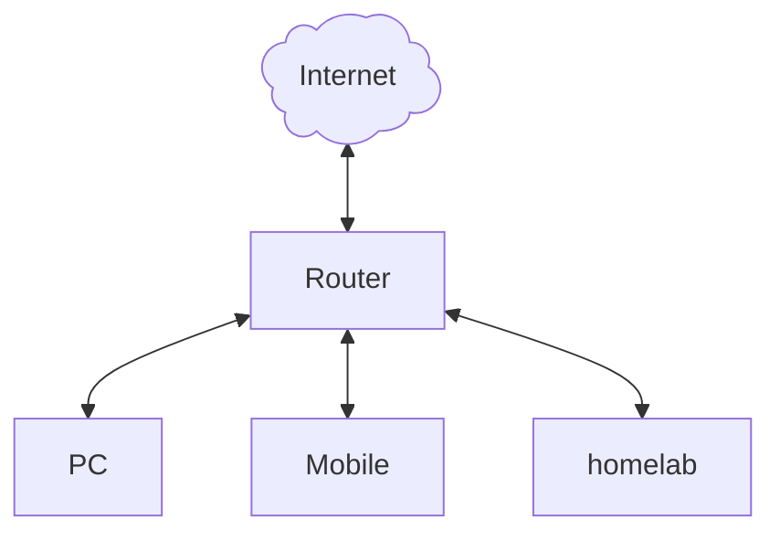
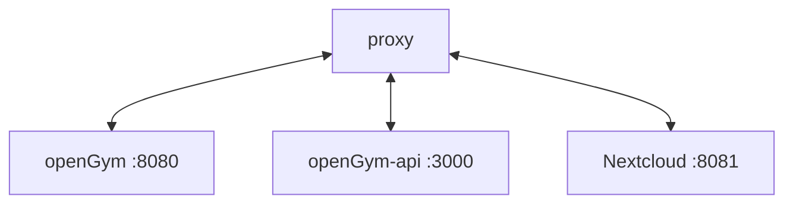

# Selfhosting with HTTPS

Since we handling a rather complex topic with this, it is separate from the [SELF_HOSTING.md](./SELF_HOSTING.md) which is focusing on how to run openGym.
This document is takes a more general approach on how to achieve "https at home", it is not necessarily focused on openGym and applies to self hosting in general.

When self hosting it is often thought of that one needs to expose their services to the internet, this is not necessarily the case.  
We can have https certificates without having to expose our precious hosts to the world. You can still do that if you want to access your applications from the internet without any VPN, but it's not necessary to take the risk.

Since VPN is a beast of it's own we'll only handle the certificates for now and grant https traffic to our local network hosts.

## Components

Given we have the following setup:
- a little server (e.g. a Raspberry Pi or mini PC) that runs our applications.
- a client (your PC, mobile, tablet, etc.)
- your router (the thing that provides internet access, wifi, etc.)

### DNS

In most cases the router also provides DNS for the local network and forwards all requests to the internet provider DNS.  
(If you set up your own DNS server on your homelab, you probably know what you're doing.)

The clients (PC, mobile phone, ...) will ask the local DNS for adress translation and if the local DNS can't provide the target adress, it will forward the request.
Usually the DNS servers out there translate DNS names to public IP adresses.  
Since we do not own a plublic DNS server, we need a DNS provider that does this for us.
You probably heard of dyndns, duckdns and the like. This is what they do: provide a public DNS for us.

In order to make the public DNS servers out there resolve the local IP adress of our homelab we will set up the DNS provider.
It is strongly adviced to check which DNS providers are supported by the tools you choose (we'll get to that later).

### Let's encrypt!

Let's encrypt is free to use, they provide certificates for everyone to make the internet safer. Read [here](https://letsencrypt.org/docs/why-all-https/) for more information.
They provide tools to automatically create certificates with a challenge to ensure your request is valid.  
Therefore the tool needs to have access to the DNS provider to generate temporary TXT entries on the DNS entry.  
If all is checked, the certificate authority of Let's encrypt singns the certificate and it can be used.

### proxy

A proxy is optional but desirable. It acts as sort of a gateway to our service and can be a single entrypoint to multiple services on our homelab.
Let's say we have three services running on our instance. Since a TCP port can be used only once on a host we would have three ports that access our individual services.
It would not be very nice to have to remember all the ports when we adress our services, so we let the proxy do it.

Port 443 (https) can only be used once so we would let our proxy answer to that port.
We configure the proxy to forward requests to our individual services like so:

Now we have a nice URL and can forget about the ports. The proxy reads the URL request and forwards it to the target service/host.

## How?!

So how does it all come together?

1. DNS provider translates name to our local IP
1. the proxy listens to the local IP and provides HTTPS
1. Let's encrypt provides certificates

### Tools

- DNS provider:
- let's encrypt client:
- reverse proxy:

This is the tools I picked and that I know to work, your choice may be different and the setup is different as well.  
But the main tasks are the same, so you can adapt to your choice.
