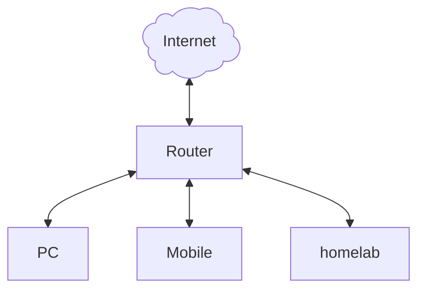
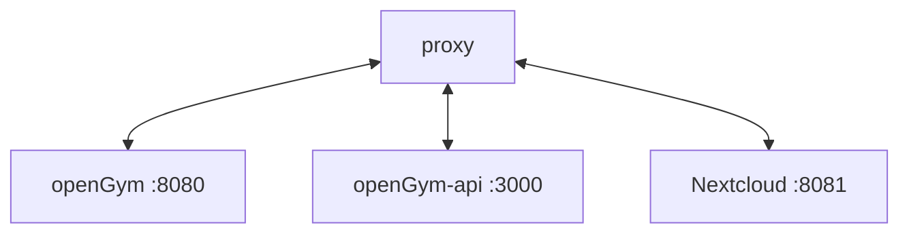

# Selfhosting with HTTPS

This is a rather complex topic of its own, so it lives apart from the [SELF_HOSTING.md](./SELF_HOSTING.md) which focuses on how to run openGym.
This document takes a more general approach on how to achieve "https at home", it is not necessarily focused on openGym and applies to self hosting in general.

When self-hosting it is often assumed that one needs to expose their services to the internet, this is not necessarily the case.  
We can have https certificates without having to expose our precious hosts to the world. You can still do that if you want to access your applications from the internet without any VPN, but it's not necessary to take the risk.

Since VPN is a beast of its own we'll only handle the certificates for now and grant https traffic to our local network hosts.

This guide assumes that you are running a Linux host, everything else is not covered.

## Components

Given we have the following setup:
- a little server (e.g. a Raspberry Pi or mini PC) that runs our applications.
- a client (your PC, mobile, tablet, etc.)
- your router (the thing that provides internet access, wifi, etc.)



### DNS

In most cases the router also provides DNS for the local network and forwards all requests to the internet provider DNS.  
(If you set up your own DNS server on your homelab, you probably know what you're doing.)

The clients (PC, mobile phone, ...) will ask the local DNS for address translation and if the local DNS can't provide the target address, it will forward the request.
Usually the DNS servers out there translate DNS names to public IP addresses.  
Since we do not own a public DNS server, we need a DNS provider that does this for us.
You probably heard of dyndns, duckdns and the like. This is what they do: provide a public DNS for us.

In order to make the public DNS servers out there resolve the local IP address of our homelab we will set up the DNS provider.
It is strongly advised to check which DNS providers are supported by the tools you choose (we'll get to that later).

### Let's encrypt!

Let's encrypt is free to use, they provide certificates for everyone to make the internet safer. Read [here](https://letsencrypt.org/docs/why-all-https/) for more information.
They provide tools to automatically create certificates with a challenge to ensure your request is valid.  
Therefore the tool needs to have access to the DNS provider to generate temporary TXT entries on the DNS entry.  
If all is checked, the certificate authority of Let's Encrypt signs the certificate and it can be used.

We will make use of a wildcard certificate, so we can serve all our services with one certificate.

### proxy

A proxy is optional but desirable. It acts as sort of a gateway to our service and can be a single entrypoint to multiple services on our homelab.
Let's say we have three services running on our instance. Since a TCP port can be used only once on a host we would have three ports that access our individual services.
It would not be very nice to have to remember all the ports when we address our services, so we let the proxy do it.

Port 443 (https) can only be used once so we would let our proxy answer to that port.
We configure the proxy to forward requests to our individual services like so:

Now we have a nice URL and can forget about the ports. The proxy reads the URL request and forwards it to the target service/host.

## How?!

So how does it all come together?

1. DNS provider translates name to the local IP of homelab (e.g.: `https://opengym.myhomelab.dedyn.io -> http://192.168.0.100:8080`)
1. the proxy listens to the local IP and provides HTTPS
1. Let's encrypt provides certificates with certbot

### Tools

- DNS provider: https://desec.io/ free and supports IPv6 and a certbot plugin
- let's encrypt client: certbot, officially supported by LE
- reverse proxy: caddy, lightweight and hackable.

These are the tools I picked and know to work, your choice may be different and the setup is different as well.  
But the main tasks are the same, so you can adapt to your choice.

Additional info:
- homelab host: 192.168.0.100  
  running services:  
    - opengym on port 8080
    - nextcloud on port 8081

1. register with desec.io and choose a name (we take `myhomelab` as example)
    1. create a new A record that points to your service, e.g.: `*.myhomelab.dedyn.io` (Wildcard!) - 192.168.0.100 (the ip of your homelab/mini PC/Raspberry Pi running the proxy)
    2. A wildcard certificate handles all certificates for that given host. e.g.: `opengym.myhomelab.dedyn.io` and `nextcloud.myhomelab.dedyn.io` can share the same certificates.
    3. create an API token for the certbot plugin. It only needs to write records inside your domain — leave `Can create domains` and `Can delete domains` **off**; a leaked token should not be able to take your domain apart. Note the token, it is only displayed once.
2. install certbot on your host
    1. most linux distributions provide the packages for this, e.g. debian: `apt install certbot python3-certbot-dns-desec` check the [docs](https://desec.readthedocs.io/en/latest/integrations/lets-encrypt.html) 
    2. create a config file in `/etc/letsencrypt`: `desec.ini` containing `dns_desec_token = YOUR_TOKEN`, and `chmod 600` it
    3. run certbot to register
        ```bash
        certbot certonly \
            --authenticator dns-desec \
            --dns-desec-credentials /etc/letsencrypt/desec.ini \
            -m YOUR_EMAIL@HOST.TLD \
            --agree-tos \
            --no-eff-email \
             -d "*.myhomelab.dedyn.io"
        ```
    4. certbot also installs a systemd timer that renews the certificate automatically. Caddy only re-reads the files when told to, so add a deploy hook once: `certbot renew --deploy-hook "systemctl reload caddy"` (or drop that line into `/etc/letsencrypt/renewal-hooks/deploy/`).
    5. certbot writes `privkey.pem` readable by root only, while caddy runs as its own user. Either `chgrp caddy /etc/letsencrypt/live /etc/letsencrypt/archive && chmod g+rx` those directories (and `g+r` on the key), or copy the files in the deploy hook — otherwise caddy starts, but every TLS handshake fails.
3. install caddy
    1. most linux distributions provide the packages for this, e.g. debian: `apt install caddy` check the [docs](https://caddyserver.com/docs/install) 
    2. create the caddy config, this is an example that should work:
    ```jsonc
    :443 {
        header Content-Type text/html
        respond <<HTML
                <html>
                        <head><title>caddy</title></head>
                        <body><h2>caddy works.</h2></body>
                </html>
                HTML 200
    }
    # define desec configuration
    (desec) {
        tls /etc/letsencrypt/live/myhomelab.dedyn.io/fullchain.pem /etc/letsencrypt/live/myhomelab.dedyn.io/privkey.pem {
                protocols tls1.3
        }
    }
    # reverse proxy config for opengym
    opengym.myhomelab.dedyn.io {
        import desec
        reverse_proxy http://192.168.0.100:8080
    }
    # config for some other service
    nextcloud.myhomelab.dedyn.io {
        import desec
        reverse_proxy http://192.168.0.100:8081
    }
    ```

And that's about it. Now you should be able to access your opengym instance from your local network via https with working passkeys.  
Be sure to update the openGym config accordingly (`RP_ID=opengym.myhomelab.dedyn.io`, `ORIGIN=https://opengym.myhomelab.dedyn.io` — see [SELF_HOSTING.md](./SELF_HOSTING.md#2-understand-the-passkey-requirement-important)).

**If the name does not resolve on your phone:** many home routers (Fritz!Box, some ISP boxes) have *DNS rebind protection* and silently drop public names that resolve to a private IP. Add `myhomelab.dedyn.io` to the router's rebind exception list, or run your own resolver.

usable URLs in this example:
- `https://opengym.myhomelab.dedyn.io -> http://192.168.0.100:8080`
- `https://nextcloud.myhomelab.dedyn.io -> http://192.168.0.100:8081`

Note that the SSL/HTTPS termination is only at the proxy, the service does not have any certificates whatsoever.


### Alternatives
- DNS providers: [certbot provider list](https://certbot.eff.org/hosting_providers) so many options...
- Let's encrypt clients: see [here](https://letsencrypt.org/docs/client-options/) 
- reverse proxy: nginx proxymanager, easier with web GUI

## Conclusion

We created a local-network-only access to our services with HTTPS using Let's encrypt, certbot and caddy.  
If something does not work, please check the corresponding documentation:
- [desec](https://desec.readthedocs.io/en/latest/index.html) 
- [caddy](https://caddyserver.com/docs/) 
- [Let's encrypt](https://letsencrypt.org/docs/) 
- [certbot](https://certbot.eff.org/) 

Reaching the services from outside your network (WireGuard plus a dynamic-DNS updater) is out of scope here.

